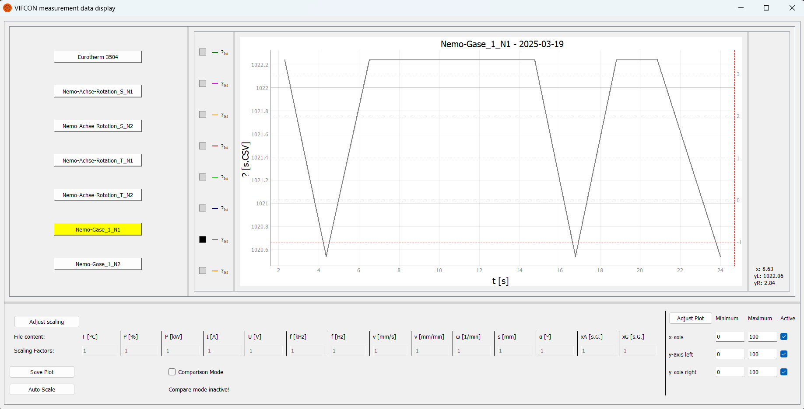

# Display of the VIFCON measurement data

The program outputs the measurement data (CSV) from VIFCON! Certain parts of the VIFCON code are reused.

## Requirements/Libraries

- os
- sys
- argparse
- math
- pyqtgraph
- matplotlib
- randomcolor 
- PyQt5

## GUI


## Usage

The GUI has two modes. A display mode of one measurement file and a display mode of multiple measurement files.

To start the comparison mode, the checkbox must be activated. If this happens, the plot is emptied. To restart or end the comparison mode, the checkbox must be reset. All files used are displayed in yellow. If a button is pressed again, the associated curves are removed from the plot. It must be noted that this is still somewhat error-prone and causes problems from time to time. Sometimes the plot does not update properly, so you have to move the mouse briefly over the plot!!

In single mode, only one file is displayed at a time. When switching to another, the plot and the legend are emptied and the new one inserted!

A short video shows the use - [Nutzung.mp4](./Video/Nutzung.mp4)

Certain quantities are displayed in the GUI. Quantities that are given a name can also be scaled. For example, if the Nemo gas file is imported, see the following image, '?' will appear in the legend. The tooltip then shows the curve name, such as PP22, which indicates the assignment! The same applies to the revolution value for the Nemo rotation!



### Buttons and areas

**Area 1 - Scaling:**    
The `Adjust scaling` button adjusts the y-axes of all sizes. The contents of the enabled input fields are read and the curves are adjusted. 

**Area 2 - Save and Auto Scale:**    
`Save Plot` saves the current plot. This creates a folder called `Bilder`. As soon as the comparison mode is active, all images are saved in a folder called `Comparison Mode`, otherwise in a folder that matches the file, e.g. `PI-Achse_x_2024-07-01`.

With `Auto Scale` the plot is adjusted.

**Area 3 - Adjust plot:**    
In this area you can scale the three axes as desired. The checkbox can be used to switch the scaling on and off. The axes are adjusted using `Adjust Plot`. If there are any value errors, an error message is displayed under the input fields.

**Area 4 - Comparison mode:**    
The checkbox with a small message can be found here.

**Area 5 - Measurement data:**      
The buttons in the upper left area are created automatically. For this, there must be a folder called `Messdaten`. All CSV files are checked and created as buttons. When clicked, the plot is created and the file is read out.

**Area 6 - Plot:**    
The plot with legend and cursor can be found next to area 5.

With the legend, you have to know that it is always on the left. The associated file can then be seen via the tooltip.

### Argparser

By entering `python .\messdata_Read.py -f Messordner_1` you can change the file folder!

```
Evaluation or Sorting from the Logging-VIFCON-File.
options:
  -h, --help            show this help message and exit
  -l LANGUAGE, --language LANGUAGE
                        Language DE (German) or EN (English) - Usage from upper() [optional, default='EN']
  -f FOLDER, --folder FOLDER
                        Name of the folder in which the measurement data is located [optional, default='Messordner]
```

## Programs

1. messdata_Read.py
  - includes the language option and the comparison mode
2. messdata_Read_ohne_VM.py
  - old version: Without comparison mode and language option

## Missing points

- Optimizations:
  - Setting and removing the scaling option does not fully work in compare mode!
  - Comparison mode: Adjustment of the y-axis when curves are removed! (e.g., P [%] remains even if no device has failed!)
  - Change the plot title if desired
  - Error messages on GUI