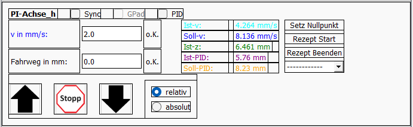

# Config-Datei

Die Config-Datei ist eins der wesentlichsten Feature der VIFCON-Steuerung. Mit dieser Datei wird alles in der Steuerung configuriert. So werden:

- die GUI,
- die Rezepte,
- der Multilog-Link,
- das Gamepad,

und vieles mehr bereitgestellt. Die Config-Datei ist eine Yaml-Datei und wird durch die Python-Bibliothek pyYAML in VIFCON eingebunden. 

## Funktion

Die Yaml-Datei wird von Python als Dictionary bzw. als Verschachtelung mehrerer Dictionaries angesehen. Ein Dictionary ist wie folgt aufgebaut:

```
    Schlüssel: Wert
```

Der Wert kann dabei eigentlich alles mögliche sein. Es kann z.B. ein Objekt, ein Dictonary, eine Liste oder auch ein Integer sein. 

Die Config-Datei wird wie folgt ausgelesen:
```
with open(config, encoding="utf-8") as f:
    self.config = yaml.safe_load(f)
```

Aufgerufen wird ein Wert wie folgt:
```
self.config['language']
```

In dem Beispiel würde so der Wert des Schlüssels "language" gewertet werden. 

## Erklärung der einzelnen Punkte

In dem Template der Datei ([config_temp.yml](../Template/config_temp.yml)) können auch Beschreibungen gefunden werden. 

Im folgenden sind die Punkte:
1. [Zeiten](#zeiten)
2. [Feature-Überspringen](#feature-überspringen)
3. [Speicher Dateien und Bilder](#speicher-dateien-und-bilder)
4. [GUI](#GUI)
5. [Logging-Datei](#logging-datei)
6. [Konsolen-Logging](#konsolen-logging)
7. [Legende der GUI](#legende)
8. [Skalierungsfaktoren](#skalierungsfaktoren)
9. [Geräte](#geräte)

### Zeiten:

```
time:
  dt-main: 150
  timeout_exit: 10
```
Nach dieser Zeit (`dt-main`) werden die Threads der Geräte aufgerufen bzw. die sample-Funktion des Sampler-Objektes in dem Thread. Die Zeit wird in ms angegeben und wird für den Reaktionstimer benötigt. 

Bei der Zeit `timeout_exit` handelt es sich um eine Zeit die in Sekunden angegeben wird. In der Exit-Funktion des Programms, gibt es eine While-Schleife, die auslösen soll, wenn die Threads fertig sind. Kommt es dort zu Problemen, so wird nach der angegebenen Zeit ein break ausgeführt und die Schleife verlassen. Bei Auslösung wird auch eine Warnung in der Konsole und der Log-Datei ausgegeben. 

### Feature-Überspringen 

```
Function_Skip:                                                
  Multilog_Link: 0        
  Generell_GamePad: 0
  writereadTime: 0
```
Wenn der Wert auf True (1) steht, so werden die Funktionen für den Multilog-Link und dem Gamepad freigeschaltet. Bei False wird dies im Code übersprungen und wirkt sich nicht auf VIFCON aus. 

Bei `writereadTime` wird eine Zeitspanne als Debug gelogged. Damit diese Funktion funktioniert, muss beim `logging` das `level` auf 10 gesetzt werden! Die Zeitspanne die hier gemessen wird ist für die Funktionen `write` und `read` der einzelnen Geräte. Somit wird ermittelt, wie lange diese Funktionen dauern. Beide Funktionen sind für die Geräte-Kommunikation wichtig!

### Speicher Dateien und Bilder

```
save:
  config_save: True                                
  log_save: True   
  plot_save: True
  GUI_save: True
```

Am Ende der Anwendung wird die Config-Datei und die Log-Datei aus dem Hauptordner in den Messordner kopiert. Auch die Legende und die Plots werden gespeichert. Dies passiert bei True. 

Beachtet werden muss hierbei, dass die Plots und die Legende so gespeichert werden, wie sie in der GUI zu sehen sind. 

Um ein gesamt Bild der GUI zu haben, kann auch die aktuelle sichtbare GUi gespeichert werden. 

### GUI

```
GUI:
  language: de
  GUI_Frame: 0
  GUI_color_Widget: 1
```

Die Einstellungen verändern die GUI in Sprache und Aussehen. 

Bei `language` wird die Sprache angegeben. Dabei können nur Deutsch (DE) und Englisch (EN) ausgewählt werden. Die GUI ändert sich dementsprechend.

Wenn der Wert bei `GUI_Frame` auf True (1) steht, dann werden die Rahmen der Widgets eingeschaltet. Mit diesem Mittel kann die Platzierung der einzelnen Widgets angesehen werden. 



Mit `GUI_color_Widget` können die Farben auf dem Widget abgeschaltet werden. Anstelle der Bunten GUI wird dann alles schwarz angezeigt. In dem Bild sind die gemeinten Farben zu sehen. 

### Logging-Datei

```
logging:
  level: 20
  filename: vifcon.log
  format: '%(asctime)s %(levelname)s %(name)s - %(message)s'
  filemode: w         
  encoding: 'utf-8' 
```
Über diesen Config-Teil, wird die Logging-Datei erstellt und das Logging-Level bestimmt. Es gibt:

- 10 - Debug
- 20 - Info
- 30 - Warning
- 40 - Error

Bei einigen Systemen muss das `encoding` auskommentiert werden, da z.B. Linux dadurch einen Fehler ausgibt. 

### Konsolen-Logging
```
consol_Logging:
  level: 30
  print: 1 
  format: '%(asctime)s %(levelname)s %(name)s - %(message)s'
```
Wenn beim [Logging](#logging-datei) der Schlüssel *filename* leergelassen wird, dann werden alle Log-Nachrichten in die Konsole geschrieben. 

Das Konsolen-Logging filtert bestimmte Nachrichten herraus. Beim Schlüssel *print* können somit:

- 1 - Nur das angegebene Level,
- 2 - Auch alle kleineren Level und,
- 3 - Auch alle größeren Level

angegeben werden. Beachtet werden muss hierbei, dass das Haupt-Logging Level eine höhere Priorität hat als das neue Konsolen-Logging. Zum Beispiel:

- logging-Level = 40
- Consol-logging-Level = 30 und print = 1
- In der Konsole wird nicht ausgegeben, da die Nachrichten für Level 30 nicht vom Haupt-Logger aufgerufen werden!

### Legende

```
legend:
  generator:
    legend_pos: Side
    legend_anz: 2
    side: rl 
  antrieb:
    legend_pos: Side  
    legend_anz: 2   
    side: rl
```

Hiermit wird die Legende für die beiden Geräte-Typen der Steuerung (Antriebe, Generator) erstellt. Möglich sind beim Schlüssel *legend_pos*:

- SIDE
- IN
- OUT

Bei IN wird die Legende im Plot sein. Bei OUT wird sie unter dem Plot sein und bei SIDE wird die Legende neben dem Plot in einem seperaten Widget sein. Dabei kann bei SIDE die Position:

- rl
- l
- r

Bei rl werden zwei Widgets rechts und links vom Plot erstellt. In diesen Widgets stehen dann die Kurven die für die Achse vorgesehen sind. Bei l und r wird ein Widget nur Rechts oder nur Links erstellt.

Bei OUT und IN kann auch die Anzahl der in einer Reihe stehenden Label geändert werden. Dies geschieht durch *legend_anz*.

### Skalierungsfaktoren

```
skalFak:                                                      
  Pos:      1 
  Win:      1 
  Speed_1:  0 
  Speed_2:  1    
  WinSpeed: 1 
  Temp:     0 
  Op:       0 
  Current:  0
  Voltage:  0
  Pow:      0  
  Freq:     0
  Freq_2:   0
  PIDA:     0
  PIDG:     0
```

Durch die Skalierungsfaktoren kann der Plot der GUI geändert werden. Nicht immer sind die verschiedenen Größen im selben Wertebereich. Sobald der Wert ungleich eins ist, wird die Kurve um diesen Wert skalliert. Diese Skalierung wird in dem Label der y-Achse angezeigt. Weiterhin bewirken bestimmte Zahlen in dem Sinne auch eine Änderung. Die Zahl 1 als Skalierungsfaktor wird nicht im y-Achsen-Label angezeigt. Bei einer Null wird die Große aus dem y-Achsen-Label entfernt. Wenn keine Größe im Label mehr enthalten ist, so wird *Keine Einträge!* angezeigt.

Mit PIDA und PIDG sind spezielle Größen gemeint. PIDA findet bei der PI-Achse und den beiden Nemo-Antrieben Anwendung, während PIDG nur beim TruHeat genutzt wird. Hiermit kann die PID-Regler Input Größe skalliert werden. Bei Eurotherm ist diese Größe die Temperatur, weshalb sie nicht mit PIDG skaliert wird.  

### Geräte

```
devices:
  Eurotherm 3504:
    ...
  PI-Achse_h:
    ...
```

Unter dem Schlüssel ***devices*** finden sich nun alle vorhandenen Geräte wieder. Jedes Gerät muss dabei einen bestimmten Namens-Teil haben:

Gerät                              | String-Teil
-----------------------------------|----------------------
Eurotherm                          | Eurotherm
TruHeat                            | TruHeat
PI-Achse                           | PI-Achse
Nemo-Anlage 1 & 2 Hub-Antrieb      | Nemo-Achse-Linear
Nemo-Anlage 1 & 2 Rotation Antrieb | Nemo-Achse-Rotation
Nemo-Anlage 1 & 2 Sensoren         | Nemo-Gase
Nemo-2-Anlage Generator            | Nemo-Generator

Bei der PI-Achse und dem Eurotherm-Regler ist ein Beispiel am Anfang zu finden. Die einzelnenen Geräte haben nun teilweise Unterschiede und teilweise Gemeinsamkeiten.

#### Gemeinsamkeiten

1. ```skip: 1```
    - Um ein Gerät nicht in die GUI zu übertragen, muss bei diesem Schlüssel der Wert True (1) ausgewählt werden. In dem Fall wird die Definition des Gerätes im Programm übersprungen.
2. ```typ:  Generator```
    - Auswahlmöglichkeiten: Generator, Antrieb, Monitoring
    - Generator: Eurotherm, TruHeat, Nemo-Generator
    - Antrieb: PI-Achse, Nemo-Achse-Linear, Nemo-Achse-Rotation
    - Monitoring: Nemo-Gase
    - Durch diesen Schlüssel wird die Seite und Tab des Widgets bestimmt. 
3. ```ende: 0```
    - Mit diesem Schlüssel wird der Sichere Endzustand aktiviert. Wenn der Wert auf True (1) steht, dann wird bei Ausführung des Exits (Ende der Anwendung) die Stop-Funktion des jeweiligen Gerätes aktiviert und ausgeführt. 
4.  ```serial-interface```
    - Schnittstellen-Eigenschaften für die Kommunikation
    - RS233
      - port, baudrate, bytesize, stopbits, parity, timeout
      - Eurotherm, TruHeat, PI-Achse
    - Modbus
      - host (Server-IP-Adresse), port, debug
      - Nemo-Anlage 1 & 2
5. Multilog-Link 
    ```
      multilog:
        write_trigger: Eurotherm1
        write_port: 50000
        read_trigger_ist: IGA-6-23-adv
        read_port_ist: 0              
        read_trigger_soll: DAQ-6510   
        read_port_soll: 0             
    ```
    - Trigger-Wort hängt von Multilog Konfiguration ab
    - Port hängt von Multilog Konfiguration ab
    - Durch diese Schlüssel, kommuniziert VIFCON mit Multilog:
      - Write: VIFCON sendet Werte an Multilog
      - Read: VIFCON holt sich Werte von Multilog für den PID-Modus
        - read_trigger und read_Port sind bei Nemo-Gase nicht vorhanden!
        - einmal für Sollwert und einmal für Istwert
6. Limits
    - Jedes Gerät hat bestimmte Limits.
    - Diese Limits sind Software-Limits, wodurch das Senden von Werten nur bis zu diesen Werten funktioniert.
    - Beispiel Eurotherm:
      ```
      limits:
        maxTemp: 1000
        minTemp: 0
        opMax: 35 
        opMin: 0
      ```
7. GUI-Kurven
    ```
      GUI:
        legend: RezOp ; RezT ; IWT ; IWOp ; SWT ; uGT ; oGT ; oGOp ; uGOp
    ```
    - Mit dieser Konfiguration wird dem Programm gesagt, welche Kurven im Plot angezeigt werden sollen. 
    - Je nach Gerät gibt es andere Bezeichnungen.
    - Grundlegend: Rezepte, Istwerte, Sollwerte, Obere Grenze, Untere Grenze + Größenbezeichnung
    - z.B. RezOP bedeutet Rezeptkurve für Operating Point (Leistung)
8. Eingabefeldanzeige
    ```
      defaults:
        startTemp: 20  
        startPow: 25 
    ```
    - Diese Werte werden zu Beginn des Programms in der GUI angezeigt. 
9. Rezepte:
    - Für diesen Punkt sehe bitte [Rezepte_DE.md](Rezepte_DE.md).
10. PID-Modus:
    ```
      PID:  
        PID_Aktiv: 1 
        Value_Origin: VV  
        kp: 200 
        ki: 0.3 
        kd: 0  
        sample: 500 
        sample_tolleranz: 100
        start_ist: 25
        start_soll: 25
        umstell_wert: 0
        Multilog_Sensor_Ist: TE_1_K air 155 mm over crucible
        Multilog_Sensor_Soll: TE_2_K air 155 mm over crucible
        Input_Limit_max: 1000
        Input_Limit_min: 0
        Input_Error_option: error
        debug_log_time: 5
    ```
    - Zwischen den Geräten gibt es nur minimale Unterschiede!
    - `PID_Aktiv` - Bei True wird der PID-Modus aktivierbar gemacht!
    - `Value_Origin` - Gibt die Herkunft der Inputwerte wieder
      - Erste Stelle: Istwert
      - Zweite Stelle: Sollwert
      - V - VIFCON, M - Multilog
    - PID-Parameter: kp, ki, kd
    - `sample` - PID-Timer Zeit, Sample-Rate
      - `sample_tolleranz` - Abweichung von Sample-Rate ohne Fehlermeldung
    - `start_ist` und `start_soll` geben den ersten Wert für den Input wieder
    - `umstell_wert` - Wert der bei Wechsel im write_value Dictionary für die Output-Größe im Normalen Modus gespeichert wird!
      - bei TruHeat gibt es drei dieser Variablen
    - `Multilog_Sensor_Ist` - Multilog-Sensor von dem der Istwert-Input kommt
    - `Multilog_Sensor_Soll` - Multilog-Sensor von dem der Sollwert-Input kommt
    - Limits-Input: `Input_Limit_max` und `Input_Limit_min`
    - `Input_Error_option` - Bei einem Auslesefehler wird hierbei eine von drei Möglichkeiten eingestellt 
      - max - Oberes Limit wird als Input gesetzt
      - min - unteres Limit wird als Input gesetzt
      - error - Fehlermeldung und letzten Input verwenden
    - `debug_log_time` - Debug Logzeit in s

#### Unterschiede

**Eurotherm:**

```
    start:
      sicherheit: 0
      PID_Write: 0
      start_modus: Auto
      readTime: 2 
      init: 1
      ramp_start_value: ist 
      ramp_m_unit: K/s
```

*sicherheit*:
  - Legt fest wie der Maximale Leistungsausgang (HO) gesetzt wird. 
  - True: HO kann nur am Gerät geändert werden
  - False: HO kann von VIFCON nur gelesen werden, wodurch OPmax angepasst wird (1. Menü-Knopf, 2. Umschalten auf Manuel-Mode)

*PID_Write:*
  - Bei True werden die PID-Parameter aus `PID-Device` an das Eurotherm-Gerät gesendet!

*start_modus*:
  - Möglichkeiten: Auto, Manuel
  - Eurotherm besitzt zwei Modies
    - Automatischer Modus: 
      - Regelung der Temperatur aktiv
      - PID-Regler sorgt für Leistungsausgang
    - Manueller Modus:
      - Benutzer legt Leistungsausgang fest

*readtime*:
  - Zeitintervall, wann das Gerät ausgelesen werden soll
  - eine Null schaltet das Lesen von Werten ab

*init*:
  - Initalisierung des Gerätes erfolgen oder nicht erfolgen
  - True: 
    - Gerät hängt an der Schnittstelle und wird direkt vom Programm angesprochen
  - False:
    - Schnittstelle existiert, das Gerät hängt aber noch nicht umbedingt daran
    - Programm sorgt dafür, dass keine Befehle gesendet werden

*ramp_start_value*:
  - Möglich: IST, SOLL
  - Jenach Auswahl fängt die erste Rampe beim Sollwert oder dem Istwert an

*ramp_m_unit*:
  - Möglich: K/s, K/h, K/min
  - Durch diese Einstellung wird die Eurotherm-Rampe an eine interne Geräte Einstellung angepasst. Im Eurotherm-Regler muss dies selbst geändert werden. Mit der Einstellung kann man VIFCON mitteilen, welche Steigungseinheit die Rampe haben soll. 

```
    PID-Device:
      PB: 11.8
      TI: 114
      TD: 0 
```

Hier werden die drei Eurotherm-PID-Parameter definiert. Diese können zum Start oder über eine Menü-Funktion beschrieben werden. 

**TruHeat:**

```
    start:
      start_modus: P
      readTime: 0
      init: True 
      ad: '00001'
      watchdog_Time: 5000
      send_Delay: 20 
```

*init* und *readTime* sind bei allen Geräten identisch, siehe Eurotherm für Erklärung!

*start_modus*:
  - Möglich: P, I, U
  - Durch das setzen wird der Radio-Button in der GUI auf die Größe gesetzt.

*ad*:
  - TruHeat-Generator Adresse

*watchdog_Time*:
  - Der TruHeat besitzt einen Watchdog Timer als Sicherheitsfunktion. Der Zeitwert in Millisekunden wird zu Beginn des Programms gesetzt. 

*send_Delay*:
  - Hier kann eine Zeit in Millisekunden festgelegt werden, die eine Verzögerung zwischen dem Senden von Befehlen verursacht.
  - Sollte nicht Größer als die Watchdog Zeit sein!

```
    serial-loop-read: 3
```

Mit der Konfiguration wird eine while-Schleife gesteuert. Bei TruHeat und der PI-Achse gibt es eine while-Schleife die einen Lese-Versuch wiederholt. Der Wert gibt die Häufigkeit dieser Wiederholungen wieder. 

**PI-Achse:**

1. ```mercury_model: C862```
    - Bei der PI-Achse wurden zwei verschiedene Modelle des Mercury-Models genutzt. Diese waren C862 und C863.
    - Beide Modelle haben kleine Unterschiede. Speziell bei der Messung bzw. dem Auslesen der Geschwindigkeit.

2. ```gamepad_Button: PIh```
    - Möglich bei PI-Achse: PIh, PIz, PIx, PIy
    - Durch diesen Schlüssel, werden bestimmte Knöpfe für bestimmte Achsen-Bewegungs-Richtungen freigeschaltet.

3. Start:
    - Bei der PI-Achse gibt es nur *init*, *readTime* und *mode*.
    - Die ersten beiden sind wie bei den anderen (siehe Eurotherm).
    - *mode*
      - Verriegelungsmodus der Bewegungsknöpfe
      - 0 - Keine Verriegelung
      - 1 - Entriegelung durch Timer
      - 2 - Entriegelung durch erreichen von 0 mm/s

4. Parameter:
    ```
      parameter:
        adv: '0133' 
        cpm: 29752 
        mvtime: 25  
        nKS_Aus: 3  
    ```
    - *adv* = Adressauswahlcode
    - *cpm* = Counts per mm
      - Umrechnungsfaktor
    - *mvtime*
      - Auslese-Delay für die Achsengeschwindigkeit (ms)
      - Wird für den Befehl MV bei C862 benötigt
    - *nKS_Aus*
      - angezeigte Nachkommastellen

5. Zielwerte Loggen:  
      ```
          read_TT_log: True  
      ```    
    - Bei True wird der Befehl TT ausgeführt, wodurch die Positionszielwerte gelogged werden. 

6. While-Schleife:   
      ```
        serial-loop-read: 3
      ```

    - Mit der Konfiguration wird eine while-Schleife gesteuert. Bei TruHeat und der PI-Achse gibt es eine while-Schleife die einen Lese-Versuch wiederholt. Der Wert gibt die Häufigkeit dieser Wiederholungen wieder. 

7. GUI-Konfiguration:
    ```
      GUI:
        bewegung: z
        piSymbol: Un
        knopf_anzeige: 1
    ```
    - *bewegung* - Bewegungsrichtung (y, x, z)
    - *piSymbol* - Ausrichtung der Achse am PI-Symbol (y -> Li, Re | x -> Vo, Hi | z -> Ob, Un)
    - *knopf_anzeige* - Wenn True wird die Richtung durch einen grünen Knopf angezeigt!
      - Bewegungsknopf z.B. ↑ wird dann grün (Hintergrund)
      - Bei Stopp wieder normal farbend!

**Nemo-Achse-Linear und Nemo-Achse-Rotation:**

1. ```gamepad_Button: HubS```
    - Möglich bei Linear: HubS, HubT
    - Möglich bei Rotation: RotS, RotT
    - Durch diesen Schlüssel, werden bestimmte Knöpfe für bestimmte Achsen-Bewegungs-Richtungen freigeschaltet.

2. Start:
    - *readTime* und *init* sind wie bei den anderen (siehe Eurotherm).
    - *invert*
      - True: Invertierung des Geschwindigkeitswertes
        - Bei der Spindel würden Rezept und Reale Geschwindigkeit sich unterscheiden!
    - *invert_Pos* (nur Nemo-Achse-Linear)
      - Bei der Nemo-2-Anlage können auch die realen Positionen genutzt werden! Diese sind aber verkehrt gerichtet!
      - Bei True wird die Position mal -1 genommen.
    - *start_weg* oder *start_winkel*
      - Bei der Nemo-1-Anlage wird der Weg und die Geschwindigkeit selbst berechnet. 
      - Aus dem Grund kann man hier einen Start Wert angeben.
    - *pos_controll* (nur Nemo-Achse-Linear)
      - Möglich: REAL, SIM
      - REAL: die realen Positionswerte werden für die Limit-Kontrolle genutzt
      - SIM: die simulierten Positionswerte werden für die Limit-Kontrolle genutzt
    - *sicherheit* (nur Nemo-Achse-Linear)
      - Wird bei den realen Positionswerten genutzt, da ein Wert auch falsch ankommen kan!!
      - 0: Fehlermeldung, Fehler ignorieren
      - 1: Fehlermeldung, Achse stoppt
    - *kont_rot* (nur Nemo-Achse-Rotation)
      - setzt die Checkbox in der GUI auf True
      - Der Winkel hat bei Checkbox True keine Limits!
  
  3. Modbus-Register
      ```
        register:
          hoch: 17 
          runter: 18  
          stopp: 16   
          lese_st_Reg: 38  
          write_v_Reg: 4
          posAktuel: 42  
          posLimReg: 46
          InfoReg: 143
          statusReg: 50
          statusRegEil: 155
      ```
      - Bei der Nemo-Anlage werden bestimmte Register gesetzt.
      - Hierbei werden Coils, Input-Register und Holding-Register angesprochen.
      - *InfoReg* und *statusRegEil* nur bei Nemo-2 vorhanden!
  
  4. Parameter:
      - Diese haben *nKS_Aus*, *Vorfaktor_Ist* und *Vorfaktor_Soll*.
      - Ersteres sind wieder die Nachkommerstellen die Angezeigt werden.
      - Der Vorfaktor diente der Korrektur des Fehlerhaften fahrens. Die eingestellte Geschwindigkeit war nicht die richtig, die auch bei den Antrieben ankam.  
    
  5. Anlagen-Version:   
    - `nemo-Version: 2`
    - Mit der Konfiguration kann zwischen Nemo-1 und Nemo-2 gewechselt werden!

  6. Anzeige des Knopf-Status:
    - Unter GUI: `knopf_anzeige: 1`
    - Wenn True wird die Richtung durch einen grünen Knopf angezeigt!
      - Bewegungsknopf z.B. ↑ wird dann grün (Hintergrund)
      - Bei Stopp wieder normal farbend!

**Nemo-Gase:**

- Besitzt weniger Teile, da nur ausgelesen wird.
- Werte werden nur in GUI angezeigt und können an Multilog übergeben werden.
- Ähnlich wie der Rest von Nemo-Anlage.

**Nemo-Generator:**

Der Nemo-Generator setzt sich bei der Konfiguration aus dem TruHeat und den Nemo-Achsen zusammen. Neu ist folgender Punkt:

1. unter start - `Auswahl`
  - Möglichkeiten: PUI, I
  - Bei dem Generatoren der Nemo-Anlage gibt es einen der nur Strom zulässt.
  - Mit *I* wird VIFCON gesagt, dass die Radio-Buttons nicht umgestellt werden können. Nur der für den Strom ist auswählbar bzw. bereits gesetzt.
  - Bei *PUI* sind alle drei Größen nutzbar.


## Auslese sicher:

In den Modulen (Widget, Device) wurden alle Konfigurationen überprüft. Auch im Controller (Haupt-Init) wurde dies eingebaut. Hierbei gibt es immer eine Prüfung des Schlüssels und des dazugehörigen Wertes. Beim Wert wird geschaut ob dieser vom richtigen Typ ist oder ob der Wert überhaupt genutzt werden darf. 

**Beispiel:**

Schlüssel-Test:
```
try: self.init = self.config['start']['init']
except Exception as e: 
  logger.warning(f'{self.device_name} - {self.Log_Pfad_conf_4[self.sprache]} start|init {self.Log_Pfad_conf_5[self.sprache]} False')
  logger.exception(f'{self.device_name} - {self.Log_Pfad_conf_6[self.sprache]}')
  self.init = False
```

*Meldungen:*   
```
2024-09-26 16:36:39,210 WARNING vifcon.view.truHeat - TruHeat - Fehler beim Auslesen der Config bei Konfiguration: start|init ; Setze auf Default: False
2024-09-26 16:36:39,217 ERROR vifcon.view.truHeat - TruHeat - Fehlergrund:
Traceback (most recent call last):
  File "z:\Gruppen\modexp-all\Private\work\Vincent\vifcon\vifcon\view\truHeat.py", line 130, in __init__
    try: self.init = self.config['start']['init']
                     ~~~~~~~~~~~~~~~~~~~~^^^^^^^^
KeyError: 'init'
```

---

Wert-Test:    
```
if not type(self.init) == bool and not self.init in [0,1]: 
  logger.warning(f'{self.device_name} - {self.Log_Pfad_conf_1[self.sprache]} init - {self.Log_Pfad_conf_2[self.sprache]} [True, False] - {self.Log_Pfad_conf_3[self.sprache]} False - {self.Log_Pfad_conf_8[self.sprache]} {self.init}')
  self.init = 0
```

*Meldungen:*  
```
2024-09-26 16:38:00,026 WARNING vifcon.view.truHeat - TruHeat - Konfigurationsfehler im Element: init - Möglich sind: [True, False] - Default wird eingesetzt: False - Fehlerhafte Eingabe: Truea
```

## Letzte Änderung

Die Letzte Änderung des [Templates](#erklärung-der-einzelnen-punkte) und dieser Beschreibung war: 17.12.2024