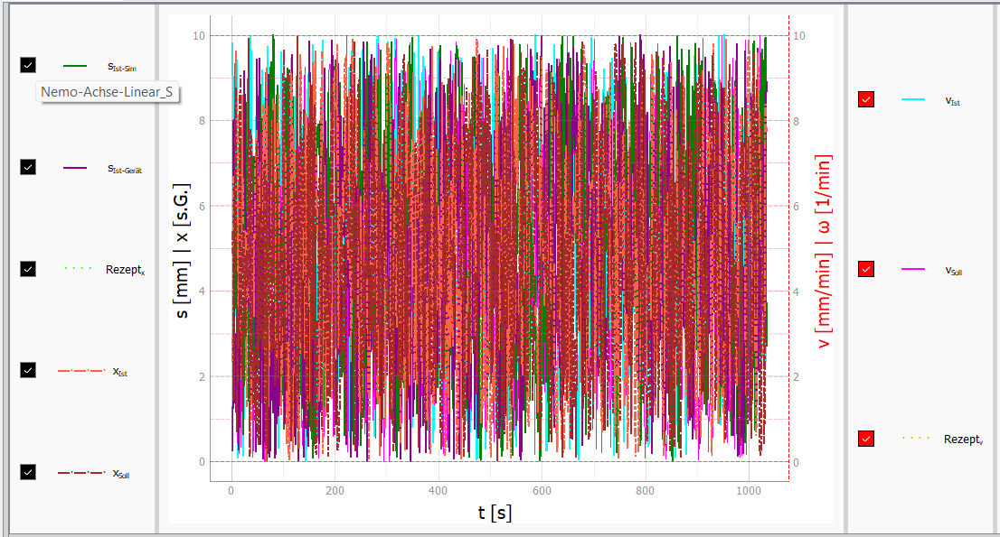
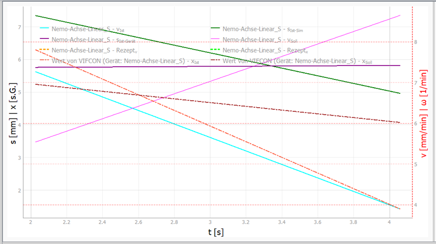
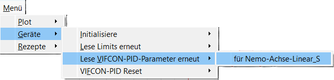
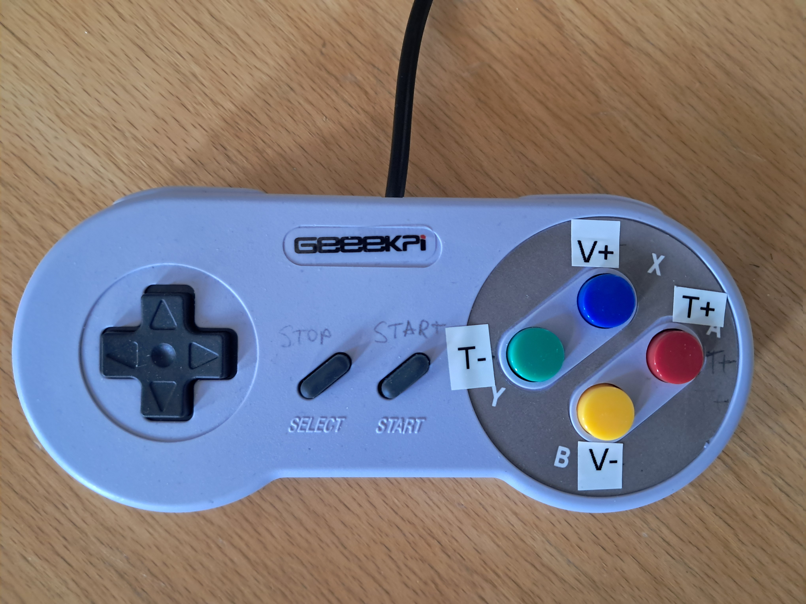
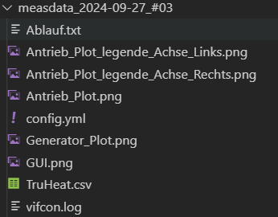

# Funktionen in VIFCON

Im diesem Readme sollen die wichtigsten Funktionen der VIFCON-Anwendung beschreiben und gezeigt werden. Hierbei werden z.B. die verschiedenen Modis wie Gamepad und PID erläutert, sowie spezielle GUI-Funktionen. Folgend wird ein Inhaltsverveichnis gezeigt:

1. [Initialisierung](#Initialisierung)
2. [Plot, Legenden und Cursor](#Plot-Legenden-und-Cursor)
3. [Menü](#Menü)
4. [Fehleranzeige](#Fehleranzeige)
5. [Sicherer Endzustand](#Sicherer-Endzustand)
6. [Synchro-Modus](#Synchro-Modus)
7. [Rezept-Modus](#Rezept-Modus)
8. [PID-Modus](#PID-Modus)
9. [Gamepad-Modus](#Gamepad-Modus)
10. [Multilog Link](#Multilog-Link)
11. [Test-Modus](#Test-Modus)
12. [Dateien](#Dateien)

## Initialisierung

Bei Start des Programmes VIFCON werden alle konfigurierten Geräte initialisierit. Hierbei werden dann bestimmte Start-Werte ausgelesen und gegebenfalls Werte an das Gerät gesendet. Weiterhin wird die Schnittstelle aufgebaut. In der [Konfiguration](Config_DE.md) findet sich jedoch die Einstellung `init` unter `start` wieder. Wenn dort **False** ausgewählt wird, so wird die Schnittstelle zwar aufgebaut, doch noch nicht verwendet. In dem Fall kann der Nutzer das Gerät später anschließen und über das [Menü](#Menü) einschalten. Wichtig ist nur das die Schnittstelle aufgebaut werden kann. Durch diese Funktion die Kommunikation über die Schnittstelle nicht durchgeführt. 

Der zweite Punkt ist, das über das selbe Menü (Toggle) das Gerät getrennt werden kann. Wenn die Initialisierung geklappt hat, so wird ein grüner Kreis im Menü angezeigt und bei Trennung oder Fehler ein rotes Kreuz. Die folgende Abbildung zeigt dies.


Sobald das Gerät initialisiert wird, beginnt die Aufnahme der Messwerte. Wenn die Initialisierung während des Betriebs ausgeschaltet wird, aktualliesieren sich die Kurven von dem Gerät nicht mehr. Dies passiert solange bis das Gerät wieder initialisiert wird! 

Das Auschalten der Kommunikation mit dem Gerät kann auch zu Problemen führen. Beachtet werden muss z.B. ob die Antriebe noch laufen, da VIFCON sie nicht auschalten kann. Beim TruHeat wird der Watchdog auslösen, da keine konstanten Lese-Befehle mehr kommen. Vor der Neu-Initialisierung muss der TruHeat Generator wieder richtig eingestellt werden, was nur am Gerät selbst geht. 

### Start-Funktion

Bei der Initialisierung werden bestimmte Werte ausgelesen bzw. auch an das Gerät gesendet. Folgend soll gezeigt werden was bei der Initialisierung bei den Geräten passiert: 

Gerät |	Was passiert
--- | ---
Educrys-Antrieb (Linear) | 	1. Lese Istposition<br>2. Schreibe Start Weg (Ein- und Ausschaltbar - Config)<br>3. Schreibe Positions-Limits (Ein- und Ausschaltbar - Config)
Educrys-Antrieb (Rotation, Lüfter) | nichts passiert 
Educrys-Heizer | 1. Schreibe PID-Werte (Ein- und Ausschaltbar - Config)<br>2. Setze den Modus (nach Config)
Eurotherm |	1. Lese Informationen:<br>- Instrument Identity, Software Version, Instrumenten Modus, Display Maximum, Display Minimum, Sollwert Maximum, Sollwert Minimum<br>2. Schreibe PID-Werte (Ein- und Ausschaltbar - Config)<br>3. Lese PID-Parameter (Überprüfung)<br>4. Lese Statuswort und Setze Modus (nach Config)<br>5. Ändere HO (wenn Sicherheit False)<br>6. Lese HO aus (HO - Maximale Ausgangsleistung)
Nemo-Achse-Linear |	1. Lese Limits Position<br>2. Lese (Anlage 2) Informationen<br>- TEO, TEU, SEO, SEU, Aktuelle Position Lineal, Positions Offset<br>
Nemo-Achse_Rotation | Nichts passiert!
Nemo-Generator |1. Lese Max-Limits (P, I, U, f) und Generator Einstellungen (Name, Typ, Schnittstelle (Mode))<br>2. Setze den Modus (Coil)
PI-Achse | 1. Lese Informationen: <br>- Board Adresse, Status, Version <br>2. Start-Position Lesen
TruHeat | 1. Schreibe den Watchdog-Timer<br>2. Lese Informationen:<br>- Software Version, Seriennummer Modul, Netzteil-Typ, SIMIN, SUMIN, Maximale Leistung, Maximaler Strom, Maximale Spannung, Aktives Interface 

## Plot, Legenden und Cursor


### Plot

Die [GUI](GUI_De.md) ist das was der Bediner sieht und für die Steuerung verwendet. In der GUI werden neben den Geräte-Widgets auch Messwerte angezeigt. Diese Messwerte sind entweder einmalig als Wert zu sehen (werden gelogged) oder als Kurve dargestellt. Der Plot beinhaltet alle konfigurierten Kurven für die Messung. Wenn bestimmte Kurven nicht dargestellt werden, heißt das nicht, das diese nicht gelogged werden. In der [Konfiguration](Config_DE.md) finden sich unter `GUI` die konfiguration `legend`. In dieser konfiguration werden die gewollten Kurven angegeben. Folgend ein Beispiel:

```
devices:
  Eurotherm 3504: 
    # Config nicht dargestellt
    GUI:
      legend: RezOp ; RezT ; IWT ; IWOp ; SWT ; SWTPID ; IWTPID 
```

In dem Beispiel würden nun 7 Kurven im Plot auf der Generator-Seite dargestellt werden. Die Kurve *RezOp* würde die Kurve für ein OP-Rezept erstellen. Die GUI von VIFCON beinhaltet zwei Plots, einen für die Generatoren und einen für die Antriebe. Eurotherm verfügt über 13 verschiedene Kurven. Durch die Auswahl, kann der Bediener die sich selbst aussuchen was dieser sehen will. 

In den Plots exestieren zwei y-Achsen, eine Links und eine Rechts. An jeder Achse stehen die Größen und die Einheit wie z.B. `v [mm/min]`. Über die [Konfiguration](Config_DE.md) können weiterhin Skallierungsfaktoren eingestellt werden. Auch diese werden in der Achsenbeschriftung angezeigt: `v [mm/min]x0.1`   
Nur beim PID-Regler findet sich `x [s.G.]` in der Beschriftung wieder. Das s.G. steht für siehe Gerät, da beim PID-Regler die Einheit konfiguriert werden kann und somit bei allen Geräten anders sein kann!

### Legende

Wenn nun mehrere Geräte konfiguriert werden, wird der Plot schnell unübersichtlich. Aus dem Grund gibt es die Legende. Für die Legende gibt es in der Konfiguration drei Konfigurationen: Side, Out, In

Die Side-Legnde ist außerhalb des Plots und in seperaten Widgets. Die Legende kann zugeklappt werden. Im Falle der Side-Legend werden die beiden Knöpfe *Setze Alle Kurven* und *Entferne Alle Kurven* sichtbar. Mit diesen Knöpfen können alle Kurven sichtbar oder unsichtbar gemacht werden. Genau gesagt werden die Checkboxen gesetzt und nicht gesetzt. Hierbei gibt es noch die Konfiguration: l, r und rl - wodurch die Legende an der Seite der y-Achse angezeigt wird. Bei l werden alle Checkboxen an der linken y-Achse gezeigt! Das Beispiel zeigt die rl-Einstellung. 



Bei der Out-Legende wird eine Legende unterhalb des Plots, im selbem Widget erstellt. Über die Konfiguration kann die Anzahl an Einträgen in einer Reihe eingestellt werden. 


Bei der In-Legende wird eine Legende im Plot erstellt. Auch hier kann die Anzahl an Einträgen konfiguriert werden. 



### Cursor

Rechts neben dem Plot und gegebenfalls der Side-Legende befinden sich weitere Knöpfe. Diese Knöpfe können folgende sein:

1. Stopp Alle Geräte
2. Synchro Fahren (nur Antrieb)
3. Auto Scaling
4. Legenden Ein und Aus (nur Side-Legende)

In dem selben Widget findet sich unten der Text yL, yR und x. Diese Bezeichnungen geben die Achsen an und einen Wert. Wenn mit der Maus in den Plot gefahren wird, so verändert sich der Text und man sieht den Wert der Maus, den Cursor. Somit kann sich der Bediener Punkte im Plot anzeigen lassen!

## Menü


Das Menü ist ein GUI-Element, das weitere Funktionen beinhaltet. So wird dieses Menü in Plot, Geräte und Rezepte unterteilt. Die folgende Tabelle zeigt die einzelnen Ebenen des Menüs.  Die Ebene 1 ist die Task-Leiste, in der nur Menü steht. Die Nummern verweisen darauf, was zu welchem Punkt gehört. Das Bild kann dafür als Beispiel genommen werden. Die Bezeichnung „**Geräte Name**“ ist ein Platzhalter für alle konfigurierten Geräte- Im Beispiel wären das Eurotherm und PI-Achse. 

Ebene 1 | Menü |        |           |
------- |------|--------|----	 	 
Ebene 2 | Plot | Geräte | Rezepte
Ebene 3 | (1) Gitter | (1) Initialisiere<br>(2) Lese Limits erneut<br>(3) Lese VIFCON-PID-Parameter erneut<br>(4) VIFCON-PID Reset<br>(5) Eurothern - HO lesen<br>(6) Eurotherm - PID-Parameter lesen<br>(7) Eurotherm - PID-Parameter schreiben |(1) Starte Synchron Modus<br>(2) Beende Synchron Modus<br>(3) Alle Geräte neu Einlesen
Ebene 4 | (1.1) Generator - Toggle Gitter An/Aus<br>(1.2) Antrieb - Toggle Gitter An/Aus |	(1.1) 'Geräte Name' initialisieren<br>(2.1) für 'Geräte Name'<br>(3.1) für 'Geräte Name'<br>(4.1) für 'Geräte Name'	

Über das Menü kann das Gitter im Plot an und aus geschaltet werden, Geräte initialisiert, Limits und Parameter neueingelesen, der PID-Regler resettet und Werte am Gerät gelesen oder beschrieben werden. Weiterhin können die Rezeptfunktionen Synchron ein- und ausgeschaltet werden. Auch das Rezept-Neueinlesen kann so ausgelöst werden. 

Ein weiteres Feature bei dem Menü ist die Tastenkombination. Wenn Alt und ein bestimmter Buchstabe betätigt wird, wird das Menü weiter aufgeklappt und sogar die Funktion ausgelöst. Die Folgende Tabelle zeigt die Ebene und den Buchstaben für die Tastenkombination. In Ebene 4 haben alle Punkte mit "**Geräte Name**" keine Tastenkombination zugewiesen bekommen. Hier können dann die Pfeiltasten und Enter verwendet werden. Für jede Ebene kann jeder Buchstabe einmal verwendet werden! Bei den Tastenkombinationen wird Alt gedrückt gehalten und dann in der Reihenfolge die Buchstaben eingegeben! Alternativ zu der Tastenkombination kann die Maus verwendet werden.

Menü-Punkt | Ebene | Buchstabe
-----------|-------|-----------------
Menü                                | 1 | M
Plot                                | 2 | P
Gitter                              | 3 | G
Generator - Toggle Gitter An/Aus    | 4 | T
Antrieb - Toggle Gitter An/Aus      | 4 | O
Geräte                              | 2 | G
Initialisiere                       | 3 | I
Lese Limits erneut                  | 3 | L
Lese VIFCON-PID-Parameter erneut    | 3 | V
VIFCON-PID Reset                    | 3 | F
Eurotherm - HO lesen                | 3 | H
Eurotherm - PID-Parameter lesen     | 3 | R
Eurotherm - PID-Parameter schreiben | 3 | S
Rezepte                             | 2 | R
Start Synchron Modus                | 3 | S
Beende Synchron Modus               | 3 | B
Alle Geräte neu Einlesen            | 3 | A

**Beispiele:**

Alt+M+R+A   --> Alle Rezepte werden neu eingelesen!    
Alt+M+P+G+T --> Toggelt das Gitter des Generator-Plots

Das folgende Bild zeigt die Darstellung der Tastenkombination in der GUI. Die in der Tabelle gezeigten Buchstaben werden unterstrichen, sobald Alt gedrückt wird.



## Fehleranzeige

Jedes Gerät verfügt über eine Fehleranzeige. Diese Funktion ist dazu da, dem Bediener direkt auf einen Fehler hinzuweisen. Alle Fehler und Warnungen werden bei richtiger Konfiguration nur geloggt. Bestimmte Fehler oder Warnungen werden jedoch direkt im Widget angezeigt. Im Funktionierenden Betrieb sieht der Bediener ein „o.k.“ und bei Fehler ein dickes rotes „**Fehler**“. Um die Warnung zu sehen muss der Bediener den **Tooltip** ansehen. Folgende Warnungen können erscheinen:

1. Fehler mit der Eingabe:  
    - Falsche Eingabe
    - Fehlerhafte Eingabe
    - Limit überschritten
2. Rezept
    -	Kein Rezept gewählt
    -	Limit im Segment überschritten
    -	Rezept passt nicht zum Modus (z.B. PID)

Einige Geräte haben auch spezifische Punkte, wie z.B. die PI-Achse im Punkt Auswahl relative und absolute Position. Weiterhin haben einige Geräte zwei Fehlermeldungen, je Eingabefeld eine. Wenn bei den Antrieben eins der Limits erreicht wird, wird der Antrieb gestoppt und eine Meldung erscheint. Wenn der Bediener nun weiter fahren will, das Limit aber erreicht ist, wird dies verhindert und die Warnung verändert sich, das die Richtung nicht mehr geht. 

## Sicherer Endzustand

Wenn ein Programm geschlossen wird, so müssen gegebenfals auch Dinge in einen **Sicheren Endzustand** gebracht werden. In der [Konfiguration](Config_DE.md) findet eine Konfiguration mit dem Namen `ende`. Wenn diese auf True steht, so wird eine Funktion bei Programm-Exit ausgeführt. Diese Funktion ruft die Stopp-Funktionen der gewünschten Geräte auf! Die folgende Tabelle zeigt, was bei den Geräten passiert:

Gerät |	Was passiert
--- | ---
Educrys-Antrieb     | Achse hält an	
Educrys-Heizer      | Manuellen Modus einschalten, Leistung auf Null    
Eurotherm           | Manuellen Modus einschalten, Leistung auf Null  
Nemo-Achse-Linear   | Achse hält an
Nemo-Achse_Rotation | Achse hält an
Nemo-Generator      | Alle Sollgrößen (P, U, I) auf Null setzen, Generator Ausschalten 
PI-Achse            | Achse hält an
TruHeat             | Alle Sollgrößen (P, U, I) auf Null setzen, Generator Ausschalten

Bei allen Geräten werden Funktionen wie PID- und Rezept-Modus beendet. 

## Synchro-Modus

In VIFCON gibt es einen Synchro-Modus, wodurch zum einen die Antriebe gleichzeitig gestartet werden können und zum anderen dies mit den Rezepten aller Geräte getan werden kann. Die Auslösung erfolgt durch die folgenden Knöpfe:

1.	[Menü](#Menü) (**Rezept Synchro-Start** und **Rezept Synchro-Beenden**)
2.	Übergeordnete Knöpfe (**Stopp Alle** und **⇈**)

Wie diese Knöpfe aussehen, kann in dem Bild im Kapitel [Plot, Legenden und Cursor](#Plot-Legenden-und-Cursor) gesehen werden. 

Bis auf die **Stopp Alle** Funktion muss der Synchro-Modus durch eine **Checkbox** (`Sync`) freigeschaltet werden. Mit dieser Checkbox kann der Bediener entscheiden, welche Geräte er zeitgleich ansteuern will.  Bei den Rezept Möglichkeiten werden die beiden GUI-Knöpfe **Rezept Star**t und **Rezept Beenden** ausgelöst. Die [Rezept Funktion](#Rezept-Modus) erfolgt später und ist auch [ausgelagert](Rezepte_DE.md) zu finden. 

Bei dem übergeordneten Knöpfen handelt es sich um Knöpfe, die alle Geräte der Gruppe ansteuern. Bei den Gruppen gibt es *Generatoren/Regler* und *Antriebe*. Auf beiden Seiten der GUI finden sich die **Stopp Alle** Knöpfe, die die zum Gerät gehöhrende Stopp-Funktion ausführen. Der andere Knopf, der oben gezeigt wird, sorgt für eine Bewegung der Achsen. Somit können die Antriebe gleichzeitig gestartet werden. Insgesamt gibt es drei Gruppen von Antrieben in der aktuellen Umsetzung von VIFCON. Diese sind:

1.	Educrys-Anlage (Lüfter, Linear- und Rotationsbewegung)
2.	Nemo-Anlage (Linear- und Rotationsbewegung)
3.	PI-Achse (Linearbewegung)

Insgesamt sind das 4-VIFCON Module in *device* und *view* (1xPI-Achse, 2xNemo, 1xEducrys). Bei den Achsen muss beachtet werden, welche Richtung gefahren wird. Bei allen vier Modulen, gibt es ein Eingabefeld für die Geschwindigkeit. Wenn die Synchro-Funktion gestartet wird, wird eine seperate Funktion oder direkt der Linke Knopf ausgelöst (PI). Bei der Educrys- und Nemo-Anlage wird die richtige Richtung durch die seperate Funktion weitergeleitet. Hierbei bestimmt das Vorzeichen im Eingabefeld der Geschwindigkeit die Richtung.

- **Educrys-Anlage:**
    Antriebswahl | <0 |	>=0
    --- | --- | ---
    **L** | Runter | Hoch
    **R** |CCW | CW
    **F** |/ | Dreht sich
- **Nemo-Anlage:**
    Antriebswahl | <0 |	>=0
    --- | --- | ---
    **Linear** | Runter | Hoch
    **Rotation** |CCW | CW

Bei der PI-Achse ist dies anders. Um eine Bewegung auszulösen, benötigt es auch eine Position, die im dazugehörigen Eingabefeld eingegeben werden muss. Anders als bei den anderen Antrieben, wird hier nur eine absolute Bewegung erlaubt. Bei der PI-Achse kann zwischen einer relativen und absoluten Bewegung gewechselt werden. Im Absoluten Modus, wird der linke Knopf zum Start-Knopf dieser Bewegung. Sobald ein Fehler in den Eingabefeldern (keine Eingabe, Falsche Eingabe, Limit überschritten) oder durch den falschen Modus entstehet, wird keine Achse in Bewegung versetzt und der Fehler wird bei der Achse angezeigt!

## Rezept-Modus 

Die Rezept-Funktion ist eine der wichtigsten Funktion, für die Automation von Prozessen. Die wichtigsten Punkte, wie der Aufbau der Rezepte, werden in einem [anderen Readme](Rezepte_DE.md) näher erläutert. An der Stelle finden sich auch Beispiele für verschiedene Rezepte. Der Rezept-Modus kann bei allen Geräten, die im Steuerungs-Tab zu finden sind, ausgelöst werden.  Somit gibt es ihn nur bei den beiden Monitorings-Geräten nicht. Der Rezept-Modus beinhaltet vier Funktionen. Diese sind:

1.	Start eines Rezepts (Knopf, Menü)
2.	Beenden eines Rezepts (Knopf, Menü)
3.	Die Auswahl eines Rezepts (Combo-Box) 
4.	Das Neueinlesen der Konfiguration (Menü)

Aus der Aufzählung kann gesehen werden, dass die Rezepte sowohl durch einen Knopf als auch durch das Menü gestartet und beendet werden können. Die Menü-Funktionen gehören zum [Synchronen-Modus](#Synchro-Modus). Sobald die Checkbox aktiviert ist, können alle ausgewählten Rezepte gestartet und beendet werden. Weiterhin kann die Konfiguration für alle Geräte neu eingelesen werden. In dem Fall ändert sich die Combobox. Im Falle eines Fehlers, wird dieser im Geräte-Widget angezeigt. Jedes Gerät verfügt über eine Stopp-Funktion. Wenn diese ausgelöst wird, so wird auch der Rezept-Modus beendet, das bedeutet auch, dass die Stopp-Knöpfe dies bewirken.   

Die Knöpfe für Start und Beenden lösen nur das Rezept, des jeweiligen Geräte-Widgets aus. Bei Start von VIFCON oder beim Neueinlesen der Konfiguration, wird die Combo-Box erstellt bzw. geupdatet. Bei Default steht in der Box nur eine gestrichelte Linie. Wenn man auf die Box geht, so werden alle Rezepte des Gerätes angezeigt. Wenn bei Auswahl etwas nicht stimmt, wird dies als Fehlermeldung angezeigt, in einem Error-Label. Wenn das Rezept richtig ist, so wird die Rezept-Kurve angezeigt. Die Kurve an sich wird nur angezeigt, wenn diese bei der Legenden-Konfiguration ausgewählt wurde. Das Rezept selber funktioniert auch ohne angezeigte Kurve. Ein Beispiel für eine Kurve ist z.B. Rezv. Bei Start wird die Kurve zum Startzeitpunkt neuerstellt. 

Einige Geräte haben auch die Fähigkeit, ein Rezept zu wiederholen. Dies wird durch eine **Checkbox** (`Rez.-Loop`) gezeigt. Wenn diese aktiviert ist, wird bei Auswahl und Start, die Kurve wiederholend angezeigt. Wenn das Rezept 5 Segmente hat und 3 mal wiederholt hat, so werden 20 Segmente angezeigt (1x grundlegend und 3x wiederholt).  

## PID-Modus

Der PID-Modus ist ein Modus, den alle Geräte haben. Über die [Konfiguration](Config_DE.md) kann dieser freigegeben werden. Die Freigabe erfolgt bei jedem Gerät einzeln. Unter `PID` findet sich die Konfiguration `PID_Aktiv`. Wenn diese auf True steht, kann die **Checkbox** `PID` in der GUI eingestellt werden. Sobald dies geschehen ist, verändert sich die GUI Teilweise. 


Der Unterschied ist, dass sich das Label des Eingabefelds ändert, so das der Nutzer weiß welchen Wert er dort eingibt. Weiterhin wird der Tooltip des Eingabefelds gelöscht und kehrt erst zurück wenn der PID-Modus ausgeschaltet wird. Die Nötigen Parameter-Daten und Limits finden sich im Tooltip der Checkbox. Die einzelnen Geräte-Widgets kann man im Readme für die [GUI](GUI_De.md) finden. Beim TruHeat und Nemo-Generator passiert bei den Werte-Labeln noch etwas mehr. Dort wird die ausgewählte Größe mit `Soll-PID` getauscht. Bei Eurotherm wird die GUI in den Manuellen Modus versetzt.

Im PID-Modus wird in dem Eingabefeld nun der PID-Sollwert angegeben und über die selben Knöpfe gesendet. Bei den Achsen muss die Bewegungsrichtung mit ausgesucht werden. Auch die [Rezept-Funktion](#Rezept-Modus) und die [Synchro-Funktion](#Synchro-Modus) funktionieren mit dem PID-Modus. 

Über die Konfiguration `Value_Origin` unter `PID` des jeweiligen Gerätes, gibt man die Herkunft des Ist- und Sollwertes für den Regler an. Hierbei können VV, VM, MM und MV ausgefählt werden. V steht für VIFCON und M für [Multilog](#Multilog-Link). Der erste Buchstabe gibt den Istwert und der zweite den Sollwert vor. Somit bedeutet MV das der Istwert von Multilog kommt und der Sollwert durch VIFCON gegeben wird. 

Über das [Menü](#Menü) kann der PID einen Reset bekommen. Dieser Reset wird auch bei den Generatoren ausgeführt, wenn zwischen P, U und I hin- und hergeschaltet wird.

## Gamepad-Modus

Im Gamepad-Modus wird ein Gamepad für die Ansteuerung der Antriebe genutzt. Auch hier muss dieser Modus über die [Konfiguration](Config_DE.md) eingestellt werden. Die Konfiguration heißt `Generell_GamePad` und ist unter `Function_Skip` zu finden. Bei den Geräten selbst findet sich die Konfiguration `gamepad_Button`, bei denen ein String für die Knopf-Zuweisung angegeben werden muss. 

Um das Gamepad nutzen zu können, muss in der GUI, bei den Geräten eine **Checkbox** (`GPad`) gesetzt werden. Somit können bestimmte Antriebe auch von der Kontrolle mit dem Gamepad ausgenommen sein. 

Das genutzte Gamepad sieht wie folgt aus:



Antrieb | Bezeichnung | Knöpfe
--- | --- | ---
PI-Achse | PIh | ← & → (Achse)
PI-Achse | PIz | ↑ & ↓ (Achse)
PI-Achse | PIx | X & B (Button)
PI-Achse | PIy | Y & A (Button)
Nemo-Achse-Linear | HubS | X & B (Button) 
Nemo-Achse-Linear | HubT | ↑ & ↓ (Achse) 
Nemo-Achse-Rotation | RotS | Y & A (Button) 
Nemo-Achse-Rotation | RotT | ← & → (Achse) 
Educrys-Antrieb | EduL | X, B, ↑ & ↓ 
Educrys-Antrieb | EduR | A, Y, ← & →
Educrys-Antrieb | EduF | Start

Bei allen Geräten sorgt `Select` für den Stopp der Antriebe. 

## Multilog Link

Multilog ist eine Software die vom IKZ programmiert wurde. Diese ist unter GitHub im Link:

https://github.com/nemocrys/multilog 

zu finden. Multilog ist eine Logging-Software. In Zusammenarbeit mit VIFCON gibt es nun zwei Aufgaben:

1.	Logging der VIFCON-Messwerte
2.	Daten liefern für den PID-Regler in VIFCON

Beide Fälle arbeiten mit einer TCP-Verbindung. Hierfür müssen Ports und Trigger definiert werden, die auf beiden Seiten (beiden Programmen) identisch sind. Im Falle der Nutzung muss VIFCON vor Multilog gestartet werden. Damit sich VIFCON bei der Erstellung des Ports nicht aufhängt, gibt es ein Timeout, da die Konfiguration der Reihenfolge der Ports auch eine Rolle spielt. Zuerst müssen die Ports des Loggings (Write) und dann die Ports des Auslesens (Read) definiert werden. Um die Werte richtig zuordnen zu können, benötigt es Trigger, die auch in der VIFCON-Konfiguration angegeben werden müssen. Folgend werden Beispiele für **Write** und **Read** bei Eurotherm gezeigt:

**Beispiel-Write:**

```
Trigger:	Eurotherm1		(Config: write_trigger)
Port:		56000			(Config: write_port)
```

Bei Multilog ist der Trigger als Gerät zu finden und der Port unter *Port-Vifcon* definiert. 

Multilog-Gerät |	VIFCON-Gerät
--- | ---
Vifcon_achsen | PI-Achse<br>Nemo-Achse-Linear<br>Nemo-Achse-Rotation
Vifcon_gase | Nemo-Gase
Vifcon_generator | TruHeat<br>Nemo-Generator

Bei *Vifcon_gase* und *Vifcon_generator* werden die Geräte-Namen als Trigger genommen. Bei *Vifcon_achsen* werden separate Trigger definiert. Hierfür muss sich die Multilog-Config angesehen werden. 

*Beispiel Senden (von VIFCON):*
```
b'{"Time": 19.129, "MFC24": 6.849, "MFC25": 9.612, "MFC26": 4.186, "MFC27": 5.322, "DM21": 1.174, "PP21": 4.836, "PP22": 8.51, "PP21Status": 128, "PP22Status": 128, "PP22I": 0.815, "PP22mPtS": 0.044, "MV1_I": 8.858, "MV1_S": 1.995, "MV1_VS": 3.164, "MV1_SG": 7.975, "MV1Status": 128, "MFC24_S": 5.472, "MFC24_FM": 0.565, "MFC24Status": 128, "MFC25_S": 9.022, "MFC25_FM": 9.891, "MFC25Status": 128, "MFC26_S": 6.241, "MFC26_FM": 2.035, "MFC26Status": 128, "MFC27_S": 3.923, "MFC27_FM": 9.772, "MFC27Status": 128, "V1Status": 128, "V2Status": 128, "V3Status": 128, "V4Status": 128, "V5Status": 128, "V6Status": 128, "V7Status": 128, "V17Status": 128, "KWKDF_1": 3.569, "KWKDF_2": 9.925, "KWKDF_3": 0.032, "KWKDF_4": 8.041, "KWKDF_5": 9.315, "KWKDF_6": 9.633, "KWKDF_7": 8.748, "KWKDF_8": 5.485, "KWKDF_9": 7.288, "KWKT_1": 6.006, "KWKT_2": 3.757, "KWKT_3": 2.903, "KWKT_4": 9.568, "KWKT_5": 0.838, "KWKT_6": 2.94, "KWKT_7": 8.181, "KWKT_8": 7.474, "KWKT_9": 7.192, "KWK5_In": 5.11, "KWK5_Out": 9.273, "KWK5_diff": 1.379, "KWK46_In": 3.342, "KWK46_Out": 3.738, "KWK46_diff": 4.543, "ASTO": 2.451, "ASTM": 6.961, "ASTU": 3.197, "ASBMStatus": 128, "ASStatus": 128}'
```

Im Beispiel wird das Dictionary von Nemo-Gase gesendet!

**Beispiel-Read:**

```
Trigger-Istwert:	IGA-6-23-adv	    (Config: read_trigger_ist)
Port-Istwert:		59001		    (Config: read_port_ist)
Trigger-Sollwert:	DAQ-6510	    (Config: read_trigger_soll)
Port-Sollwert:		59002		    (Config: read_port_soll)
```

Auch hier sind die Trigger die Gerätenamen in der Multilog-Config. Bei einigen Geräten muss jedoch aufgepasst werden, da die Übertragung mehr als den Geräte-Namen beinhaltet! Bei dem DAQ-Multimeter können mehrere Sensoren definiert werden. Da die Funktion mit dem PID-Regler in VIFCON zutun hat, gibt es in der Config unter PID noch ein paar Einstellungen.

```
Sensor-Istwert:		no sensor		                (Config: Multilog_Sensor_Ist)
Sensor-Sollwert:	TE_1_K air 155 mm over crucible 	(Config: Multilog_Sensor_Soll)
```

Wenn das Dictionary der Werte keine Untersensoren hat, so wird **„no sensor“** angegeben. Im anderen Fall wird der Sensor aus der Multilog-Config angegeben. 

*Beispiel Erhalten:*
```
{'Series-600': {'Pyro_h1': 11.6}}
```

Bei dem Series-600 Pyrometer benötigt es die Angabe des Sensors. Im Beispiel sieht man, dass in dem Dictionary noch ein Dictionary ist! Bei dem Sensor wird dann `Pyro_h1 angegeben`!

Wenn bei dem Aufbau etwas schief geht oder Multilog geschlossen wird, reagiert VIFCON und beendet die Kommunikation mit den Fehlerhaften Verbindungen, läuft aber weiter. Der letzte Wert, der angekommen war, wird gemerkt, so dass das Programm nicht abstürzt. 

Um die Kommunikation einzuschalten, muss die Konfiguration *Multilog_Link* unter *Function_Skip* auf True (1) gestellt werden.  Somit ist es möglich das beide Programme miteinander kommunizieren. Zum einen werden alle Daten im Multilog-Messordner gespeichert und zum anderen können Multilog-Messwerte für den PID-Regler von VIFCON für alle Steuergeräte genutzt werden. 

## Test-Modus

Zu Beginn eines Programmes kann der Test-Modus über die Konsole (`-t`) eingeschaltet werden. Durch diese Funktion kann VIFCON vollkommen ohne ein Gerät genutzt werden. Die [Initialisierung](#Initialisierung), die [Rezept-Funktion](#Rezept-Modus) und andere Punkte können sich angesehen werden. Beachtet werden muss aber, das die zu sehenden Messwerte zufällig generiert werden. Im [Haupt-Readme](Readme_DE.md) ist ein Beispiel zu finden.

## Dateien

In VIFCON werden verschiedene Dateien erstellt:

**Beispiel:**    
measdata_2024-09-27_#03

**Inhalt des Ordners:**   


**Datei-Typen:**

1. [*CSV*](#CSV-Datei) - Messdaten für jedes konfigurierte Gerät
2. [*PNG*](#Bilder-bei-Exit) - Bilder der GUI und der Plots (Plot + Legende)
3. [*YML*](#Kopien-von-wichtigen-Dateien) - Kopie der Letzten Yaml-Datei (Config-Datei)
4. [*LOG*](#Kopien-von-wichtigen-Dateien) - Kopie der Log-Datei
5. [*TXT*](#Ablaufdatei) - Ablaufdatei

### CSV-Datei

In der CSV-Datei werden alle Messdaten gespeichert. Hierbei bekommt jedes Gerät eine eigene CSV-Datei. 

```
# datetime,s,ml/min,ml/min,ml/min,ml/min,mbar,mbar,mbar,%,
time_abs,time_rel,MFC24,MFC25,MFC26,MFC27,DM21,PP21,PP22,PP22I,
2025-02-19 13:20:12.895+01:00,6.528,0.0,0.0,0.0,0.0,1023.401,0.0,1020.541,0.145,0,0,0,0,0,0,0,0,0,0,0,0,0,0,0,0,0,0,0,0,0,0,0,0,0,0,0,0,0,0,0,0,0,0,0,0,0,0,0,0,
2025-02-19 13:20:15.011+01:00,8.644,0.0,0.0,0.0,0.0,1023.401,0.0,1020.541,0.145,0,0,0,0,0,0,0,0,0,0,0,0,0,0,0,0,0,0,0,0,0,0,0,0,0,0,0,0,0,0,0,0,0,0,0,0,0,0,0,0,
```

Das Beispiel zeigt die CSV-Datei des Gerätes **Nemo-Gase**. In der ersten Zeile stehen die Einheiten und in der zweiten Zeile die Größen. Die folgenden Zeiten beinhalten die Zeitstempel und passenden Messwerte. Über Excel lässt eine solche CSV-Datei als Tabelle anzeigen. Über **Data** und From **Text/CSV** lässt sich diese in Excel laden. 


### Bilder bei Exit

In der [Konfiguration](Config_DE.md) gibt es unter `save` verschiedene Konfigurationen die auf True gesetzt werden können. Mit `plot_save` und `GUI_save` werden der Plot und die GUI gespeichert. In beidem Fällen wird der letzte Stand bei Programm-Exit gespeichert. Wenn der Monitorings-Tab offen ist, so wird dieser Tab als GUI gespeichert. Wenn der Plot zugeklappt ist, so wird auch ein Bild gespeichert, aber stark komprimiert. Jenach Einstellung der Legende, wird diese als Extra-Bild gespeichert. 

### Kopien von wichtigen Dateien

In der [Konfiguration](Config_DE.md) gibt es unter `save` verschiedene Konfigurationen die auf True gesetzt werden können. Mit `log_save` und `config_save` lassen sich die wichtigsten Datein bei Programm-Exit kopieren. Hierbei sind die Config- und Log-Datei gemeint. 

Bei der Config-Datei muss beachtet werden, das diese während eines Versuchs auch geändert werden kann. Im [Menü](#Menü) finden sich Funktionen mit denen z.B. das Rezept neueinlesen lässt. Diese Config Änderungen werden gelogged. Wenn die Datei gespeichert bzw. kopiert wird, ist dies der letzte Stand der Datei. 

### Ablaufdatei

Die Ablaufdatei ist eine zusätzliche Log-Datei. In dieser wird z.B. vermerkt, welcher GUI-Knopf wann betätigt wurde und ob die Funktion wie z.B. das Senden eines Wertes funktioniert hat. Ein Beispiel für die Ablaufdatei ist in den Templates zu finden: [Beispiel](../Template/Ablauf_temp.txt)

## Letzte Änderung

Die Letzte Änderung dieser Beschreibung war: 13.03.2025
