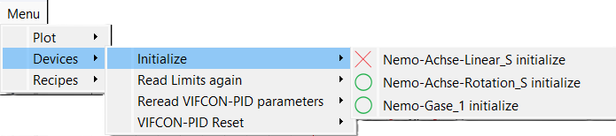
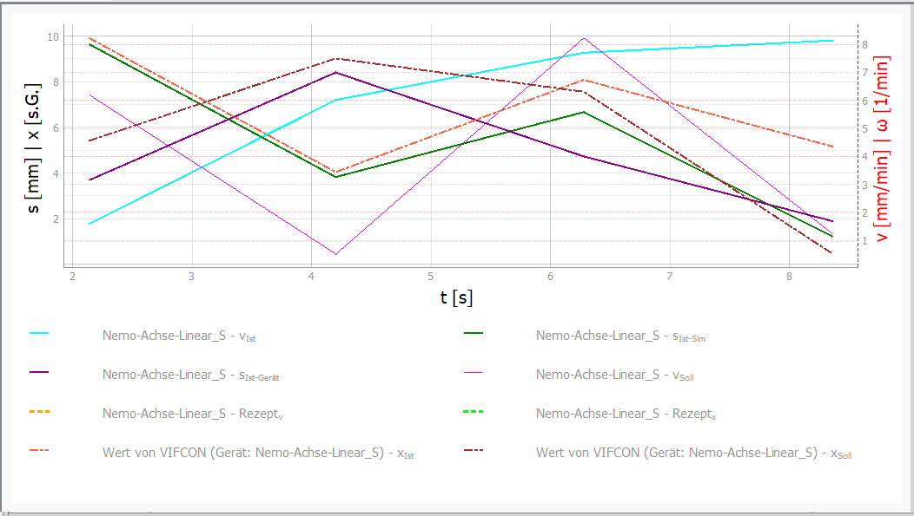
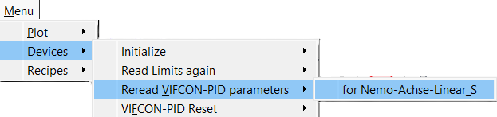
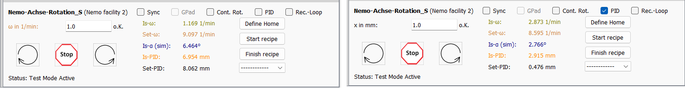
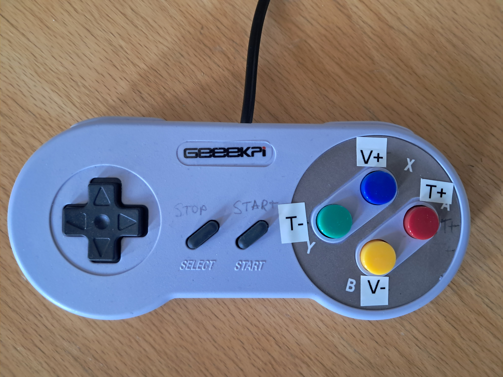

# Functions in VIFCON

This Readme describes and shows the most important functions of the VIFCON application. For example, the different modes such as gamepad and PID are explained, as well as special GUI functions. A table of contents is shown below:

1. [Initialization](#Initialization)
2. [Plot, legends and cursors](#Plot-legends-and-cursors)
3. [Menu](#Menu)
4. [Error display](#Error-display)
5. [Safe end state](#Safe-end-state)
6. [Synchro mode](#Synchro-mode)
7. [Recipe mode](#Recipe-mode)
8. [PID mode](#PID-mode)
9. [Gamepad mode](#Gamepad-mode)
10. [Multilog link](#Multilog-link)
11. [Test mode](#Test-mode)

## Initialization

When the VIFCON program is started, all configured devices are initialized. Certain start values ​​are read out and, if necessary, values ​​are sent to the device. The interface is then set up. In the [Configuration](Config_En.md), however, the setting `init` can be found under `start`. If **False** is selected there, the interface is set up but not yet used. In this case, the user can connect the device later and switch it on via the [Menu](#Menu). The only important thing is that the interface can be set up. This function does not enable communication via the interface.

The second point is that the device can be disconnected via the same menu (toggle). If the initialization was successful, a green circle is displayed in the menu and if there is a disconnection or an error, a red cross. The following figure shows this.



As soon as the device is initialized, the recording of the measured values ​​begins. If the initialization is switched off during operation, the curves from the device are no longer updated. This continues until the device is initialized again!

Switching off communication with the device can also lead to problems. For example, you have to check whether the drives are still running, as VIFCON cannot switch them off. With the TruHeat, the watchdog will trigger because there are no more constant read commands. Before reinitialization, the TruHeat generator must be set correctly again, which can only be done on the device itself.

### Start function

During initialization, certain values ​​are read out or sent to the device. The following shows what happens to the devices during initialization:

Device | What happens
--- | ---
Educrys drive (linear) | 1. Read actual position<br>2. Write start path (can be switched on and off - Config)<br>3. Write position limits (can be switched on and off - Config)
Educrys drive (rotation, fan) | nothing happens
Educrys heater | 1. Write PID values ​​(can be switched on and off - Config)<br>2. Set the mode (after Config)
Eurotherm | 1. Read information:<br>- Instrument identity, software version, instrument mode, display maximum, display minimum, setpoint maximum, setpoint minimum<br>2. Write PID values ​​(can be switched on and off - Config)<br>3. Read PID parameters (check)<br>4. Read status word and set mode (after config)<br>5. Change HO (if security false)<br>6. Read HO from (HO - maximum output power)
Nemo-Axis-Linear | 1. Read limits position<br>2. Read (Appendix 2) information<br>- TEO, TEU, SEO, SEU, Current position ruler, Position offset<br>
Nemo-Axis_Rotation | Nothing happens!
Nemo-Generator |1. Read max limits (P, I, U, f) and generator settings (name, type, interface (mode))<br>2. Set mode (coil)
PI-Axis | 1. Read information: <br>- Board address, status, version <br>2. Read start position
TruHeat | 1. Write watchdog timer<br>2. Read information:<br>- Software version, Module serial number, Power supply type, SIMIN, SUMIN, Maximum power, Maximum current, Maximum voltage, Active interface

## Plot, legends and cursors


### Plot

The [GUI](GUI_En.md) is what the user sees and uses for control. In addition to the device widgets, the GUI also displays measured values. These measured values ​​can either be seen once as a value (are logged) or shown as a curve. The plot contains all the curves configured for the measurement. If certain curves are not shown, this does not mean that they are not logged. In the [Configuration](Config_En.md) you will find the configuration `legend` under `GUI`. The desired curves are specified in this configuration. The following is an example:

```
devices:
  Eurotherm 3504: 
    # Config not displayed
    GUI:
      legend: RezOp ; RezT ; IWT ; IWOp ; SWT ; SWTPID ; IWTPID 
```

In the example, 7 curves would now be shown in the plot on the generator side. The curve *RezOp* would create the curve for an OP recipe. The VIFCON GUI contains two plots, one for the generators and one for the drives. Eurotherm has 13 different curves. By selecting, the operator can choose what he wants to see.

There are two y-axes in the plots, one on the left and one on the right. The sizes and the unit are on each axis, such as `v [mm/min]`. Scaling factors can also be set using the [Configuration](Config_En.md). These are also shown in the axis label: `v [mm/min]x0.1`
Only with the PID controller does `x [s.d.]` appear in the label. The s.d. stands for see device, since the unit can be configured with the PID controller and can therefore be different for all devices!

### Legend

If several devices are configured, the plot quickly becomes confusing. That's why there is a legend. There are three configurations for the legend in the configuration: Side, Out, In

The side legend is outside the plot and in separate widgets. The legend can be collapsed. In the case of the side legend, the two buttons *Set All Curves* and *Remove All Curves* become visible. With these buttons, all curves can be made visible or invisible. To be precise, the checkboxes are set and not set. There is also the configuration: l, r and rl - which shows the legend on the side of the y-axis. With l, all checkboxes are shown on the left y-axis! The example shows the rl setting.


With the out legend, a legend is created below the plot, in the same widget. The number of entries in a row can be set via the configuration.



With the in legend, a legend is created in the plot. The number of entries can also be configured here.


### Cursor

To the right of the plot and possibly the side legend there are further buttons. These buttons can be the following:

1. Stop all devices
2. Synchronous driving (drive only)
3. Auto scaling
4. Legends on and off (side legend only)

In the same widget at the bottom you will find the text yL, yR and x. These names indicate the axes and a value. If you move the mouse over the plot, the text changes and you can see the value of the mouse, the cursor. This allows the operator to display points in the plot!

## Menu


The menu is a GUI element that contains additional functions. This menu is divided into plot, devices and recipes. The following table shows the individual levels of the menu. Level 1 is the task bar, which only contains menu. The numbers indicate what belongs to which point. The image can be used as an example. The name "**Device Name**" is a placeholder for all configured devices - in the example, these would be Eurotherm and PI axis.

Level 1 | Menu | | |
------- |------|--------|----
Level 2 | Plot | Devices | Recipes
Level 3 | (1) Grid | (1) Initialize<br>(2) Read Limits again<br>(3) Reread VIFCON-PID parameters<br>(4) VIFCON-PID Reset<br>(5) Eurotherm - Read HO<br>(6) Eurotherm - Read PID parameters<br>(7) Eurotherm - Write PID parameters |(1) Start synchronously mode<br>(2) Finish synchronous mode<br>(3) Re-read all devices
Level 4 | (1.1) Generator - Toggle Grid On/Off<br>(1.2) Drive - Toggle Grid On/Off | (1.1) 'Device Name' initialize<br>(2.1) for 'Device Name'<br>(3.1) for 'Device Name'<br>(4.1) for 'Device Name'

The menu can be used to switch the grid in the plot on and off, initialize devices, re-read limits and parameters, reset the PID controller and read or write values ​​on the device. The recipe functions can also be switched on and off synchronously. The recipe re-read can also be triggered in this way.

Another feature of the menu is the key combination. If Alt and a certain letter are pressed, the menu opens further and the function is even triggered. The following table shows the level and the letter for the key combination. In level 4, all points with "**Device name**" have not been assigned a key combination. The arrow keys and Enter can then be used here. Each letter can be used once for each level! For the key combinations, hold down Alt and then enter the letters in order! As an alternative to the key combination, the mouse can be used.

Menu item | Level | Letter
-----------|--------|-----------------
Menu                                | 1 | M
Plot                                | 2 | P
Grid                                | 3 | G
Generator - Toggle Grid On/Off      | 4 | T
Drive - Toggle Grid On/Off          | 4 | O
Devices                             | 2 | D
Initialize                          | 3 | I
Read Limits again                   | 3 | L
Read VIFCON-PID parameters          | 3 | V
VIFCON-PID Reset                    | 3 | F
Eurotherm - Read HO                 | 3 | H
Eurotherm - Read PID parameters     | 3 | R
Eurotherm - Write PID parameters    | 3 | W
Recipes                             | 2 | R
Start synchronous mode              | 3 | S
Finish synchronous mode             | 3 | F
Re-read all devices                 | 3 | A

**Examples:**

Alt+M+R+A --> All recipes are reloaded!   
Alt+M+P+G+T --> Toggles the grid of the generator plot

The following image shows the keyboard shortcut displayed in the GUI. The letters shown in the table are underlined when Alt is pressed.




## Error display

Every device has an error display. This function is there to alert the operator directly to an error. All errors and warnings are only logged if correctly configured. However, certain errors or warnings are displayed directly in the widget. When the device is functioning, the operator sees an "o.k." and, if an error occurs, a big red "**Error**". To see the warning, the operator must look at the **tooltip**. The following warnings can appear:

1. Error with the input:
    - Incorrect input
    - Incorrect input
    - Limit exceeded
2. Recipe
    - No recipe selected
    - Limit exceeded in the segment
    - Recipe does not match the mode (e.g. PID)

Some devices also have specific points, such as the PI axis in the selection of relative and absolute position point. Furthermore, some devices have two error messages, one for each input field. If one of the limits is reached for the drives, the drive is stopped and a message appears. If the operator now wants to continue driving but the limit has been reached, this is prevented and the warning changes so that the direction is no longer possible.

## Safe end state

When a program is closed, things may also need to be brought into a **safe end state**. In the [configuration](Config_En.md) there is a configuration called `ende`. If this is set to True, a function is executed when the program exits. This function calls the stop functions of the desired devices! The following table shows what happens with the devices:

Device | What happens
--- | ---
Educrys drive       | Axis stops
Educrys heater      | Switch on manual mode, power to zero
Eurotherm           | Switch on manual mode, power to zero
Nemo axis linear    | Axis stops
Nemo axis rotation  | Axis stops
Nemo generator      | Set all setpoints (P, U, I) to zero, switch off generator
PI axis             | Axis stops
TruHeat             | Set all setpoints (P, U, I) to zero, switch off generator

Functions such as PID and recipe mode are terminated on all devices.

## Synchro mode

In VIFCON there is a synchro mode, which allows the drives to be started simultaneously and also allows this to be done with the recipes of all devices. This is triggered by the following buttons:

1. [Menu](#Menu) (**Recipe Synchro-Start** and **Recipe Synchro-End**)
2. Parent buttons (**Stop All** and **⇈**)

You can see what these buttons look like in the picture in the chapter [Plot, Legends and Cursors](#Plot-Legends-and-Cursors).

With the exception of the **Stop All** function, the synchro mode must be activated by a **checkbox** (`Sync`). With this checkbox, the operator can decide which devices he wants to control at the same time. The two GUI buttons **Recipe Start** and **Recipe End** are triggered for the recipe options. The [recipe function](#recipe-mode) comes later and can also be found [outsourced](Rezepte_En.md).

The higher-level buttons are buttons that control all devices in the group. The groups include *generators/controllers* and *drives*. On both sides of the GUI there are the **Stop All** buttons that execute the stop function associated with the device. The other button, shown above, causes the axes to move. This means that the drives can be started at the same time. There are three groups of drives in the current implementation of VIFCON. These are:

1. Educrys system (fan, linear and rotary movement)
2. Nemo system (linear and rotary movement)
3. PI axis (linear movement)

In total there are 4 VIFCON modules in *device* and *view* (1xPI axis, 2xNemo, 1xEducrys). With the axes, it is important to note which direction the motor is moving in. All four modules have an input field for the speed. When the synchro function is started, a separate function or the left button is triggered directly (PI). With the Educrys and Nemo systems, the correct direction is passed on by the separate function. The sign in the speed input field determines the direction.

- **Educrys system:**
  Drive selection | <0 | >=0
  --- | --- | ---
  **L** | Down | Up
  **R** |CCW | CW
  **F** |/ | Rotates
- **Nemo system:**
  Drive selection | <0 | >=0
  --- | --- | ---
  **Linear** | Down | Up
  **Rotation** |CCW | CW

This is different with the PI axis. In order to trigger a movement, a position is also required, which must be entered in the corresponding input field. Unlike the other drives, only absolute movement is permitted here. With the PI axis, you can switch between relative and absolute movement. In absolute mode, the left button becomes the start button for this movement. As soon as an error occurs in the input fields (no input, incorrect input, limit exceeded) or due to the wrong mode, no axis is set in motion and the error is displayed on the axis!

## Recipe mode

The recipe function is one of the most important functions for automating processes. The most important points, such as the structure of the recipes, are explained in more detail in [another Readme file](Rezepte_En.md). Examples of different recipes can also be found there. The recipe mode can be triggered on all devices that can be found in the control tab. It is therefore only not available on the two monitoring devices. The recipe mode contains four functions. These are:

1. Starting a recipe (button, menu)
2. Ending a recipe (button, menu)
3. Selecting a recipe (combo box)
4. Re-reading the configuration (menu)

From the list you can see that the recipes can be started and ended using both a button and the menu. The menu functions belong to the [synchronous mode](#Synchro-mode). As soon as the checkbox is activated, all selected recipes can be started and ended. Furthermore, the configuration can be re-read for all devices. In this case, the combo box changes. In the event of an error, this is displayed in the device widget. Each device has a stop function. If this is triggered, the recipe mode is also ended, which also means that the stop buttons have this effect.

The buttons for start and stop only trigger the recipe of the respective device widget. When VIFCON is started or when the configuration is re-read, the combo box is created or updated. By default, there is only a dashed line in the box. If you click on the box, all the recipes for the device are displayed. If something is wrong with the selection, this is displayed as an error message in an error label. If the recipe is correct, the recipe curve is displayed. The curve itself is only displayed if it was selected in the legend configuration. The recipe itself also works without a curve displayed. An example of a curve is Rezv. When you start, the curve is recreated at the start time.

Some devices also have the ability to repeat a recipe. This is shown by a **checkbox** (`Rec.-Loop`). If this is activated, the curve is displayed repeatedly when selected and started. If the recipe has 5 segments and is repeated 3 times, 20 segments will be displayed (1x basic and 3x repeated).

## PID mode

The PID mode is a mode that all devices have. This can be enabled via the [Configuration](Config_DE.md). The enablement is done individually for each device. The configuration `PID_Active` can be found under `PID`. If this is set to True, the **Checkbox** `PID` can be set in the GUI. As soon as this has happened, the GUI changes partially.



The difference is that the label of the input field changes so that the user knows which value he is entering there. Furthermore, the tooltip of the input field is deleted and only returns when the PID mode is switched off. The necessary parameter data and limits can be found in the tooltip of the checkbox. The individual device widgets can be found in the readme for the [GUI](GUI_En.md). With the TruHeat and Nemo generator, something more happens with the value labels. There, the selected size is swapped with `Set-PID`. With Eurotherm, the GUI is set to manual mode.

In PID mode, the PID setpoint is now specified in the input field and sent using the same buttons. The direction of movement for the axes must also be selected. The [Recipe function](#Recipe mode) and the [Synchro function](#Synchro mode) also work with PID mode.

Using the `Value_Origin` configuration under `PID` of the respective device, you specify the origin of the actual and setpoint values ​​for the controller. VV, VM, MM and MV can be selected here. V stands for VIFCON and M for [Multilog](#Multilog-link). The first letter indicates the actual value and the second the setpoint. MV means that the actual value comes from Multilog and the setpoint is given by VIFCON.

The PID can be reset via the [Menu](#Menu). This reset is also carried out on the generators when switching back and forth between P, U and I.

## Gamepad mode

In gamepad mode, a gamepad is used to control the drives. Here, too, this mode must be set via the [Configuration](Config_En.md). The configuration is called `General_GamePad` and can be found under `Function_Skip`. The devices themselves have the configuration `gamepad_Button`, where a string must be specified for the button assignment.

In order to be able to use the gamepad, a **checkbox** (`GPad`) must be set in the GUI for the devices. This means that certain drives can also be excluded from control with the gamepad.

The gamepad used looks like this:



Drive | Description | Buttons
--- | --- | ---
PI-Achse | PIh | ← & → (Axis)
PI-Achse | PIz | ↑ & ↓ (Axis)
PI-Achse | PIx | X & B (Button)
PI-Achse | PIy | Y & A (Button)
Nemo-Achse-Linear | HubS | X & B (Button) 
Nemo-Achse-Linear | HubT | ↑ & ↓ (Axis) 
Nemo-Achse-Rotation | RotS | Y & A (Button) 
Nemo-Achse-Rotation | RotT | ← & → (Axis) 
Educrys-Antrieb | EduL | X, B, ↑ & ↓ 
Educrys-Antrieb | EduR | A, Y, ← & →
Educrys-Antrieb | EduF | Start

For all devices, `Select` stops the drives.

## Multilog Link

Multilog is a software that was programmed by IKZ. This can be found on GitHub in the link:

https://github.com/nemocrys/multilog

Multilog is a logging software. In collaboration with VIFCON there are now two tasks:

1. Logging the VIFCON measured values
2. Providing data for the PID controller in VIFCON

Both cases work with a TCP connection. For this, ports and triggers must be defined that are identical on both sides (both programs). If used, VIFCON must be started before Multilog. To prevent VIFCON from hanging when creating the port, there is a timeout, as the configuration of the order of the ports also plays a role. First the logging ports (Write) and then the reading ports (Read) must be defined. In order to be able to assign the values ​​correctly, triggers are required, which must also be specified in the VIFCON configuration. Examples of **Write** and **Read** at Eurotherm are shown below:

**Example write:**

```
Trigger:	Eurotherm1		(Config: write_trigger)
Port:		56000			(Config: write_port)
```

For Multilog, the trigger can be found as a device and the port is defined under *Port-Vifcon*.

Multilog device | VIFCON device
--- | ---
Vifcon_achsen | PI-Achse<br>Nemo-Achse-Linear<br>Nemo-Achse-Rotation
Vifcon_gase | Nemo-Gase
Vifcon_generator | TruHeat<br>Nemo-Generator

For *Vifcon_gase* and *Vifcon_generator*, the device names are used as triggers. For *Vifcon_achsen*, separate triggers are defined. The Multilog config must be viewed for this.

*Example send (from VIFCON):*
```
b'{"Time": 19.129, "MFC24": 6.849, "MFC25": 9.612, "MFC26": 4.186, "MFC27": 5.322, "DM21": 1.174, "PP21": 4.836, "PP22": 8.51, "PP21Status": 128, "PP22Status": 128, "PP22I": 0.815, "PP22mPtS": 0.044, "MV1_I": 8.858, "MV1_S": 1.995, "MV1_VS": 3.164, "MV1_SG": 7.975, "MV1Status": 128, "MFC24_S": 5.472, "MFC24_FM": 0.565, "MFC24Status": 128, "MFC25_S": 9.022, "MFC25_FM": 9.891, "MFC25Status": 128, "MFC26_S": 6.241, "MFC26_FM": 2.035, "MFC26Status": 128, "MFC27_S": 3.923, "MFC27_FM": 9.772, "MFC27Status": 128, "V1Status": 128, "V2Status": 128, "V3Status": 128, "V4Status": 128, "V5Status": 128, "V6Status": 128, "V7Status": 128, "V17Status": 128, "KWKDF_1": 3.569, "KWKDF_2": 9.925, "KWKDF_3": 0.032, "KWKDF_4": 8.041, "KWKDF_5": 9.315, "KWKDF_6": 9.633, "KWKDF_7": 8.748, "KWKDF_8": 5.485, "KWKDF_9": 7.288, "KWKT_1": 6.006, "KWKT_2": 3.757, "KWKT_3": 2.903, "KWKT_4": 9.568, "KWKT_5": 0.838, "KWKT_6": 2.94, "KWKT_7": 8.181, "KWKT_8": 7.474, "KWKT_9": 7.192, "KWK5_In": 5.11, "KWK5_Out": 9.273, "KWK5_diff": 1.379, "KWK46_In": 3.342, "KWK46_Out": 3.738, "KWK46_diff": 4.543, "ASTO": 2.451, "ASTM": 6.961, "ASTU": 3.197, "ASBMStatus": 128, "ASStatus": 128}'
```

In the example, the dictionary is sent by Nemo-Gase!

**Example read:**

```
Trigger-actual value:	IGA-6-23-adv  (Config: read_trigger_ist)
Port-actual value:	59001         (Config: read_port_ist)
Trigger-setpoint:       DAQ-6510      (Config: read_trigger_soll)
Port-setpoint:          59002         (Config: read_port_soll)
```

Here too, the triggers are the device names in the multilog config. However, you have to be careful with some devices, as the transmission includes more than the device name! Several sensors can be defined for the DAQ multimeter. Since the function has to do with the PID controller in VIFCON, there are a few more settings in the config under PID.

```
actual sensor value:		no sensor                             	(Config: Multilog_Sensor_Ist)
sensor setpoint:	        TE_1_K air 155 mm over crucible 	(Config: Multilog_Sensor_Soll)
```

If the dictionary of values ​​has no sub-sensors, **“no sensor”** is specified. Otherwise, the sensor from the Multilog config is specified.

*Example Received:*
```
{'Series-600': {'Pyro_h1': 11.6}}
```

For the Series-600 pyrometer, the sensor information is required. In the example, you can see that there is another dictionary in the dictionary! The sensor is then specified as `Pyro_h1`!

If something goes wrong during setup or Multilog is closed, VIFCON reacts and terminates communication with the faulty connections, but continues running. The last value that arrived is remembered so that the program does not crash.

To switch on communication, the *Multilog_Link* configuration under *Function_Skip* must be set to True (1). This makes it possible for both programs to communicate with each other. On the one hand, all data is saved in the Multilog measurement folder and, on the other hand, Multilog measurement values ​​for the VIFCON PID controller can be used for all control devices.

## Test mode

At the start of a program, test mode can be switched on via the console (`-t`). This function allows VIFCON to be used without a device. The [Initialization](#Initialization), the [Recipe function](#Recipe mode) and other points can be viewed. However, it must be noted that the measurement values ​​shown are generated randomly. An example can be found in the [main readme](../README.md).

## Last change

The last change to this description was: March 13, 2025