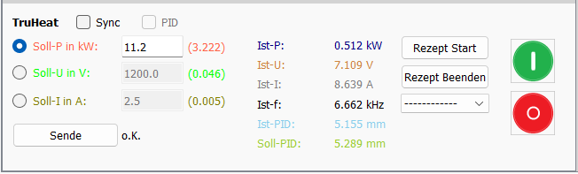
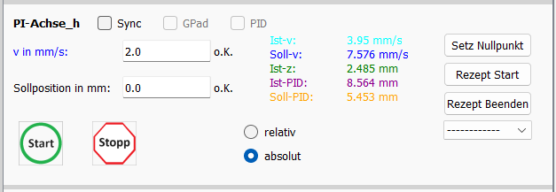

# Verschiedene Funktionen von VIFCON

In dieser Beschreibung sollen verschiedenen Funktionen von VIFCON wie z.B. der PID-Regler und die verschiedenen Knöpfe bzw. GUI-Widgets kurz erläutert werden. Mit dieser Beschreibung soll der Leser einen Eindruck zu den verschiedenen Möglichkeiten der Nutzung von VIFCON bekommen. 

## Letzte Änderung

Die Letzte Änderung dieser Beschreibung war: 16.7.2024

## Konfiguration

Durch die Config-Datei kann die gesammte GUI und ein mögliches Experiment angepasst werden. Über die Config-Datei und ihren Aufbau kann mehr in der Datei [Config_DE.md](Config_DE.md) gefunden werden. 

## Test-Modus

Durch den Test-Modus kann der Benutzer einen ersten Eindruck der GUI erhalten. Der Aufruf sieht wie folgt aus:

`python .\vifcon_main.py -t`

Im Test-Modus wird folgendes geschehen:
- GUI wird nach Config-Datei erstellt
- Zufallswerte werden im Plot angezeigt
- Kommunikation wird überbrückt 
- Ablaufdatei und Messordner werden nicht erstellt
- die Plots werden nicht gespeichert
- die Log-Datei wird erstellt und mann kann Ereignisse darin sehen

## Kommunikation

Wenn das Programm mit einem Gerät verwendet wird, also nicht im [Test-Modus](#test-modus), dann wird auch eine Kommunikation erstellt. Hierbei gibt es folgende Funktionen:

1. [Initialisierung](#initialisierung) An/Aus
2. [Benutzereingaben](#benutzereingabe) über die GUI
3. [Rezepte](#rezepte) 

Bei der Kommunikation wird entweder RS232 oder Ethernet mit Modbus verwendet. Die Modbus-Geräte sind speziell und bassieren auf der Nemo-1-Anlage des IKZ (speziell der Modellexperimente Gruppe). 

### Initialisierung

Diese Funktion wird durch die Config-Datei gesetzt. Hierbei ist volgendes zu beachten:

- Wenn der Port nicht exestiert, so wird das Programm sich beenden, da keien Kommunikation aufgebaut werden kann!
- Wenn der Port exestiert, jedoch noch nicht initialisiert wurde, so wird die Kommunikation bis zu diesem Zeitpunkt nicht durchgeführt.

**Bei Initialisierung:**
- Startwerte werden ausgelesen
- Messung beginnt
- Kommunikation beginnt 

### Benutzereingabe 

Wenn die Kommunikation läuft, so können die verschiedenen Funktionen der GUI verwendet werden, um Werte an die Geräte zu senden. Hierzu kann mehr in Kapitel [GUI-Funktionen](#gui-funktionen) gefunden werden. 

### Rezepte

Die Rezepte werden über die GUI gestartet und durch die Config-Datei geliefert. Mehr zu dem Aufbau der Rezepte kann in der Datei [Rezepte_DE.md](Rezepte_DE.md) gefunden werden. Bei den Rezepten werden Sollwerte an die Geräte gesendet. 

## GUI-Funktionen

Auf der Grapfischen Oberfläche finden sich unter Steuerung die Geräte-Widgets wieder. Neben den Geräte-Widgets gibt es auch andere Funktionen wie z.B. das Menü. So gibt es:

- [Geräte-Widgets](#geräte-widgets)
- [Menü-Leiste](#menü)
- [Übergeordnete Knöpfe](#übergeordnete-Knöpfe)

### Geräte-Widgets

Alle Widgets haben dabei ähnliche Bereiche:

Die einzelnen Bereiche können sich unterscheiden von Gerät zu Gerät. Bei einigen gibt es auch noch mehr Teile. Im Folgenden werden die einzelnen Geräte-Widgets und ihre Widgets erläutert. Einige Punkte doppeln sich von Gerät zu Gerät. 

#### Eurotherm

1. ***Checkbox-Bereich***
    - *Sync*: 
        - Durch das setzen dieser Checkbox, kann das Gerät durch den [Synchronen-Modus](#synchron-modus) des Menüs synchron mit anderen Geräten laufen. Dabei handelt es sich speziell um die Auslösung von Rezepten.
    - *PID*:
        - Durch das setzen dieser Checkbox, kann der [PID-Modus](#pid-modus) des Gerätes aktiviert werden. Somit wird der Sollwert (Ausgang) durch einen berechneten Wert vom Programm vorgegeben. 
2. ***Wert-Sende-Bereich*** 
    - Über einen **Radio-Button** kann ausgewählt werden, ob eine Temperatur oder eine Leistung (Operating Point) an Eurotherm gesendet werden soll. Durch den Radio-Button wird auch der Modus (Automatische Regelung, Manuelle Regelung) gewechselt. 
    - In die **Eingabefelder** wird der gewollte Sollwert eingetragen. 
    - Durch den **Knopf** Sende wird das Eingabefeld ausgelesen und an Eurotherm weitergeleitet. 
    - Das **Label** o.K. zeigt dabei die aktuelle Fehler-Meldung an. Wenn ein Fehler erscheint, so wird ein dickes rotes Fehler dastehen. Über den Tooltip (Maus auf Label) wird der genaue Fehler angezeigt. 
3. ***Wert-Lese-Bereich***
    - Hier werden die wichtigsten Werte angezeigt:
        - Ist-Temperatur
        - Operating Point (Ausgangsleistung)
        - neben Eingabefeld Temperatur Solltemperatur
4. ***Rezept-Bereich***
    - Hier können die einzelnen Rezepte für das Gerät ausgewählt und gestartet werden.
        - Rezept-Start (Knopf)
        - Rezept-Beenden (Knopf)
        - Rezept-Auswahl (Drop-Down-Anzeige)
    - Ein Rezept wird durch **Rezept-Start** gestartet, wenn ein Fehler vorliegt, so wird das Fehler-Label gesetzt. Wenn alles stimmt, wird die Kurve angezeigt bzw. aktuallisert und das Rezept beginnt. Nach Ablauf des Rezeptes beendet es sich selbst.
    - Ein Rezept kann auch zwischenzeitlich beendet werden. Hierfür wird das **Rezept-Ende** benötigt. 
    - Um ein **Rezept auszuwählen** wird das Drop-Down-Menü mit **-------** genutzt. Durch die Auswahl eines Rezeptes wird dieses direkt geprüft und bei Fehlerfreien Zustand als Kurve im Plot angezeigt. Bei Wechsel zu **-------** wird die Kurve entfernt. 

#### TruHeat

1. ***Checkbox-Bereich***
    - *Sync*: 
        - Durch das setzen dieser Checkbox, kann das Gerät durch den [Synchronen-Modus](#synchron-modus) des Menüs synchron mit anderen Geräten laufen. Dabei handelt es sich speziell um die Auslösung von Rezepten.
2. ***Wert-Sende-Bereich*** 
    - Über einen **Radio-Button** kann ausgewählt werden, ob eine Leistung, ein Strom oder eine Spannung an TruHeat gesendet werden soll. 
    - In die **Eingabefelder** wird der gewollte Sollwert eingetragen. 
    - Durch den **Knopf** Sende wird das Eingabefeld ausgelesen und an TruHeat weitergeleitet. 
    - Das **Label** o.K. zeigt dabei die aktuelle Fehler-Meldung an. Wenn ein Fehler erscheint, so wird ein dickes rotes Fehler dastehen. Über den Tooltip (Maus auf Label) wird der genaue Fehler angezeigt. 
3. ***Wert-Lese-Bereich***
    - Hier werden die wichtigsten Werte angezeigt:
        - Leistung
        - Spannung
        - Strom
        - Frequenz
4. ***Rezept-Bereich***
    - Hier können die einzelnen Rezepte für das Gerät ausgewählt und gestartet werden.
        - Rezept-Start (Knopf)
        - Rezept-Beenden (Knopf)
        - Rezept-Auswahl (Drop-Down-Anzeige)
    - Ein Rezept wird durch **Rezept-Start** gestartet, wenn ein Fehler vorliegt, so wird das Fehler-Label gesetzt. Wenn alles stimmt, wird die Kurve angezeigt bzw. aktuallisert und das Rezept beginnt. Nach Ablauf des Rezeptes beendet es sich selbst.
    - Ein Rezept kann auch zwischenzeitlich beendet werden. Hierfür wird das **Rezept-Ende** benötigt. 
    - Um ein **Rezept auszuwählen** wird das Drop-Down-Menü mit **-------** genutzt. Durch die Auswahl eines Rezeptes wird dieses direkt geprüft und bei Fehlerfreien Zustand als Kurve im Plot angezeigt. Bei Wechsel zu **-------** wird die Kurve entfernt. 
5. ***Extra-Bereich***
    - Bei dem TruHeat gibt es noch einen Einschalt- und Auschalt-Knopf. Diese wurden nach dem genutzten TruHear designt. Um den Induktor mit Leistung zu versorgen, muss der Generator eingeschaltet werden. 

#### PI-Achse

1. ***Checkbox-Bereich***
    - *Sync*: 
        - Durch das setzen dieser Checkbox, kann das Gerät durch den [Synchronen-Modus](#synchron-modus) des Menüs synchron mit anderen Geräten laufen. Hierbei können die Achsen synchron laufen oder ein synchrones Rezept gestartet werden. 
    - *GPad*:
        - Wenn diese Box gesetzt wird, dann kann diese Achse durch ein Gamepad gesteuert werden. 
2. ***Wert-Sende-Bereich*** 
    - In die **Eingabefelder** wird der gewollte Sollwert eingetragen. Bei der PI-Achse werden Geschwindigkeit und Sollposition/Fahrweg gleichzeitig gesendet. 
    - Bei den Achsen gibt es zwei bis drei **Knöpfe**:
        - Bewege dich Rechts/Links oder Auf/Ab oder Rein/Raus (Einstellung Config)
        - Bewege dich zu einer absoluten Position
        - Stoppe
    - Das **Label** o.K. zeigt dabei die aktuelle Fehler-Meldung an. Wenn ein Fehler erscheint, so wird ein dickes rotes Fehler dastehen. Über den Tooltip (Maus auf Label) wird der genaue Fehler angezeigt. Hierbei hat jedes Eingabefeld ein eigenes Fehler-Label.
    - Der **Radio-Button** ändert das Geräte-Widget. Bei *relativ* wird der gewollte Fahrweg abgefahren. Wenn jedoch absolut ausgewählt wurde, so wird eine Position angefahren. Zum Beispiel wird beim Weg 1 angegeben und befindet sich bei 9 mm:
        - relativ: Fährt 1 mm in die angegeben Richtung
        - absolut: Fährt nun 8 mm auf die Position 1 mm
3. ***Wert-Lese-Bereich***
    - Hier werden die wichtigsten Werte angezeigt:
        - Ist-Position
        - Ist-Geschwindigkeit
4. ***Rezept-Bereich***
    - Hier können die einzelnen Rezepte für das Gerät ausgewählt und gestartet werden.
        - Rezept-Start (Knopf)
        - Rezept-Beenden (Knopf)
        - Rezept-Auswahl (Drop-Down-Anzeige)
    - Ein Rezept wird durch **Rezept-Start** gestartet, wenn ein Fehler vorliegt, so wird das Fehler-Label gesetzt. Wenn alles stimmt, wird die Kurve angezeigt bzw. aktuallisert und das Rezept beginnt. Nach Ablauf des Rezeptes beendet es sich selbst.
    - Ein Rezept kann auch zwischenzeitlich beendet werden. Hierfür wird das **Rezept-Ende** benötigt. 
    - Um ein **Rezept auszuwählen** wird das Drop-Down-Menü mit **-------** genutzt. Durch die Auswahl eines Rezeptes wird dieses direkt geprüft und bei Fehlerfreien Zustand als Kurve im Plot angezeigt. Bei Wechsel zu **-------** wird die Kurve entfernt. 
5. ***Extra-Bereich***
    - Im Rezept-Bereich, also über den drei Teilen dieses Bereiches gibt es noch den Knopf *Setze Nullpunkt*. Mit der Funktion sagt man der Achse wo die Null-Position ist.

#### Nemo-1-Anlage Lineare Bewegung

1. ***Checkbox-Bereich***
    - *Sync*: 
        - Durch das setzen dieser Checkbox, kann das Gerät durch den [Synchronen-Modus](#synchron-modus) des Menüs synchron mit anderen Geräten laufen. Hierbei können die Achsen synchron laufen oder ein synchrones Rezept gestartet werden. 
    - *GPad*:
        - Wenn diese Box gesetzt wird, dann kann diese Achse durch ein Gamepad gesteuert werden. 
2. ***Wert-Sende-Bereich*** 
    - In die **Eingabefelder** wird der gewollte Sollwert eingetragen. Bei der Achse wird die Geschwindigkeit gesendet. 
    - Bei den Achsen gibt es drei **Knöpfe**:
        - Bewege dich Auf und Ab
        - Stoppe
    - Das **Label** o.K. zeigt dabei die aktuelle Fehler-Meldung an. Wenn ein Fehler erscheint, so wird ein dickes rotes Fehler dastehen. Über den Tooltip (Maus auf Label) wird der genaue Fehler angezeigt. Hierbei hat jedes Eingabefeld ein eigenes Fehler-Label.
3. ***Wert-Lese-Bereich***
    - Hier werden die wichtigsten Werte angezeigt:
        - Ist-Position (Programm berechnet)
        - Ist-Position (Modbus Register Anlage)
        - Ist-Geschwindigkeit
    - Status-Meldung unter Sende-Bereich
4. ***Rezept-Bereich***
    - Hier können die einzelnen Rezepte für das Gerät ausgewählt und gestartet werden.
        - Rezept-Start (Knopf)
        - Rezept-Beenden (Knopf)
        - Rezept-Auswahl (Drop-Down-Anzeige)
    - Ein Rezept wird durch **Rezept-Start** gestartet, wenn ein Fehler vorliegt, so wird das Fehler-Label gesetzt. Wenn alles stimmt, wird die Kurve angezeigt bzw. aktuallisert und das Rezept beginnt. Nach Ablauf des Rezeptes beendet es sich selbst.
    - Ein Rezept kann auch zwischenzeitlich beendet werden. Hierfür wird das **Rezept-Ende** benötigt. 
    - Um ein **Rezept auszuwählen** wird das Drop-Down-Menü mit **-------** genutzt. Durch die Auswahl eines Rezeptes wird dieses direkt geprüft und bei Fehlerfreien Zustand als Kurve im Plot angezeigt. Bei Wechsel zu **-------** wird die Kurve entfernt. 
5. ***Extra-Bereich***
    - Im Rezept-Bereich, also über den drei Teilen dieses Bereiches gibt es noch den Knopf *Setze Nullpunkt*. Mit der Funktion sagt man der Achse wo die Null-Position ist.

#### Nemo-1-Anlage Rotations Bewegung

1. ***Checkbox-Bereich***
    - *Sync*: 
        - Durch das setzen dieser Checkbox, kann das Gerät durch den [Synchronen-Modus](#synchron-modus) des Menüs synchron mit anderen Geräten laufen. Hierbei können die Achsen synchron laufen oder ein synchrones Rezept gestartet werden. 
    - *GPad*:
        - Wenn diese Box gesetzt wird, dann kann diese Achse durch ein Gamepad gesteuert werden. 
    - *Kont. Rot*:
        - Wenn dieser gesetzt wird, dann werden die Limits der Rotation abgestellt und die Achse kann unendlich lange rotieren. 
2. ***Wert-Sende-Bereich*** 
    - In die **Eingabefelder** wird der gewollte Sollwert eingetragen. Bei der Achse wird die Winkelgeschwindigkeit gesendet. 
    - Bei den Achsen gibt es drei **Knöpfe**:
        - Bewege dich im und gegen den Uhrzeigersinn (Betrachtung von vorne, Sicht Rezipienten)
        - Stoppe
    - Das **Label** o.K. zeigt dabei die aktuelle Fehler-Meldung an. Wenn ein Fehler erscheint, so wird ein dickes rotes Fehler dastehen. Über den Tooltip (Maus auf Label) wird der genaue Fehler angezeigt. Hierbei hat jedes Eingabefeld ein eigenes Fehler-Label.
3. ***Wert-Lese-Bereich***
    - Hier werden die wichtigsten Werte angezeigt:
        - Ist-Winkel (Programm berechnet)
        - Ist-Winkelgeschwindigkeit
    - Status-Meldung unter Sende-Bereich
4. ***Rezept-Bereich***
    - Hier können die einzelnen Rezepte für das Gerät ausgewählt und gestartet werden.
        - Rezept-Start (Knopf)
        - Rezept-Beenden (Knopf)
        - Rezept-Auswahl (Drop-Down-Anzeige)
    - Ein Rezept wird durch **Rezept-Start** gestartet, wenn ein Fehler vorliegt, so wird das Fehler-Label gesetzt. Wenn alles stimmt, wird die Kurve angezeigt bzw. aktuallisert und das Rezept beginnt. Nach Ablauf des Rezeptes beendet es sich selbst.
    - Ein Rezept kann auch zwischenzeitlich beendet werden. Hierfür wird das **Rezept-Ende** benötigt. 
    - Um ein **Rezept auszuwählen** wird das Drop-Down-Menü mit **-------** genutzt. Durch die Auswahl eines Rezeptes wird dieses direkt geprüft und bei Fehlerfreien Zustand als Kurve im Plot angezeigt. Bei Wechsel zu **-------** wird die Kurve entfernt. 
5. ***Extra-Bereich***
    - Im Rezept-Bereich, also über den drei Teilen dieses Bereiches gibt es noch den Knopf *Setze Nullpunkt*. Mit der Funktion sagt man der Achse wo die Null-Position ist.

#### Nemo-1-Anlage Gase

Das Widget zeigt die Nemo-1-Anlagen Sensoren für Druck und Durchfluss, sowie der Status der Pumpen. Hierbei handelt es sich um ein Monitioring Widget. 

## Modus

### Synchron-Modus

### PID-Modus