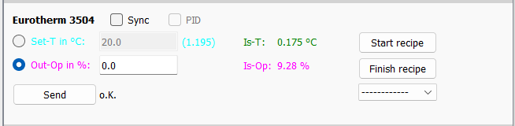
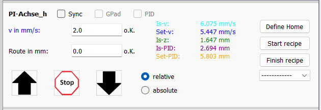
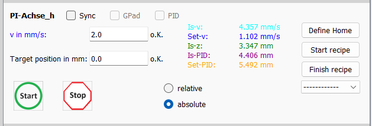
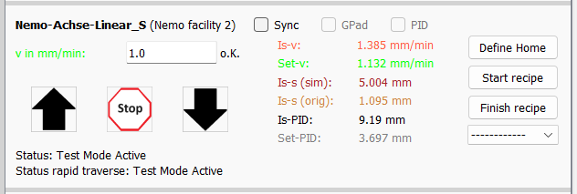

# Various functions of VIFCON

This description briefly explains various functions of VIFCON, such as the PID controller and the various buttons or GUI widgets. This description is intended to give the reader an impression of the various ways of using VIFCON.

## Last change

The last change to this description was: July 16, 2024

## Configuration

The config file can be used to customize the entire GUI and a possible experiment. More information about the config file and its structure can be found in the file [Config_En.md](Config_En.md).

## Test mode

The test mode allows the user to get a first impression of the GUI. The call looks like this:

`python .\vifcon_main.py -t`

In test mode the following will happen:
- GUI is created according to config file
- Random values ​​are displayed in the plot
- Communication is bridged
- Run file and measurement folder are not created
- Plots are not saved
- Log file is created and you can see events in it

## Communication

If the program is used with a device, i.e. not in [test mode](#test-mode), then communication is also created. The following functions are available:

1. [Initialization](#initialization) On/Off
2. [User input](#user-input) via the GUI
3. [Recipes](#recipes)

For communication, either RS232 or Ethernet with Modbus is used. The Modbus devices are special and based on the Nemo-1 system of the IKZ (especially the model experiments group).

### Initialization

This function is set by the config file. The following must be observed:

- If the port does not exist, the program will terminate because no communication can be established!

- If the port exists but has not yet been initialized, communication will not be carried out until this point.

**During initialization:**
- Start values ​​are read
- Measurement begins
- Communication begins

### User input

When communication is running, the various functions of the GUI can be used to send values ​​to the devices. More on this can be found in chapter [GUI functions](#gui-functions).

### Recipes

The recipes are started via the GUI and delivered via the config file. More information about the structure of the recipes can be found in the file [Rezepte_En.md](Rezepte_En.md). The recipes send target values ​​to the devices.

## GUI functions

The device widgets can be found under Control on the graphical interface. In addition to the device widgets, there are also other functions such as the menu. There are:

- [Device widgets](#device-widgets)
- [Menu bar](#menu)
- [Parent buttons](#parent-buttons)

### Geräte-Widgets

All widgets have similar areas:

The individual areas may vary from device to device. Some may have more parts. The individual device widgets and their widgets are explained below. Some points are duplicated from device to device.

#### Eurotherm

1. ***Checkbox area***
    - *Sync*:
        - By setting this checkbox, the device can run synchronously with other devices using the [Synchronous mode](#synchronous-mode) of the menu. This specifically involves the triggering of recipes.
    - *PID*:
        - By setting this checkbox, the [PID mode](#pid-mode) of the device can be activated. The setpoint (output) is thus specified by a calculated value from the program.
2. ***Value send area***
    - A **radio button** can be used to select whether a temperature or a power (operating point) should be sent to Eurotherm. The radio button also changes the mode (automatic control, manual control).
    - The desired setpoint is entered in the **input fields**.
    - The **Send** button reads the input field and forwards it to Eurotherm.
    - The **label** OK shows the current error message. If an error occurs, a large red error will appear. The exact error is displayed via the tooltip (mouse on label).
3. ***Value reading area***
    - The most important values ​​are displayed here:
        - Actual temperature
        - Operating point (output power)
        - next to the temperature input field, target temperature
4. ***Recipe area***
    - Here you can select and start the individual recipes for the device.
        - Recipe start (button)
        - Recipe end (button)
        - Recipe selection (drop-down display)
    - A recipe is started by **Recipe start**, if there is an error, the error label is set. If everything is correct, the curve is displayed or updated and the recipe begins. After the recipe has finished, it ends itself.
    - A recipe can also be ended in the meantime. The **Recipe end** is required for this.
    - To select a **recipe**, use the drop-down menu with **-------**. By selecting a recipe, it is checked directly and, if there are no errors, is displayed as a curve in the plot. If you switch to **-------**, the curve is removed.

#### TruHeat

1. ***Checkbox area***
    - *Sync*:
        - By setting this checkbox, the device can run synchronously with other devices using the [Synchronous mode](#synchronous-mode) of the menu. This specifically concerns the triggering of recipes.
2. ***Value send area***
    - A **radio button** can be used to select whether a power, current or voltage should be sent to TruHeat.
    - The desired target value is entered in the **input fields**.
    - The input field is read out and forwarded to TruHeat using the **Send** button.
    - The **label** OK shows the current error message. If an error occurs, a large red error will appear. The exact error is displayed using the tooltip (mouse over label).
3. ***Value reading area***
    - The most important values ​​are displayed here:
        - Power
        - Voltage
        - Current
        - Frequency
4. ***Recipe area***
    - Here you can select and start the individual recipes for the device.
        - Recipe start (button)
        - Recipe end (button)
        - Recipe selection (drop-down display)
    - A recipe is started by **Recipe start**, if there is an error, the error label is set. If everything is correct, the curve is displayed or updated and the recipe begins. After the recipe has finished, it ends itself.
    - A recipe can also be ended in the meantime. The **Recipe end** is required for this.
    - To select a **recipe**, use the drop-down menu with **-------**. By selecting a recipe, it is checked directly and, if there are no errors, is displayed as a curve in the plot. If you switch to **-------**, the curve is removed.
5. ***Extra area***
    - The TruHeat also has an on and off button. These were designed based on the TruHear used. In order to supply the inductor with power, the generator must be switched on.

#### PI-Achse

1. ***Checkbox area***
    - *Sync*:
        - By setting this checkbox, the device can run synchronously with other devices using the [Synchronous mode](#synchronous-mode) in the menu. The axes can run synchronously or a synchronous recipe can be started.
    - *GPad*:
        - If this box is set, this axis can be controlled by a gamepad.
2. ***Value send area***
    - The desired target value is entered in the **input fields**. For the PI axis, the speed and target position/travel path are sent simultaneously.
    - There are two to three **buttons** on the axes:
        - Move right/left or up/down or in/out (config setting)
        - Move to an absolute position
        - Stop
    - The **label** OK shows the current error message. If an error occurs, a big red error will appear. The exact error is displayed via the tooltip (mouse on label). Each input field has its own error label.
    - The **radio button** changes the device widget. If *relative* is selected, the desired travel path is followed. However, if absolute is selected, a position is approached. For example, path 1 is specified and is at 9 mm:
        - relative: moves 1 mm in the specified direction
        - absolute: now moves 8 mm to the position 1 mm
3. ***Value reading area***
    - The most important values ​​are displayed here:
        - Actual position
        - Actual speed
4. ***Recipe area***
    - Here you can select and start the individual recipes for the device.
        - Recipe start (button)
        - Recipe end (button)
        - Recipe selection (drop-down display)
    - A recipe is started by **Recipe start**, if there is an error, the error label is set. If everything is correct, the curve is displayed or updated and the recipe begins. After the recipe has finished, it ends itself.
    - A recipe can also be ended in the meantime. The **Recipe end** is required for this.
    - To select a **recipe**, use the drop-down menu with **-------**. By selecting a recipe, it is checked directly and, if there are no errors, is displayed as a curve in the plot. If you switch to **-------**, the curve is removed.
5. ***Extra area***
    - In the recipe area, i.e. above the three parts of this area, there is the button *Define Home*. This function tells the axis where the zero position is.

#### Nemo-1-System Linear movement

1. ***Checkbox area***
    - *Sync*:
        - By setting this checkbox, the device can run synchronously with other devices using the [Synchronous mode](#synchronous-mode) in the menu. The axes can run synchronously or a synchronous recipe can be started.
    - *GPad*:
        - If this box is set, this axis can be controlled by a gamepad.
2. ***Value send area***
    - The desired target value is entered in the **input fields**. The speed is sent for the axis.
    - There are three **buttons** for the axes:
        - Move up and down
        - Stop
    - The **label** OK shows the current error message. If an error occurs, a big red error will appear. The exact error is displayed via the tooltip (mouse on label). Each input field has its own error label.
3. ***Value reading area***
    - The most important values ​​are displayed here:
        - Actual position (program calculated)
        - Actual position (Modbus register system)
        - Actual speed
    - Status message under send area
4. ***Recipe area***
    - Here you can select and start the individual recipes for the device.
        - Recipe start (button)
        - Recipe end (button)
        - Recipe selection (drop-down display)
    - A recipe is started by **Recipe start**, if there is an error, the error label is set. If everything is correct, the curve is displayed or updated and the recipe begins. After the recipe has finished, it ends itself.
    - A recipe can also be ended in the meantime. The **Recipe end** is required for this.
    - To select a **recipe**, use the drop-down menu with **-------**. By selecting a recipe, it is checked directly and, if there are no errors, is displayed as a curve in the plot. If you switch to **-------**, the curve is removed.
5. ***Extra area***
    - In the recipe area, i.e. above the three parts of this area, there is the button *Define Home*. This function tells the axis where the zero position is.

#### Nemo-1-System rotational movement

1. ***Checkbox area***
    - *Sync*:
        - By setting this checkbox, the device can run synchronously with other devices using the [Synchronous-mode](#synchronous-mode) in the menu. The axes can run synchronously or a synchronous recipe can be started.
    - *GPad*:
        - If this box is set, then this axis can be controlled by a gamepad.
    - *Cont. Rot*:
        - If this is set, then the rotation limits are turned off and the axis can rotate indefinitely.
2. ***Value send area***
    - The desired target value is entered in the **input fields**. The angular velocity is sent for the axis.
    - There are three **buttons** for the axes:
        - Move clockwise and anti-clockwise (viewed from the front, view of the recipient)
        - Stop
    - The **label** OK shows the current error message. If an error occurs, a big red error will appear. The exact error is displayed via the tooltip (mouse on label). Each input field has its own error label.
3. ***Value reading area***
    - The most important values ​​are displayed here:
        - Actual angle (program calculated)
        - Actual angular velocity
    - Status message under transmission area
4. ***Recipe area***
    - Here you can select and start the individual recipes for the device.
        - Recipe start (button)
        - Recipe end (button)
        - Recipe selection (drop-down display)
    - A recipe is started by **Recipe start**, if there is an error, the error label is set. If everything is correct, the curve is displayed or updated and the recipe begins. After the recipe has finished, it ends itself.
    - A recipe can also be ended in the meantime. The **Recipe end** is required for this.
    - To select a **recipe**, use the drop-down menu with **-------**. By selecting a recipe, it is checked directly and, if there are no errors, is displayed as a curve in the plot. If you switch to **-------**, the curve is removed.
5. ***Extra area***
    - In the recipe area, i.e. above the three parts of this area, there is the button *Set zero point*. This function tells the axis where the zero position is.

#### Nemo-1-Anlage Gase

The widget shows the Nemo-1 system sensors for pressure and flow, as well as the status of the pumps. This is a monitoring widget.

## Mode

### Synchronous mode

### PID mode