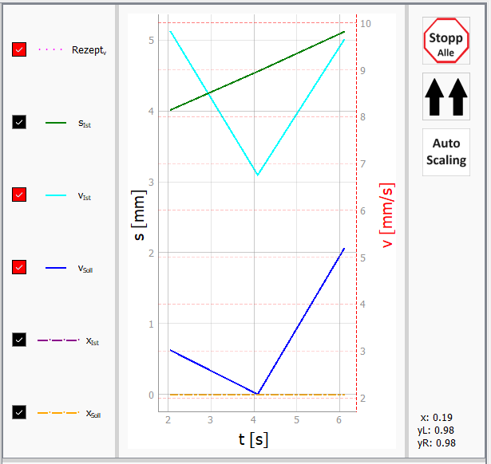
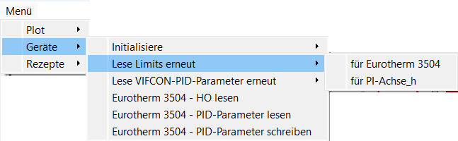
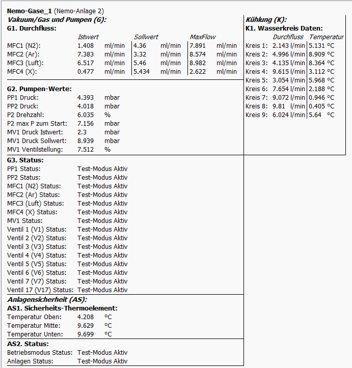
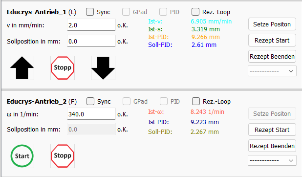
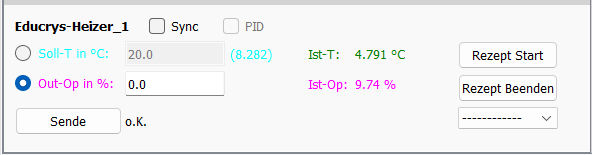
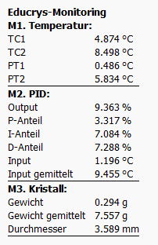
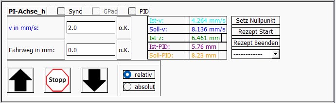
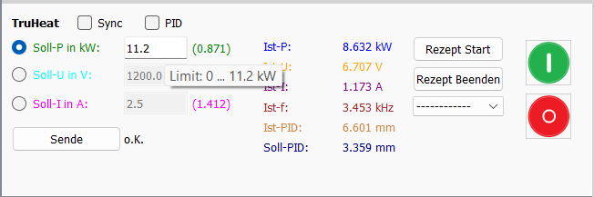
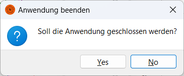

# GUI von VIFCON

Im folgenden werden die einzelnen Widgets der VIFCON-GUI gezeigt. Hierbei werden Besonderheiten gezeigt bzw. genannt. Die komplette GUI ist im [Readme](Readme_DE.md) zu sehen. Die GUI enthält neben einem Menü noch einen Plot.

## Plot

In dem Bild kann das Plot-Widget der Antriebsseite gesehen werden. Die Generator-Seite ist identisch, bis auf den einen Knopf für die **Synchrobewegung** der Antriebe/Achsen. Beide Seiten haben einen Knopf für den **Stopp aller Geräte**, für das **Auto Scaling**, für das **Setzen aller Kurven** und das **Entfernen aller Kurven**. Bei den Knöpfen im unteren Bereich findet man die Koordinaten des Maus-Cursor, wenn dieser im Plot ist. Alle anderen Punkte werden durch die Konfiguration verändert. Diese Punkte sind:

- die Position der Legende,
- die zu sehenden Kurven (Legende und Plot) und,
- die Skalierung der beiden y-Achsen.

Die beiden Knöpfe zum Setzen und Entfernen aller Legenden ist nur bei der Variante **Side** der Legenden Konfiguration nutzbar und wird daher nur dann angezeigt! In dem Beispiel ist diese Variante dargestellt. Wenn z.B. der Entferne alle Kurven Knopf betätigt wird, sowerden alle Checkboxen in der Legende auf False (Unckecked) gesetzt. Weiterhin wird dann keine Kurve im Plot mehr angezeigt. Der andere Knopf sorgt für das Gegenteil. 

## Menü

In dem Bild ist ein Beispiel für das Menü zu sehen. Das Menü besteht aus **Plot**, **Geräte** und **Rezepte** Einstellungen. Einige Einstellungen erscheinen nur bei bestimmten Geräten. Im Beispiel können drei Eurotherm spezifiche Punkte gesehen werden. Plot und Rezepte sind immer gleich. 

## Geräte-Widget

Im folgenden werden die einzelnen Geräte-Widgets gezeigt. Durch die Konfiguration können Teile der GUI freigeschaltet werden. Zum anderen kann es auch sein, das sich während bestimmten Prozessen, bestimmte Teile deaktivieren. Zum Beispiel kann der PID-Modus während eines laufenden Rezeptes nicht abgeschaltet werden. Dies ist dann durch eine ausgegraute PID-Checkbox zu sehen. Nicht alle möglichen GUI-Versionen werden hier gezeigt. Der PID-Modus ändert z.B. die Bezeichnungen (Labels) an den Eingabefeldern und die Istgrößen, sodas der Nutzer die PID-Eingangs und Ausgangsgrößen sehen kann. Die Farben ändern sich zu den Kurven. 

### Eurotherm

   

Stand des Bildes: 03.12.24

In dem Bild ist das Widget für den Eurotherm-Regler zu sehen. Bei diesem Widget kann man zwischen Temperatur (Automatisch) und Leitsung (Manuel) umschalten. Folgende Punkte beinhaltet das Widget:

1. Rezept Funktionen (Start, Beenden, Auswahl)
2. Syncro-Rezept Funktion freischalten (Checkbox)
3. PID-Modus einschalten (Checkbox)
4. Wert aus Eingabefeld Senden (Senden)
5. Das *o.K.* zeigt die Fehlermeldungen -> Wenn dort ein rotes und fettes *Fehler!* steht, kann man über den Tooltip sehen, welches Problem anliegt.

Im PID-Modus ändern sich dann die Bezeichnungen bzw. Farben der Soll- und Istgrößen.

### TruHeat

    

Stand des Bildes: 03.12.24

In dem Bild ist das Widget des TruHeat Generators zu sehen. Bei diesem Widget kann zwischen Leistung, Spannung und Strom gewählt werden. Folgende Punkte beinhaltet das Widget:

1. Rezept Funktionen (Start, Beenden, Auswahl)
2. Syncro-Rezept Funktion freischalten (Checkbox)
3. PID-Modus einschalten (Checkbox)
4. Wert aus Eingabefeld Senden (Senden)
5. Generator Ein- und Ausschalten
6. Das *o.K.* zeigt die Fehlermeldungen -> Wenn dort ein rotes und fettes *Fehler!* steht, kann man über den Tooltip sehen, welches Problem anliegt.

Im PID-Modus werden die gewählte Größe mit den PID-Werten getauscht. Wenn z.B. *Soll-I* gewählt ist, so wird dies mit *Soll-PID* getauscht. Bei der Anzeige der Werte steht dann *PID-Out. (I)*.

### PI-Achse

  

Stand der Bilder: 03.12.24

Die beiden Widgets gehören zur PI-Achse. Die Achse kann durch VIFCON relative Wege fahren oder absolute Positionen anfahren. Gesendet werden daher Geschwindigkeit und Weg oder Position. Folgende Punkte beinhaltet das Widget:

1. Rezept Funktionen (Start, Beenden, Auswahl)
2. Syncro-Rezept und Synchro-Fahr Funktion freischalten (Checkbox)
3. PID-Modus einschalten (Checkbox)
4. Wert aus Eingabefeld Senden (Start, Pfeile)
5. Antrieb Stoppen
6. Position auf Null setzen
7. Gamepad Nutzung aktivieren (Checkbox)
8. Das *o.K.* zeigt die Fehlermeldungen -> Wenn dort ein rotes und fettes *Fehler!* steht, kann man über den Tooltip sehen, welches Problem anliegt. Hier gibt es dies zweimal, für beide Größen.

Auch hier wechselt der PID-Modus die Sollwerte aus. Je nach Bewegungsrichtung (z, y, x) ändern sich die Pfeile bei der Relativen Bewegung. 

### Nemo-Anlage: Antrieb Hub

  

Stand des Bildes: 03.12.24

Das Widget gehört zu der Hub-Bewegung der Nemo-Anlagen-Antriebe. Im Beispiel wird das Widget der Nemo-Anlage 2 gezeigt. Bei Nemo-Anlage 1 gibt es den Eilgang Status nicht. Gesendet wird hier die Geschwindigkeit. Folgende Punkte beinhaltet das Widget:

1. Rezept Funktionen (Start, Beenden, Auswahl)
2. Syncro-Rezept und Synchro-Fahr Funktion freischalten (Checkbox)
3. PID-Modus einschalten (Checkbox)
4. Wert aus Eingabefeld Senden (Pfeile)
5. Antrieb Stoppen
6. Position auf Null setzen
7. Gamepad Nutzung aktivieren (Checkbox)
8. Das *o.K.* zeigt die Fehlermeldungen -> Wenn dort ein rotes und fettes *Fehler!* steht, kann man über den Tooltip sehen, welches Problem anliegt.
9. Statusmeldungen

Wie bei PI-Achse und TruHeat ändert der PID-Modus den einzugebenen Sollwert und wechselt diesen aus. 

### Nemo-Anlage: Antrieb Rotation

    

Stand des Bildes: 11.02.25

Das Widget gehört zu der Rotations-Bewegung der Nemo-Anlagen-Antriebe. Im Beispiel wird das Widget der Nemo-Anlage 2 gezeigt. Die Nemo-Anlage 1 ist identisch im Aufbau der GUI. Gesendet wird hier die Winkelgeschwindigkeit. Folgende Punkte beinhaltet das Widget:

1. Rezept Funktionen (Start, Beenden, Auswahl)
2. Syncro-Rezept Funktion freischalten (Checkbox)
3. PID-Modus einschalten (Checkbox)
4. Wert aus Eingabefeld Senden (Pfeile)
5. Antrieb Stoppen
6. Winkel auf Null setzen
7. Gamepad Nutzung aktivieren (Checkbox)
8. Kontinuierliche Rotation einschalten (Checkbox)
9. Das *o.K.* zeigt die Fehlermeldungen -> Wenn dort ein rotes und fettes *Fehler!* steht, kann man über den Tooltip sehen, welches Problem anliegt.
10. Statusmeldungen
11. Rezept Wiederholung (Checkbox)

Wie bei PI-Achse und TruHeat ändert der PID-Modus den einzugebenen Sollwert und wechselt diesen aus. 

### Nemo-Anlage: Monitoring

   

Stand der Bilder: 19.03.25

Je nach Anlage ist das Monitoring verschieden. Die Bilder zeigen die Monitorings-Werte der Nemo-1 und Nemo-2-Anlage des IKZ. 

### Nemo-Anlage: Generator

Stand der Bilder: 11.02.25

Das Widget zeigt das Nemo-Generator-Modul. Der Aufbau ist wie bei [TruHeat](#TruHeat).

### Educrys-Anlage: Antriebe
     

Stand der Bilder: 11.02.25

Das Widget zeigt das Educrys-Antriebs-Modul. Educrys hat drei ansprechbare Antriebs-Arten: **R**otation, **L**inear und **F**an. Die letzten beiden sind in dem Bild zu sehen. Je nach dem welcher der drei Antriebe ausgewählt wurde, ändern sich nur Kleinigkeiten. Bei Linear ist alles Verfügbar und bei Rotation und Fan wird das Position setzen und die Sollposition verriegelt, als auch die Knöpfe geändert. Beim Fan (Lüfter) braucht es nur einen Start Knopf. Bei der Rotation würden die Pfeile aus dem [Nemo-Rotations-Widget](#Nemo-Anlage:-Antrieb-Rotation) zu sehen sein. 

Folgende Punkte beinhaltet das Widget:
1. Bewegung starten (Pfeil oder Start)
2. Bewegung beenden (Stopp)
3. Synchro-Modus (Checkbox)
4. GamePad-Modus (Checkbox)
5. PID-Modus (Checkbox)
6. Rezept Wiederholungs Modus (Checkbox)
7. Rezept-Funktionen (Start, Ende, Auswahl)
8. Setze eine Position (nur Linear)
9. Einagbe von Geschwindigkeit und Sollposition

### Educrys-Anlage: Heizer
   

Stand der Bilder: 11.02.25

Das Widget zeigt das Educrys-Heizer-Modul. Der Aufbau ist wie bei [Eurotherm](#Eurotherm).

### Educrys-Anlage: Monitoring
     

Stand der Bilder: 11.02.25

Das Widget zeigt die Monitorings-Daten der Educrys-Anlage. 

## Weiteres

 

Durch die Konfigurationen können die Widget-Rahmen sichtbar gemacht werden, sodas eine Platzierung verbessert werden kann. Weiterhin können die Farben der Labels abgestellt werden. Die Farben bei den Labels spiegeln die dazugehörigen Kurven im Plot wieder. 

 

Alle Eingabefelder und die PID-Checkbox, zeigen die dazugehörigen Limits als Tool-Tip. Beim Nemo-Generator wird ein weitere Tool-Tip gegeben, welches die Schnittstellen Kombination und den ausgelesenen Namen des Generators beinhaltet. Diese Daten sind dann beim angezeigten Konfig-Namen zu finden (im Beispiel wäre das TruHeat oder PI-Achse_h).  

## Pop-Up-Fenster

In VIFCON gibt es verschiedene Pop-Up-Fenster. Diese Fenster können durch verschiedene Umstände aufgerufen werden. Am Ende der Anwendung, wenn diese über das Windows-X geschlossen werden soll, wird folgendes Fenster angezeigt. Mit *Yes* wird das schließen bestätigt und die Exit-Funktion von VIFCON ausgelöst.

 

Neben diesem Pop-Up-Fenster gibt es noch sechs weitere:

Gerät | Auslösung | Text
--- | --- | ---
Eurotherm           | sicherheit = 1 & Update Limit ausgelöst | Die maximale Ausgangsleistung (HO) wird nicht an das Limit angepasst! Die Einstellung Sicherheit wurde auf True gesetzt. Das bedeutet das der Wert nur direkt am Eurotherm geändert werden kann!      
Eurotherm           | sicherheit = 1 & Programm Start oder Init auf True  | Bitte beachten Sie, dass bei der Config-Einstellung "sicherheit" True der OPmax Wert nicht mit dem in dem Gerät übereinstimmen muss. Bitte Betätigen Sie zur Anpassung im Menü "Eurotherm HO lesen" oder Wechseln Sie in den Manuellen Modus, damit der OPmax-Wert in VIFCON aktualisiert wird!
Eurotherm           | Auswahl eines Rezeptes | Beachte Konfikuration am Gerät: 1. Sehe nach ob die richtige Einstellung für die Rampensteigung eingegeben ist (Am Eurotherm: Drücke 2xBlatt, 3xPfeil CCW -> Ramp Units -> Pfeiltasten zur Auswahl)(Achtung: Wähle das richtige Programm nach einmal Blatt)! 2. Beachte Konfigurationseinstellung (Eurotherm) "Servo" (Eurotherm-Rampe: Start Soll- oder Istwert)!!
Nemo-Achse-Rotation | Uncheck kontinuierliche Rotation | Das kontinuierlische rotieren wurde beendet. Bitte beachte, dass zu diesem Zeitpunkt bereits ein Limit überschritten sein kann. In Fall der Überschreitung setze den Winkel auf Null, schalte die kontinuierlische Rotation wieder ein oder fahre in die andere Richtung. Wenn z.B. das CCW Limit erreicht wurde, so kann der Antrieb noch immer bis zum CW Limit fahren.
Nemo-Generator      | Start von VIFCON oder Init auf True | Beachten Sie die Einstellungen des gewählten Generators! Diese werden als Tooltip beim Namen angezeigt und können in der Anlagen-GUI eingestellt werden!  Bei Änderung wird ein Neustart empfohlen!   
TruHeat             | Messzeit auf Null Sekunden setzen! Auch beim Init! | Der Watchdog sollte auf Null gesetzt (Deaktiviert) werden, da die Lese-Befehle ausgestellt worden sind.

## Letzte Änderung

Die Letzte Änderung dieser Beschreibung war: 11.02.2025