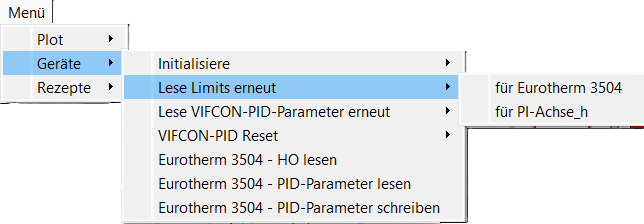
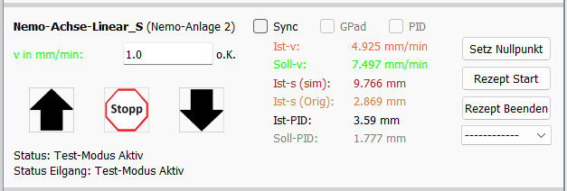
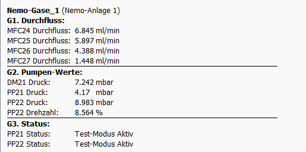

# GUI von VIFCON

Im folgenden werden die einzelnen Widgets der VIFCON-GUI gezeigt. Hierbei werden Besonderheiten gezeigt bzw. genannt. Die komplette GUI ist im [Readme](Readme_DE.md) zu sehen. Die GUI enthält neben einem Menü noch einen Plot.

## Plot

In dem Bild kann das Plot-Widget der Antriebsseite gesehen werden. Die Generator-Seite ist identisch, bis auf den einen Knopf für die **Synchrobewegung** der Antriebe/Achsen. Beide Seiten haben einen Knopf für den **Stopp aller Geräte** und für das **Auto Scaling**. Bei den Knöpfen im unteren Bereich findet man die Koordinaten des Maus-Cursor, wenn dieser im Plot ist. Alle anderen Punkte werden durch die Konfiguration verändert. Diese Punkte sind:

- die Position der Legende,
- die zu sehenden Kurven (Legende und Plot) und,
- die Skalierung der beiden y-Achsen.

## Menü

In dem Bild ist ein Beispiel für das Menü zu sehen. Das Menü besteht aus **Plot**, **Geräte** und **Rezepte** Einstellungen. Einige Einstellungen erscheinen nur bei bestimmten Geräten. Im Beispiel können drei Eurotherm spezifiche Punkte gesehen werden. Plot und Rezepte sind immer gleich. 

## Geräte-Widget

Im folgenden werden die einzelnen Geräte-Widgets gezeigt. Durch die Konfiguration können Teile der GUI freigeschaltet werden. Zum anderen kann es auch sein, das sich während bestimmten Prozessen, bestimmte Teile deaktivieren. Zum Beispiel kann der PID-Modus während eines laufenden Rezeptes nicht abgeschaltet werden. Dies ist dann durch eine ausgegraute PID-Checkbox zu sehen. Nicht alle möglichen GUI-Versionen werden hier gezeigt. Der PID-Modus ändert z.B. die Bezeichnungen (Labels) an den Eingabefeldern und die Istgrößen, sodas der Nutzer die PID-Eingangs und Ausgangsgrößen sehen kann. Die Farben ändern sich zu den Kurven. 

### Eurotherm

    
Stand des Bildes: 03.12.24

In dem Bild ist das Widget für den Eurotherm-Regler zu sehen. Bei diesem Widget kann man zwischen Temperatur (Automatisch) und Leitsung (Manuel) umschalten. Folgende Punkte beinhaltet das Widget:

1. Rezept Funktionen (Start, Beenden, Auswahl)
2. Syncro-Rezept Funktion freischalten (Checkbox)
3. PID-Modus einschalten (Checkbox)
4. Wert aus Eingabefeld Senden (Senden)
5. Das *o.K.* zeigt die Fehlermeldungen -> Wenn dort ein rotes und fettes *Fehler!* steht, kann man über den Tooltip sehen, welches Problem anliegt.

Im PID-Modus ändern sich dann die Bezeichnungen bzw. Farben der Soll- und Istgrößen.

### TruHeat

    
Stand des Bildes: 03.12.24

In dem Bild ist das Widget des TruHeat Generators zu sehen. Bei diesem Widget kann zwischen Leistung, Spannung und Strom gewählt werden. Folgende Punkte beinhaltet das Widget:

1. Rezept Funktionen (Start, Beenden, Auswahl)
2. Syncro-Rezept Funktion freischalten (Checkbox)
3. PID-Modus einschalten (Checkbox)
4. Wert aus Eingabefeld Senden (Senden)
5. Generator Ein- und Ausschalten
6. Das *o.K.* zeigt die Fehlermeldungen -> Wenn dort ein rotes und fettes *Fehler!* steht, kann man über den Tooltip sehen, welches Problem anliegt.

Im PID-Modus werden die gewählte Größe mit den PID-Werten getauscht. Wenn z.B. *Soll-I* gewählt ist, so wird dies mit *Soll-PID* getauscht. Bei der Anzeige der Werte steht dann *PID-Out. (I)*.

### PI-Achse

    
Stand der Bilder: 03.12.24

Die beiden Widgets gehören zur PI-Achse. Die Achse kann durch VIFCON relative Wege fahren oder absolute Positionen anfahren. Gesendet werden daher Geschwindigkeit und Weg oder Position. Folgende Punkte beinhaltet das Widget:

1. Rezept Funktionen (Start, Beenden, Auswahl)
2. Syncro-Rezept und Synchro-Fahr Funktion freischalten (Checkbox)
3. PID-Modus einschalten (Checkbox)
4. Wert aus Eingabefeld Senden (Start, Pfeile)
5. Antrieb Stoppen
6. Position auf Null setzen
7. Gamepad Nutzung aktivieren (Checkbox)
8. Das *o.K.* zeigt die Fehlermeldungen -> Wenn dort ein rotes und fettes *Fehler!* steht, kann man über den Tooltip sehen, welches Problem anliegt. Hier gibt es dies zweimal, für beide Größen.

Auch hier wechselt der PID-Modus die Sollwerte aus. Je nach Bewegungsrichtung (z, y, x) ändern sich die Pfeile bei der Relativen Bewegung. 

### Nemo-Anlage: Antrieb Hub

   
Stand des Bildes: 03.12.24

Das Widget gehört zu der Hub-Bewegung der Nemo-Anlagen-Antriebe. Im Beispiel wird das Widget der Nemo-Anlage 2 gezeigt. Bei Nemo-Anlage 1 gibt es den Eilgang Status nicht. Gesendet wird hier die Geschwindigkeit. Folgende Punkte beinhaltet das Widget:

1. Rezept Funktionen (Start, Beenden, Auswahl)
2. Syncro-Rezept und Synchro-Fahr Funktion freischalten (Checkbox)
3. PID-Modus einschalten (Checkbox)
4. Wert aus Eingabefeld Senden (Pfeile)
5. Antrieb Stoppen
6. Position auf Null setzen
7. Gamepad Nutzung aktivieren (Checkbox)
8. Das *o.K.* zeigt die Fehlermeldungen -> Wenn dort ein rotes und fettes *Fehler!* steht, kann man über den Tooltip sehen, welches Problem anliegt.
9. Statusmeldungen

Wie bei PI-Achse und TruHeat ändert der PID-Modus den einzugebenen Sollwert und wechselt diesen aus. 

### Nemo-Anlage: Antrieb Rotation

    
Stand des Bildes: 03.12.24

Das Widget gehört zu der Rotations-Bewegung der Nemo-Anlagen-Antriebe. Im Beispiel wird das Widget der Nemo-Anlage 2 gezeigt. Die Nemo-Anlage 1 ist identisch im Aufbau der GUI. Gesendet wird hier die Winkelgeschwindigkeit. Folgende Punkte beinhaltet das Widget:

1. Rezept Funktionen (Start, Beenden, Auswahl)
2. Syncro-Rezept Funktion freischalten (Checkbox)
3. PID-Modus einschalten (Checkbox)
4. Wert aus Eingabefeld Senden (Pfeile)
5. Antrieb Stoppen
6. Winkel auf Null setzen
7. Gamepad Nutzung aktivieren (Checkbox)
8. Kontinuierliche Rotation einschalten (Checkbox)
9. Das *o.K.* zeigt die Fehlermeldungen -> Wenn dort ein rotes und fettes *Fehler!* steht, kann man über den Tooltip sehen, welches Problem anliegt.
10. Statusmeldungen

Wie bei PI-Achse und TruHeat ändert der PID-Modus den einzugebenen Sollwert und wechselt diesen aus. 

### Nemo-Anlage: Monitoring

    
Stand der Bilder: 03.12.24

Je nach Anlage ist das Monitoring verschieden. Die Bilder zeigen die Monitorings-Werte der Nemo-1 und Nemo-2-Anlage des IKZ. 

## Weiteres

 

Durch die Konfigurationen können die Widget-Rahmen sichtbar gemacht werden, sodas eine Platzierung verbessert werden kann. Weiterhin können die Farben der Labels abgestellt werden. Die Farben bei den Labels spiegeln die dazugehörigen Kurven im Plot wieder. 

## Letzte Änderung

Die Letzte Änderung dieser Beschreibung war: 03.12.2024