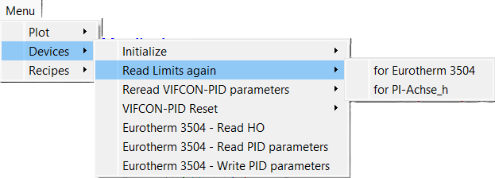
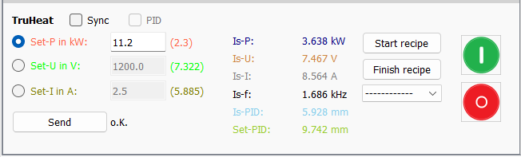
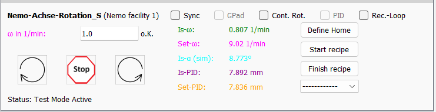
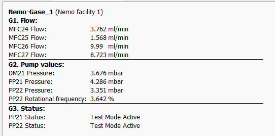
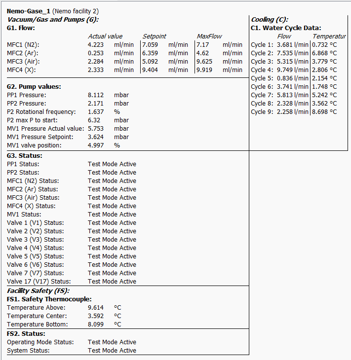

# GUI of VIFCON

The individual widgets of the VIFCON GUI are shown below. Special features are shown or mentioned. The complete GUI can be seen in the [Readme](../README.md). The GUI contains a menu and a plot.

## Plot

The plot widget of the drive side can be seen in the picture. The generator side is identical, except for the one button for the **synchronous movement** of the drives/axes. Both sides have a button for **stopping all devices** and for **auto scaling**. The buttons in the lower area contain the coordinates of the mouse cursor when it is in the plot. All other points are changed by the configuration. These points are:

- the position of the legend,
- the curves to be seen (legend and plot) and,
- the scaling of the two y-axes.

## Menu

The image shows an example of the menu. The menu consists of **Plot**, **Devices** and **Recipes** settings. Some settings only appear for certain devices. In the example, three Eurotherm-specific points can be seen. Plot and recipes are always the same.

## Device widget

The individual device widgets are shown below. Parts of the GUI can be activated through configuration. On the other hand, certain parts can also be deactivated during certain processes. For example, the PID mode cannot be switched off while a recipe is running. This can be seen by a grayed out PID checkbox. Not all possible GUI versions are shown here. The PID mode, for example, changes the labels on the input fields and the actual values ​​so that the user can see the PID input and output values. The colors change to match the curves.

### Eurotherm

Image status: 12/3/24

The image shows the widget for the Eurotherm controller. With this widget you can switch between temperature (automatic) and power (manual). The widget contains the following points:

1. Recipe functions (start, stop, selection)
2. Activate syncro recipe function (checkbox)
3. Activate PID mode (checkbox)
4. Send value from input field (send)
5. The *o.K.* shows the error messages -> If there is a red and bold *Error!* there, you can see what the problem is via the tooltip.

In PID mode, the names and colors of the target and actual values ​​then change.

### TruHeat

Image status: 12/3/24

The image shows the widget of the TruHeat generator. With this widget you can choose between power, voltage and current. The widget contains the following points:

1. Recipe functions (start, stop, selection)
2. Activate syncro recipe function (checkbox)
3. Activate PID mode (checkbox)
4. Send value from input field (send)
5. Switch generator on and off
6. The *o.K.* shows the error messages -> If there is a red and bold *Error!* there, you can see what the problem is via the tooltip.

In PID mode, the selected size is swapped with the PID values. If, for example, *Target-I* is selected, this is exchanged with *Target-PID*. The values ​​will then be displayed as *PID-Out. (I)*.

### PI axis

Images as of: 12/3/24

The two widgets belong to the PI axis. The axis can travel relative distances or move to absolute positions using VIFCON. Speed ​​and distance or position are therefore sent. The widget contains the following points:

1. Recipe functions (start, end, selection)
2. Activate synchro recipe and synchro drive function (checkbox)
3. Activate PID mode (checkbox)
4. Send value from input field (start, arrows)
5. Stop drive
6. Set position to zero
7. Activate gamepad use (checkbox)
8. The *o.K.* shows the error messages -> If there is a red and bold *Error!* there, you can see what the problem is via the tooltip. There are two of these here, for both sizes.

Here, too, the PID mode changes the setpoints. Depending on the direction of movement (z, y, x), the arrows change during relative movement.

### Nemo system: Drive stroke

Image status: 12/3/24

The widget belongs to the stroke movement of the Nemo system drives. The example shows the widget of Nemo system 2. The rapid traverse status does not exist for Nemo system 1. The speed is sent here. The widget contains the following points:

1. Recipe functions (start, stop, selection)
2. Activate synchro recipe and synchro drive function (checkbox)
3. Activate PID mode (checkbox)
4. Send value from input field (arrows)
5. Stop drive
6. Set position to zero
7. Activate gamepad use (checkbox)
8. The *o.K.* shows the error messages -> If there is a red and bold *Error!* there, you can see what the problem is via the tooltip.
9. Status messages

As with the PI axis and TruHeat, the PID mode changes the setpoint to be entered and replaces it.

### Nemo system: Drive rotation

Image status: 12/3/24

The widget belongs to the rotation movement of the Nemo system drives. The example shows the widget of Nemo system 2. Nemo system 1 has an identical GUI structure. The angular velocity is sent here. The widget contains the following points:

1. Recipe functions (start, stop, selection)
2. Activate syncro recipe function (checkbox)
3. Activate PID mode (checkbox)
4. Send value from input field (arrows)
5. Stop drive
6. Set angle to zero
7. Activate gamepad use (checkbox)
8. Activate continuous rotation (checkbox)
9. The *o.K.* shows the error messages -> If there is a red and bold *Error!* there, you can see what the problem is via the tooltip.
10. Status messages

As with the PI axis and TruHeat, the PID mode changes the setpoint to be entered and replaces it.

### Nemo system: Monitoring

Status of images: 12/3/24

Monitoring varies depending on the system. The images show the monitoring values ​​of the Nemo-1 and Nemo-2 systems of the IKZ.

### Nemo system: generator

The widget shows the Nemo generator module. The structure is the same as [TruHeat](#TruHeat).

## More

The configurations can be used to make the widget frames visible so that placement can be improved. The colors of the labels can also be turned off. The colors of the labels reflect the corresponding curves in the plot.

All input fields and the PID checkbox show the corresponding limits.

## Pop-up window

In VIFCON there are various pop-up windows. These windows can be called up under various circumstances. At the end of the application, when it is to be closed using Windows-X, the following window is displayed. *Yes* confirms the closing and triggers the VIFCON exit function.

In addition to this pop-up window, there are six more:

Device | Trigger | Text
--- | --- | ---
Eurotherm           | security = 1 & update limit triggered | The maximum output power (HO) is not adjusted to the limit! The Security setting has been set to True. This means that the value can only be changed directly on the Eurotherm!kann!      
Eurotherm           | security = 1 & program start or init to True | Please note that with the config setting "security" True, the OPmax valuedoes not have to match that in the device. To adjust, please press "Read Eurotherm HO" in the menu or switch to manual mode so that the OPmax value is updated in VIFCON!
Eurotherm           | selecting a recipe | Note the configuration on the device: 1. Check whether the correct setting for the ramp gradient has been entered (On Eurotherm: Press 2xSheet, 3xArrow CCW -> Ramp Units -> arrow keys to select)(Attention: Select the correct program after one sheet)! 2. Note configuration setting (Eurotherm) "Servo" (Eurotherm ramp: start setpoint or actual value)!!
Nemo-Achse-Rotation | Uncheck continuous rotation | Continuous rotation has ended. Please note that a limit may already have been exceeded at this point. If this limit is exceeded, set the angle to zero, switch continuous rotation back on or move in the other direction. If, for example, the CCW limit has been reached, the drive can still move up to the CW limit.
Nemo-Generator      | launch of VIFCON | Note the settings of the selected generator! These are displayed as a tooltip next to the name and can be set in the system GUI!  If changes are made, a restart is recommended!
TruHeat             | Set measurement time to zero seconds! Also at Init! | The watchdog should be set to zero (disabled) since the read commands have been issued.

## Last change

The last change to this description was: December 17, 2024