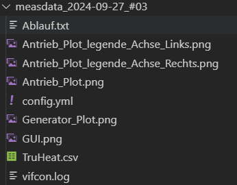
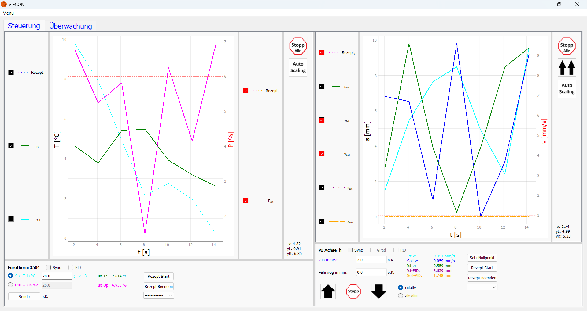
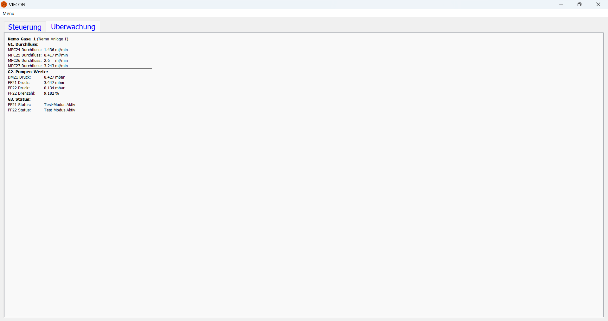

# VIFCON
**Vi**sual **F**urnace **Con**trol

Im Rahmen der Master-Arbeit "Automatisierung einer Modellanlage für Kristallzüchtung mit Induktionsheizung basierend auf Python und Raspberry Pi" von Vincent Funke (HTW) wurde die Steuerung VIFCON am Leibniz Institut für Kristallzüchtung (IKZ) für die [Gruppe Modellexperimente](https://www.ikz-berlin.de/forschung-lehre/materialwissenschaften/sektion-fundamentale-beschreibung-1) entworfen. 

Mit der Steuerung können verschiedene Anlagen und Geräte gesteuert werden um z.B. einfache Heiztest oder auch Kristallzüchtungen durchzuführen.

## Unterstützte Geräte

Derzeit werden folgende Geräte unterstützt:

- Eurotherm-Regler (RS232)
- PI-Achse (RS232)
    - Mercury-DC-Controller C-862
    - Mercury-DC-Controller C-863
- TruHeat-Generator (RS232)

Speziell kann VIFCON auf die SPS der Nemo-1- und Nemo-2-Anlage der Modellexperimente-Gruppe über Modbus zugreifen. Dabei werden:

- Antriebe für die Rotation,
- Antriebe für den Hub und,
- Messgeräte für Druck und Durchfluss, Kühlung und Anlagensicherheit

angesprochen.

Weiterhin kann die sogenannte Educrys-Anlage (Demo-CZ) von VIFCON angesprochen werden. Die Anlage besteht dabei aus 3 Antrieben (Hub, Rotation, Lüfter) und einem Heizer. VIFCON spricht über eine RS232-Schnittstelle einen Arduino an, welcher alle Geräte dann anhand der Befehle steuert. Weiterhin liest VIFCON-Monitorings Werte aus.  

Für die Steuerung der Antriebe kann auch ein Gamepad/Controller genutzt werden. Das genutzte Gamepad ist ein alter von Nintendo bzw. nun von GeekPi. Das Gamepad wird im Bild [Gamepad.jpg](../Bilder/Gamepad.jpg) gezeigt. 

Weiterhin kann eine Verbindung zu der Logging-Software Multilog aufgebaut werden. Auch dieses wurde von der Modellexperimente-Gruppe am IKZ entworfen. Siehe: https://github.com/nemocrys/multilog

Im Sinne des IKZ kann VIFCON mit allen Anlagen kommunizieren (siehe [Konfiguration](#Konfiguration)):
1. Nemo-1-Anlage 
2. Nemo-2-Anlage
3. DemoFZ 
4. Educrys (DemoCZ)

## Benutzung
### Start von VIFCON

Um VIFCON zu starten kann folgendes getan werden:

1. Schnittstelle ist vorhanden und Init wurde auf False in der Config-Datei gesetzt (Geräte müssen nicht angeschlossen sein).
2. Gerät ist vorhanden (angeschlossen), wurde richtig konfiguriert und Init wurde auf True in Config-Datei gesetzt.
3. Test-Modus (argparser) wurde aktiviert. 

Startmöglichkeiten durch argparser:
```
usage: vifcon [-h] [-c CONFIG] [-n] [-o OUT_DIR] [-t] [-v]

Use of the VIFCON control. Control and reading of various devices on one system.

options:
  -h, --help            show this help message and exit
  -c CONFIG, --config CONFIG
                        vifcon configuration file [optional, default='./config.yml']
  -n, --neustart        vifcon restart [optional, default=False]
  -o OUT_DIR, --out_dir OUT_DIR
                        directory where to put the output [optional, default='.']
  -t, --test            test-mode [optional, default=False]
  -v, --version         show program's version number and exit
```

VIFCON wird durch den Aufruf von [vifcon_main.py](..\vifcon_main.py) gestartet.
```
python .\vifcon_main.py
```

Um sich  VIFCON ohne Geräte anzuschauen bzw. einen ersten Eindruck der Steuerung zu bekommen, kann das Template genutz werden. So wird VIFCON wie folgt gestartet (Startmöglichkeit 3):
```
python .\vifcon_main.py -t -c ./Template/config_temp.yml
```

### Konfiguration

Die Konfiguration von VIFCON wird durch die Datei config.yml erreicht. Anhand der Datei wird VIFCON erstellt. Das Template [config_temp.yml](../Template/config_temp.yml) zeigt dabei diese Config-Datei. Um VIFCON nutzen zu können, muss dieses kopiert und für den jeweiligen Versuch abgeändert werden. 

Neben dieser Datei sind auch ein Template für die Ablauf-Datei und die Log-Datei zu finden. In der Modellexperimente-Gruppe des IKZ gibt es drei Anlagen die mit VIFCON betrieben werden: Nemo-1, Nemo-2 und Demo-FZ. Für alle diese Anlagen gibt es auch ein Template. 

Nemo-1: Nemo-Achse-Linear (2x), Nemo-Achse-Rotation (2x), Nemo-Gase, Eurotherm ([config_temp_Nemo-1.yml](../Template/config_temp_Nemo-1.yml))    
Nemo-2: Nemo-Achse-Linear (2x), Nemo-Achse-Rotation (2x), Nemo-Gase, Nemo-Generator (2x) ([config_temp_Nemo-2.yml](../Template/config_temp_Nemo-2.yml))    
Demo-FZ: PI-Achse (4x), TruHeat ([config_temp_DemoFZ.yml](../Template/config_temp_DemoFZ.yml))   
Educrys: Educrys-Antrieb (3x ( Hub, Rot, Fan)), Educrys-Heizer, Educrys-Monitoring ([config_temp_Educrys.yml](../Template/config_temp_Educrys.yml)) 

In der Konfigurationsdatei gibt es Kommentare die die einzelnen Zeilen beschreiben und auch deren Default-Fehler nennen, sollte das Einlesen misslingen. Weitere Informationen zu der Konfigurationsdatei sind in der Datei [Config_DE.md](Config_DE.md) zu finden.

### Rezepte

Bei der Rezept-Funktion werden Sollwertvorgaben durch das Programm erstellt und durch die Config-Datei definiert. Um die Auslagerung der Rezepte in weitere Yaml-Datein zu nutzen, muss im Ordner **vifcon**, ein Ordner **rezepte** existieren. Mehr Informationen zu den Rezepten sind in der Datei [Rezepte_DE.md](Rezepte_DE.md) zu finden.

### Datein

Wenn VIFCON gestartet wird, wird ein Messdatenordner (siehe Beispiel) mit dem Namen "measdata_date_#XX" erstellt. Je nach Konfiguration werden in diesem Ordner die Messdaten (csv), die Log-Datei (log), eine Ablauf-Datei (txt), die config-Datei (yml), die GUI (png), die Plots (png) und die Legenden (png) gespeichert. Letztere wird nur gespeichert, wenn diese außerhalb des Plots ist. Im Test-Modus wird dieser Ordner nicht erstellt. Insgesamt können nur 99 Ordner je Tag erstellt werden, sonst wird ein Error ausgeworfen!

**Beispiel:**    
measdata_2024-09-27_#03

**Inhalt des Ordners:**   


### GUI

Wenn alles richtig konfiguriert wurde startet VIFCON und die GUI wird angezeigt. Die GUI bassiert auf der Programmierung mit PyQt5.




Stand der GUI: 11.02.25

## Abhängigkeiten

VIFCON arbeitet mit Python >= 3.8 auf Windows, Linux und Raspberry Pi (RPi OS 64-bit Version 12 (bookworm)). Folgende Bibliotheken werden von Python gebraucht:

1. GUI:
    - PyQt5
    - pyqtgraph
    - sys
    - randomcolor
    - matplotlib

2.  Dateien:
    - logging
    - PyYaml
    - os
    - shutil

3. Schnittstellen/Kommunikationsprotokolle: 
    - pyserial (RS232)
    - pyModbusTCP (Modbus)
    - json (Multilog-Link)
    - socket (Multilog-Link)
    - pygame (Gamepad)

4. Weitere:
    - random
    - time
    - datetime
    - argparse
    - math

[Sehe auch](Python_RPi_En.md)

### Bildschirmgröße:
Die GUI benötigt eine Mindestauflösung des Bildschirms von 1240x900 Pixel.

## Dokumente

## Informationen

Im Ordner **[Information](../Information)** befinden sich weitere Dokumente, die VIFCON näher beschreiben. Folgende Themen sind dort in Deutsch und Englisch zu finden:

1. Python und Raspberry Pi - Installation und Bibliotheken 
    - [Zeige En](Python_RPi_En.md)
    - [Zeige De](Python_RPi_DE.md)
2. Rezepte 
    - [Zeige En](Rezepte_En.md) 
    - [Zeige De](Rezepte_DE.md)
3. Konfiguration
    - [Zeige En](Config_En.md) 
    - [Zeige De](Config_DE.md)
4. Modbus-Register
    - [Zeige En](Modbus_Nemo_En.md) 
    - [Zeige De](Modbus_Nemo_DE.md)
5. GUI
    - [Zeige En](GUI_En.md) 
    - [Zeige De](GUI_De.md)

## Letzte Änderung

Die Letzte Änderung dieser Beschreibung war: 17.12.2024
