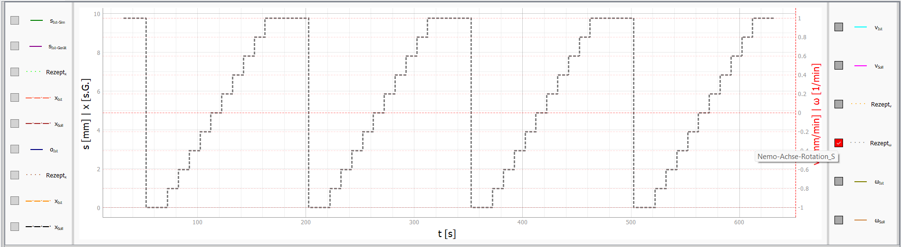
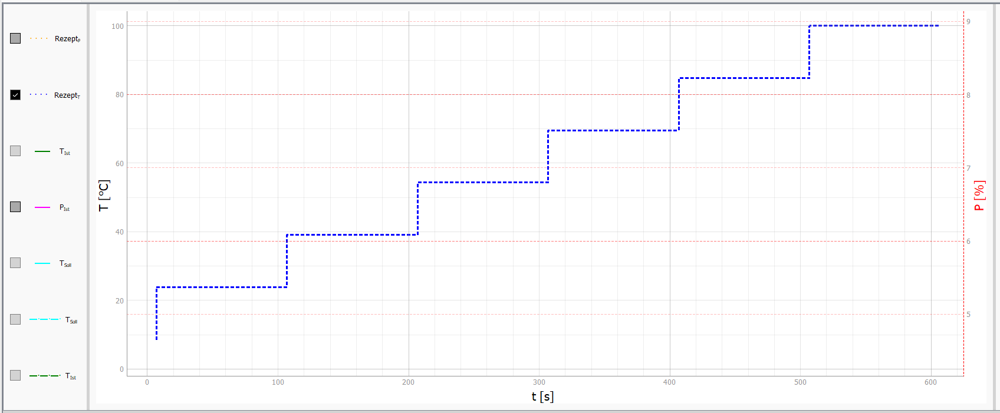
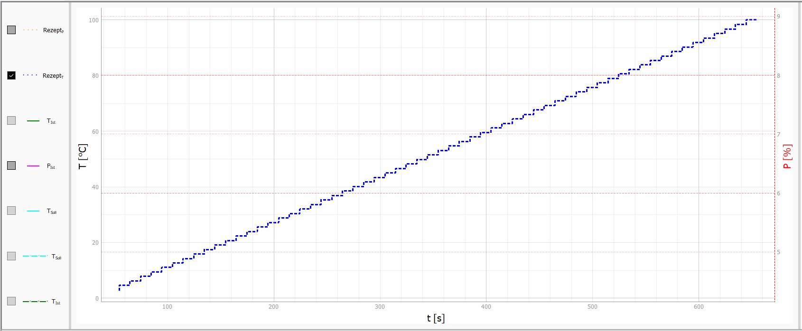
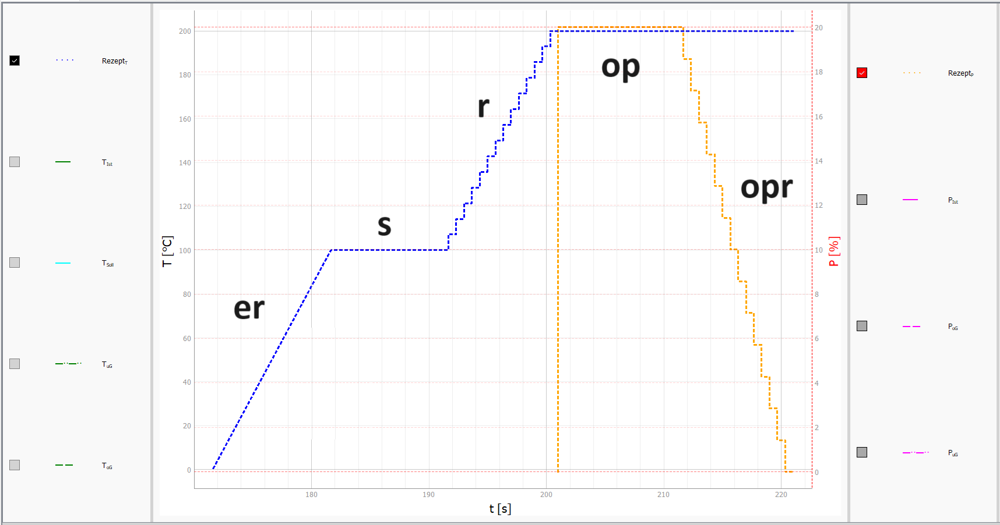
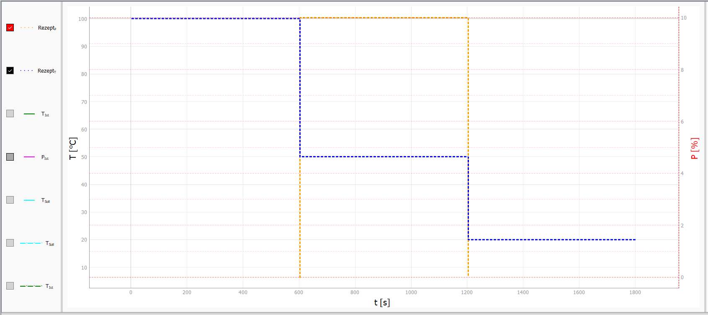
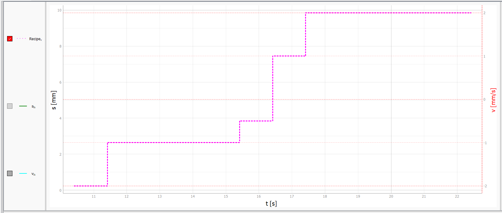
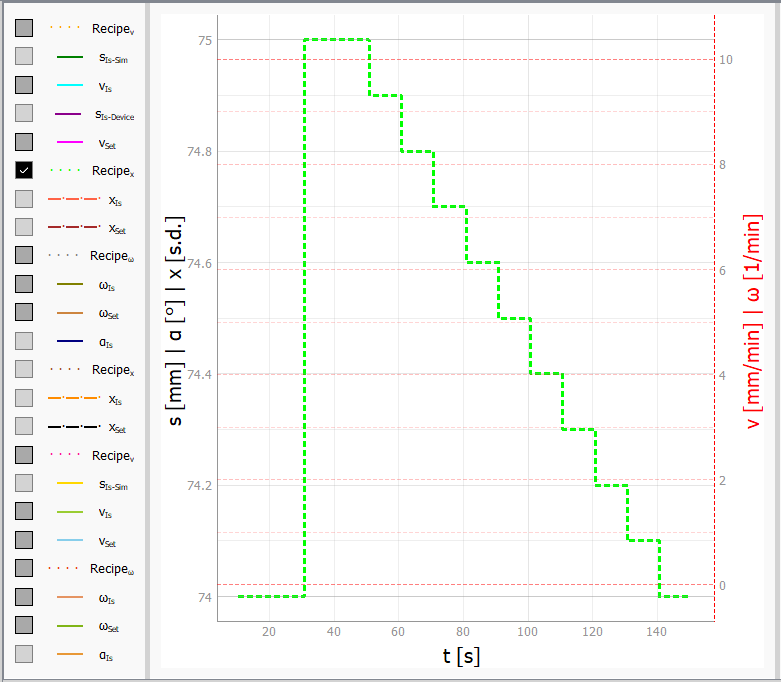
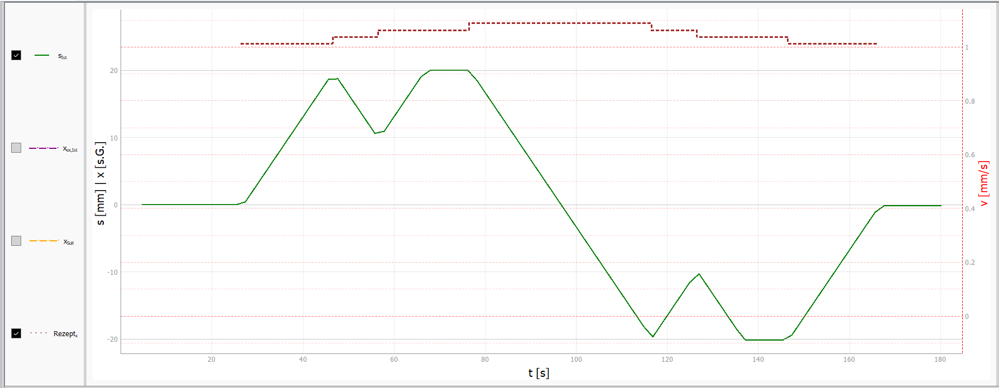

# Informationen zu den Rezepten

Im folgenden werden die einzelnen Rezept-Segmente, der Aufbau und die Auslagerung dieser Rezepte gezeigt und erläutert.

## Vorhandene Rezept-Segmente

Die Rezepte hängen von den Geräten ab. Bis auf das Eurotherm Gerät sind alle Rezepte gleich aufgebaut. Somit gibt es folgende Arten von Rezept-Segmenten:

s	-	Sprung (Sollwertsprung)   
r	-	Rampe (Reihe von Sollwertsprüngen)

Eurotherm Temperatur spezifisch:  
er	-	Eurotherm eigene Rampe  
op	-	Leistungssprung in einem Temperaturrezept   
opr	-	Leostungsrampe in einem Temperaturrezept  

Für Eurotherm Leistung, PID-Modus, TruHeat, Nemo-Antriebe (Hub, Rotation) und PI-Achse sind nur s und r verfügbar! Bei dem PID-Modus des Eurotherms, können op und opr genutzt werden!

## Aufbau Allgemein:

```
Sprung:             SN: t ; So  ; s
Rampe:              SN: t ; ZS  ; r   ; RZ
Eurotherm Rampe:    SN: t ; ZS  ; er
Leistungs Sprung:   SN: t ; SoT ; op  ; SoL
Leistungs Rampe:    SN: t ; ZST ; opr ; ZSL ; RZ ; SR
```
Legend:  
- SN - Schritt Nummer
- t - Segment-Zeit
- RZ - Rampensprung Zeitabstand
- ZS - Zielsollwert
- ZST - Zielsollwert Temperatur
- ZSL - Zielsollwert Leistung
- So - Sollwert
- SoT - Sollwert Temperatur
- SoL - Sollwert Leistung
- SR - Startwert Rampe

Bei den Nemo-Antrieben wird im PID-Modus noch ein spezieller String benötigt. In diesen Rezepten sind nur **Sprung** und **Rampe** möglich. Am Ende der Rezept-Zeile müssen bei Hub **DOWN** oder **UP** und bei Rotation **CW** oder **CCW** stehen. Beispiele sind im Kapitel [Beispiele](#Beispiele) zu finden. 

### Beschreibung:
1. Zeit:	
    - Solange dauert das Segment, Einheit Sekunden
2.  Sollwert: 			
    - Wert zu dem gesprungen werden soll.
3.  Zielsollwert:			
    - Ende der Rampe
4.  Rampensprung Zeitabstand:	
    - Abstand der Rampensprünge
    - Beispiele:  
		- r:   
            - Angabe in Config: 1 s
            - bei Zeit = 10 s und Zielsollwert = 100°C 
            - Starttemperatur: 30°C    
            --> 10 s/1 s = 10  
            --> (100°C - 30°C)/10 s = 7 °C (Sprünge)   
            --> Jede Sekunde ein Sprung
		- opr:  
            - Angabe in Config: 2 s
            - bei Zeit = 10 s und Zielsollwert = 100 % 
            - Startleistung: 0 %   
            -> 10 s/2 s =  5   
            -> (100 % -  0 %)/5 s  = 20 % (Sprünge)   
            -> Alle 2 Sekunden ein Sprung 
5. Startwert:	
    - Beginn der Rampe

## Besonderheiten:
- Leistungsrezepte bei Eurotherm werden durch s und r erzeugt. Wenn eine Leistung in einem Temperatur-Rezept verändert werden soll, dann werden dort op und opr genutzt.
- Bei "Leistungs Sprung" kann bei "Sollwert Leistung" auch IST angegeben werden. Dadurch wechselt nur der Modus des Eurotherms auf Manuell. Der aktuelle Leistungswert wird als Istwert/Sollwert gehalten. 
- Bei "Leistungs Rampe" kann bei "Startwert Rampe" auch nichts angegeben werden, dann Startet die Leistungsrampe bei Null. 
- Bei "Leistungs Sprung" und "Leistungs Rampe" wird auch ein Temperatursprung ausgelöst. 
- Bei der Eurotherm-Rampe wird die Steigung (Berechnung: m = delta y / delta x) im Programm berechnet. Bis auf den Startwert der Rampe, wird alles andere in der Konfiguration gesetzt: m = (Startwert - Zielwert)/Segmentzeit
- Bei den Rampen kann der Nutzer in der Konfiguration entweder Start mit Istwert oder Start mit Sollwert auswählen. Diese konfiguration ist nur für die erste Rampe in einem Rezept notwendig.
- Bei der Eurotherm-Rampe muss gewusst werden, das dies ein internes Programm des Eurotherm-Reglers ist. Die Rampen starten immer vom aktuellen Istwert!!

## PID-Modus

Im PID-Modus werden bestimmte Größen der Geräte ermittelt. So wird z.B. mit der Temperatur die Ausgangsleistung beim Eurotherm oder mit einer seperaten Größe die Geschwindigkeit der Antriebe (Nemo, Pi-Achse) erzeugt. Auch die Rezept-Funktion soll mit dem PID-Modus fiunktionieren. Beim Eurotherm ist die Input-Größe die Temperatur. Bei allen anderen Geräten kann diese Größe etwas anderes sein z.B. die Kristalllänge. Hierfür gibt es dann die verschiedenen Multilog-Verbindungen. Der Rezeptmodus regelt hier somit den Sollwert der Größe x (bei Eurotherm T). Bei den Antrieben muss nun etwas beachtet werden. Dies ist die Bewegungsrichtung, die das Gerät zum Verfahren benötigt. 

Weiterhin werden andere Limit-Werte im PID-Modus verwendet. Bei den Nemo-Antrieben benötigt es hierbei noch eine Richtungsangabe, sodas das Programm weiß, welche Richtung bei den Rezept-Schritten gefahren werden soll. Im Normal-Betrieb wird die Richtung durch das Vorzeichen der Geschwindigkeit angegeben. Da im PID-Modbus aber eine andere Größe durch das Rezept bestimmt wird und die Geschwindigkeit die PID-Output Größe ist, muss die Richtung nun anders angebene werden! Das selbe gilt für die PI-Achse. 

Im Falle der Achsen muss nun das Rezept um einen Richtungsstring erweitert werden! In den [Beispielen](#Beispiele) finden sich dazu einige wieder. Bei `Nemo-Achse-Linear` sind dies **UP** und **Down**, bei `Nemo-Achse-Rotation` sind es **CW** und **CCW** und bei der `PI-Achse` sind es **N** und **P**. Bei der PI-Achse gibt es drei verschiedene Bewegungsrichtungen. Jedoch ist die Positive und Negative Bewegung (bezogen auf Positionswert) immer gleich. Die Position wird zum PI-Symbol (am Gerät) negativ bzw. sinkt zum negativen und von diesem weg positiv bzw. steigt zum positiven. Aus dem Grund wurden diese Bezeichnungen gewählt.

In der Konfiguration der PI-Achse gibt es unter `GUI` die Konfiguration `piSymbol`. Bei diesem können `Re`, `Li`, `Ob`, `Un`, `Vo` und `Hi` angegeben werden. Dabei werden die x-, y- oder z-Richtung angesprochen (siehe Konfiguration). Durch die GUI-Konfiguration werden auch die Knöpfe belegt. Bei `Re`, `Un` und `Hi` wird der linke Knopf positiv und der rechte negativ belegt. Das heißt das wenn man auf den rechten Knopf drückt zum PI-Symbol gefahren wird. Bei `Li`, `Ob` und `Vo` dreht sich dies um.

## Rezept-Wiederholungen

Bei einigen Geräten findet sich in der [Konfiguration](Config_DE.md) die Konfiguration `rezept_Loop` wieder. Die besagten Geräte sind der Edzcrys-Antrieb und die Nemo-Rotation. Bei der Konfiguration wird ein Integer angegeben. Wenn z.B, eine 3 dort steht, so wird das Rezept dreimal wiederholt, heißt viermal durchgeführt. In der GUI muss dafür nur die Checkbox `Rez.-Loop` ausgewählt werden. Wenn diese ausgeschaltet ist, wird das Rezept nur einmal ausgeführt. 

*Beispiel:*
```
device:
    Nemo-Achse-Rotation_S:
        # Sonstige Einstellungen
        rezept_Loop: 3                             
        rezepte:
          v_Test:
            n1: 20 ; 1 ; s
            n2: 20 ; -1 ; s
            n3: 100 ; 1 ; r ; 10
            n4: 10 ; 1 ; s
```



## Auslagern von Rezepten

Der Ordner **rezepte** ist für VIFCON-Rezepte vorgesehen. Das Format dieser Datein ist Yaml (.yml). 
Diese Rezepte werden aus der Config-Datei folgendermaßen aufgerufen:

```
dat: Dateiname
```

Das **dat** muss  enthalten sein, wenn Rezepte ausgelagert werden. Die Configuration der Rezepte kann nun auch über eine seperate Datei durchgeführt werden. Für diesen Zweck müssen vier Dinge eingehalten werden:
1. Schritt muss ***dat*** heißen!
2. Rezeptdatei muss im Ordner 'vifcon/rezepte/' liegen!
3. In der Datei dürfen nur die Schritte stehen!
4. Die normalen Config-Rezept-Schritte dürfen niemals dat heißen!

In dem Ordner *rezepte* befindet sich die Beispiel-Datei [rec_example.yml](../vifcon/rezepte/rec_example.yml), welche eine Datei mit den hier zu finden Erläuterung enthält.

## Beispiele
           
1. Rezept in Config-Datei konfigurieren:
    ``` 
    device:
        Eurotherm:
            # Sonstige Einstellungen
            rezepte:
                Test_Rezept_1:  
                    n1: 600 ; 100 ; r ; 100
                Test_Rezept_2:
                    n1: 600 ; 100 ; r ; 10
                Test_Rezept_3:    
                    dat: rec_example.yml
    ```

Beachtet müssen hier nur die Einrückungen, damit alles richtig ausgelesen werden kann. 

2. Ausgelagerte Datei konfigurieren:
    - rec_example.yml:
        ```
        n0: 3600 ; 500 ; er
        n1: 600  ; 500 ; s 
        n2: 600  ; 500 ; op  ; 20
        n3: 1200 ; 200 ; r   ; 3
        n4: 600  ; 200 ; opr ; 5 ; 1 ; 20 
        n5: 600  ; 20  ; er
        ```

Diese Datei benötigt keine Einrückungen. Kommentare können in diesen Dateien erstellt werden, beachte hierbei aber das bestimmte Zeichen wie z.B. "\t" nicht außerhalb der Kommentare auftauchen!

---

**Test_Rezept_1:**



In dem Beispiel wird nur ein r-Segment erzeugt.Mit dem *Test_Rezept_2* soll hier die Nutzung von dem r-Segment Teil *Rampensprung Zeitabstand* gezeigt werden. Die letzte Zahl gibt somit die Genauigkeit bzw. die Häufigkeit der Sollwertsprünge in diesem Segment an. Je kleiner die Zahl, desto eher ähnelt das Segment einer linearen Funktion.

**ACHTUNG**: Sprünge sind die größte Belastung für ein System. Für die Nutzung dieser Art Rampe, sollten genügend Test durchgeführt werden, somit diese sicher mit dem System funktioniert. Beim Eurotherm-Regler könnten durch eine schlechte oder nicht konfigurierte Regelung Spitzen in der Ausgangsleistung bei jedem Sprung entstehen!!

---

**Test_Rezept_2:**



--- 

**Test_Rezept_3:**

Das Beispiel zeigt auch mit n0 bis n5 wie es in der Config-Datei direkt aussehen müsste. Der Nutzer kann festlegen wo das Rezept stehen soll! Das gezeigte Beispiel kann in Abbildung [Beispiel_Rezept_3.png](../Bilder/Beispiel_Rezept_3.png) gefunden werden und ist folgend zu sehen. 

In dem Beispiel werden alle 5 Segmentarten genutzt. Somit handelt es sich um einen Eurotherm-Regler. Das gezeigte Rezept hier ist auch Teil des [Config-Templates](../Template/config_temp.yml). 


---

**Weitere Beispiele:**

Rezept:
```
n1: 10 ; 100 ; er
n2: 10 ; 100 ; s
n3: 10 ; 200 ; r ; 0,667
n4: 10 ; 200 ; op ; 20
n5: 10 ; 200 ; opr ; 0 ; 0,667 ; 20
```
Plot:    


Dieses Rezept ist ähnlich zu *Test_Rezept_3*. Hierbei gibt es nun eine manuelle Beschriftung der einzelnen Segmente.  

---

Rezept:
```
n1: 600 ; 100 ; s
n2: 600 ; 50 ; op ; 10
n3: 600 ; 20 ; s
```
Plot:    


Mit dem Beispiel soll gezeigt werden, dass es möglich ist bei op und opr auch einen Temperatur-Sprung durchzuführen. 

---

Rezept:
```
n1: 1 ; -2 ; s
n2: 4 ; -1 ; s
n3: 1 ; -0.5 ; s
n4: 1 ; 1 ; s
n5: 5 ; 2 ; s
```
Plot:    


Auch dieses Rezept ist im [Template der Configdatei](../Template/config_temp.yml) zu finden. Dieses Rezept ist z.B. für die PI-Achse. 

---

Rezept:
```
n1: 20 ; 74 ; s ; UP
n2: 20 ; 75 ; s ; Down
n3: 100 ; 74 ; r ; 10 ; DOWN
```
```
n1: 20 ; 74 ; s ; CW
n2: 20 ; 75 ; s ; CCW
n3: 100 ; 74 ; r ; 10 ; CW
```
Plot:  


Diese Rezepte sind im Template der Configdatei für die Nemo-Anlagen [1](../Template/config_temp_Nemo-1.yml) und [2](../Template/config_temp_Nemo-2.yml) bei dem Spindel-Antrieben zu finden. Das obere zeigt den Hub-Antrieb und das untere den Rotations-Antrieb.

---

Rezept:
```
n1: 20 ; 24 ; s ; P
n2: 10 ; 25 ; s ; N
n3: 20 ; 26 ; s ; P
n4: 20 ; 27 ; s ; N
n5: 20 ; 27 ; s ; N
n6: 10 ; 26 ; s ; P
n7: 20 ; 25 ; s ; N
n8: 20 ; 24 ; s ; P
```    
Plot:    


Dieses Rezept ist im Template der Configdatei für die [Demo-FZ](../Template/config_temp_DemoFZ.yml) zu finden. Anders als bei den anderen Rezept-Beispielen wird hier der Positionswert der Achse mit gezeigt. In dem Beispiel wurde die PI-Achse mit y-Richtung genutzt, wobei das PI-Symbol auf der rechten Seite war. Bei Positiv wurde somit nach links gefahren und bei Negativ nach rechts. In dem Plot kann auch gesehen werden, das bei Limit-Ereichung (20 mm und -20 mm) die Achse diese nicht maßgeblich überschreitet und das der Richtungswechsel funktioniert!

## Letzte Änderung

Die Letzte Änderung dieser Beschreibung war: 10.03.2025