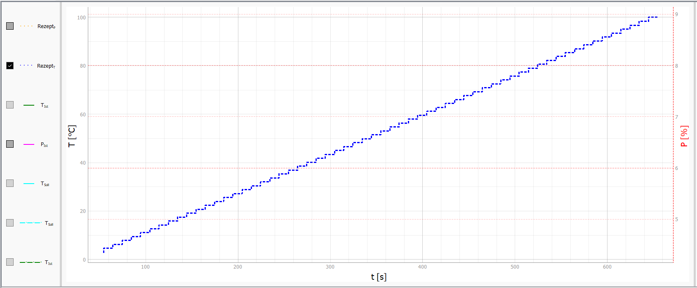
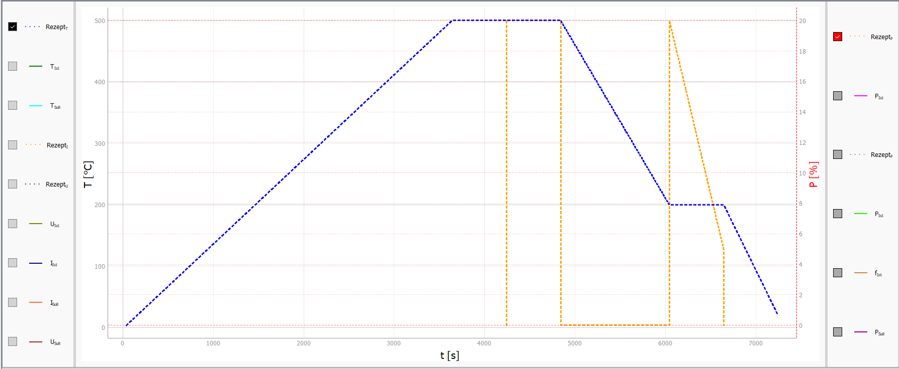
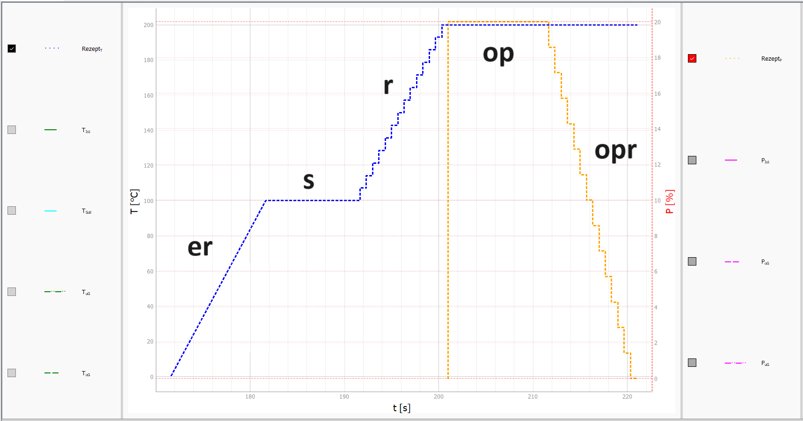
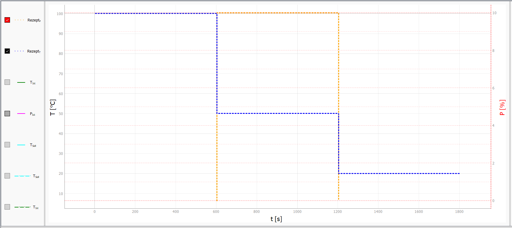

# Information about the recipes

In the following, the individual recipe segments, the structure and the outsourcing of these recipes are shown and explained.

## Existing recipe segments

The recipes depend on the device. Except for the Eurotherm device, all recipes are structured the same. There are therefore the following types of recipe segments:

s   - jump (setpoint jump)   
r   - ramp (series of setpoint jumps)

Eurotherm temperature specific:    
er 	- Eurotherm's own ramp  
op 	- jump in performance in a temperature recipe  
opr - release ramp in a temperature recipe  

For Eurotherm power, PID mode, TruHeat, Nemo drives (stroke, rotation) and PI axis only s and r are available! In the PID mode of the Eurotherm, op and opr can be used!

```
Jump:               SN: t ; ST  ; s
Ramp:               SN: t ; TS  ; r   ; RTI
Eurotherm ramp:     SN: t ; TS  ; er  
Power Jump:         SN: t ; STT ; op  ; STP
Power ramp:         SN: t ; TST ; opr ; TSP; RTI ; SVR
```
Legend:
- SN - step number
- t - segment time
- ST - setpoint
- STT - setpoint temperatur
- STP - setpoint power
- TS - target setpoint
- TST - target setpoint temperatur
- TSP - target setpoint power
- RTI - ramp jump time interval
- SVR - start value ramp

For the Nemo drives, a special string is required in PID mode. In these recipes, only **jump** and **ramp** are possible. At the end of the recipe line, **DOWN** or **UP** must appear for stroke and **CW** or **CCW** for rotation. Examples can be found in the [Examples](#Examples) chapter.

### Description:
1. Time: 			
    - The segment lasts in seconds
2.  Setpoint: 			
    - Value to which the jump should be made.
3.  Target setpoint: 		
    - end of ramp
4. Ramp jump time interval: 	
    - Distance between the ramp jumps
    - Examples:
	    - r:   
            - Specification in Config: 1 s 
            - with time = 10 s and target setpoint = 100°C 
            - starting temperature: 30°C   
            -> 10 s/1 s = 10   
            -> (100°C - 30°C)/10 s = 7 °C (jumps)   
            -> A jump every second
	    - opr: 
            - Specification in Config: 2 s 
            - with time = 10 s and target setpoint = 100 %
            - start power: 0 %    
            -> 10 s/2 s = 5     
            -> (100 % -  0 %)/5 s  = 20 % (jumps)    
            -> A jump every 2 seconds
5. Start value: 			
    - start of the ramp

## Particularities:
- Performance recipes at Eurotherm are generated by s and r. If a performance is to be changed in a temperature recipe, then op and opr are used there.
- In the case of "power jump" the ACTUAL value can also be specified in the "setpoint power". This only switches the Eurotherm mode to manual. The current power value is kept as the actual value/setpoint.
- For "Power ramp" nothing can be specified for "Start value ramp", then the power ramp starts at zero.
- A temperature jump is also triggered with "power jump" and "power ramp".
- With the Eurotherm ramp, the gradient (calculation: m = delta y / delta x) is calculated in the program. Apart from the start value of the ramp, everything else is set in the configuration: m = (start value - target value)/segment time
- With the ramps, the user can select either start with actual value or start with setpoint in the configuration. This configuration is only necessary for the first ramp in a recipe.
- With the Eurotherm ramp, it must be known that this is an internal program of the Eurotherm controller. The ramps always start from the current actual value!!

## PID mode

In PID mode, certain device sizes are determined. For example, the output power is generated with the temperature in the Eurotherm, or the speed of the drives (Nemo, Pi axis) is generated with a separate size. The recipe function should also work with PID mode. In the Eurotherm, the input size is the temperature. In all other devices, this size can be something else, e.g. the crystal length. There are various multilog connections for this. The recipe mode thus regulates the setpoint of size x (in the Eurotherm T). There is something to be observed with the drives. This is the direction of movement that the device needs to move.

Other limit values ​​are also used in PID mode. In the Nemo drives, a direction specification is required so that the program knows which direction the recipe steps should move in. In normal operation, the direction is indicated by the sign of the speed. However, since a different size is determined by the recipe in PID-Modbus and the speed is the PID output size, the direction must now be specified differently! The same applies to the PI axis.

In the case of the axes, the recipe must now be extended by a direction string! Some of these can be found in the [examples](#examples). For `Nemo-Achse-Linear` these are **UP** and **Down**, for `Nemo-Achse-Rotation` these are **CW** and **CCW** and for the `PI-Achse` these are **N** and **P**. There are three different directions of movement for the PI axis. However, the positive and negative movement (related to the position value) is always the same. The position becomes negative towards the PI symbol (on the device) or decreases towards the negative and away from this it becomes positive or increases towards the positive. This is why these names were chosen.

In the configuration of the PI axis there is the configuration `piSymbol` under `GUI`. Here you can specify `Re`, `Li`, `Ob`, ​​`Un`, `Vo` and `Hi`. The x, y or z direction is addressed (see configuration). The buttons are also assigned by the GUI configuration. For `Re`, `Un` and `Hi` the left button is assigned positively and the right one negatively. This means that if you press the right button it goes to the PI symbol. For `Li`, `Ob` and `Vo` this is reversed.

## Outsourcing of recipes

The folder **rezepte** is intended for VIFCON recipes. The format of these files is Yaml (.yml).
These recipes are called from the config file as follows:

```
dat: file name
```

The **dat** must be included. The configuration of the recipes can now also be carried out via a separate file. For this purpose, four things must be adhered to:
1. step must be called 'dat'!
2. Recipe file must be in the 'vifcon/rezepte/' folder!
3. Only the steps can be in the file!
4. The normal config recipe steps must never be called dat!

In the folder *rezepte* you will find the example file [rec_example.yml](../vifcon/rezepte/rec_example.yml), which contains a file with the explanations found here.

## Examples

1. Configure recipe in config file:
    ``` 
    device:
        Eurotherm:
            # Sonstige Einstellungen
            rezepte:
                Test_Recipe_1:  
                    n1: 600 ; 100 ; r ; 100
                Test_Recipe_2:
                    n1: 600 ; 100 ; r ; 10
                Test_Recipe_3:    
                    dat: rec_example.yml
    ```

The only thing you need to pay attention to here is the indentation so that everything can be read correctly.

2. Configure the swapped file:
    - rec_example.yml:
        ```
        n0: 3600 ; 500 ; er
        n1: 600  ; 500 ; s 
        n2: 600  ; 500 ; op  ; 20
        n3: 1200 ; 200 ; r   ; 3
        n4: 600  ; 200 ; opr ; 5 ; 1 ; 20 
        n5: 600  ; 20  ; er
        ```

This file does not require indentation. Comments can be created in these files, but note that certain characters such as "\t" do not appear outside of the comments!

---

**Test_Recipe_1:**


In the example, only one r-segment is created. The *Test_Recipe_2* is used to show the use of the r-segment part *Ramp jump time interval*. The last number therefore indicates the accuracy or the frequency of the setpoint jumps in this segment. The smaller the number, the more the segment resembles a linear function.

**WARNING**: Jumps are the biggest stress on a system. When using this type of ramp, sufficient testing should be carried out to ensure that it works safely with the system. With the Eurotherm controller, poor or incorrectly configured control could cause peaks in the output power at each jump!!

---

**Test_Recipe_2:**



--- 

**Test_Recipe_3:**

The example also shows with n0 to n5 what it should look like in the config file. The user can specify where the recipe should be! The example shown can be found in figure [Beispiel_Rezept_3.png](../Bilder/Beispiel_Rezept_3.png) and can be seen below.

All 5 segment types are used in the example. This means that it is a Eurotherm controller. The recipe shown here is also part of the [Config-Templates](../Template/config_temp.yml).



---

**More examples:**

Recipe:

```
n1: 10 ; 100 ; er
n2: 10 ; 100 ; s
n3: 10 ; 200 ; r ; 0,667
n4: 10 ; 200 ; op ; 20
n5: 10 ; 200 ; opr ; 0 ; 0,667 ; 20
```
Plot:   


This recipe is similar to *Test_Recipe_3*. There is now manual labeling of the individual segments. 

---

Recipe:
```
n1: 600 ; 100 ; s
n2: 600 ; 50 ; op ; 10
n3: 600 ; 20 ; s
```
Plot:    


The example is intended to show that it is possible to carry out a temperature jump for op and opr.

---

Recipe:
```
n1: 1 ; -2 ; s
n2: 4 ; -1 ; s
n3: 1 ; -0.5 ; s
n4: 1 ; 1 ; s
n5: 5 ; 2 ; s
```
Plot:    


This recipe can also be found in the [template of the config file](../Template/config_temp.yml). This recipe is for the PI axis, for example.

---

Recipe:
```
n1: 20 ; 74 ; s ; UP
n2: 20 ; 75 ; s ; Down
n3: 100 ; 74 ; r ; 10 ; DOWN
```
```
n1: 20 ; 74 ; s ; CW
n2: 20 ; 75 ; s ; CCW
n3: 100 ; 74 ; r ; 10 ; CW
```
Plot:  


These recipes can be found in the template of the config file for the Nemo systems [1](../Template/config_temp_Nemo-1.yml) and [2](../Template/config_temp_Nemo-2.yml) for the spindle drives. The upper one shows the lifting drive and the lower one shows the rotation drive.

---

Recipe:
```
n1: 20 ; 24 ; s ; P
n2: 10 ; 25 ; s ; N
n3: 20 ; 26 ; s ; P
n4: 20 ; 27 ; s ; N
n5: 20 ; 27 ; s ; N
n6: 10 ; 26 ; s ; P
n7: 20 ; 25 ; s ; N
n8: 20 ; 24 ; s ; P
```
Plot:


This recipe is in the template of the config file for the [Demo-FZ](../Template/config_temp_DemoFZ.yml). Unlike the other recipe examples, the position value of the axis is also shown here. In the example, the PI axis with y-direction was used , with the PI symbol on the right side. If it was positive, it was moved to the left and if it was negative, it was moved to the right. In the plot you can also see that when the limit is reached (20 mm and -20 mm) the axis does not significantly exceeds the limit and that the change of direction works!

## Last change

The last change of this description was: January 01, 2025