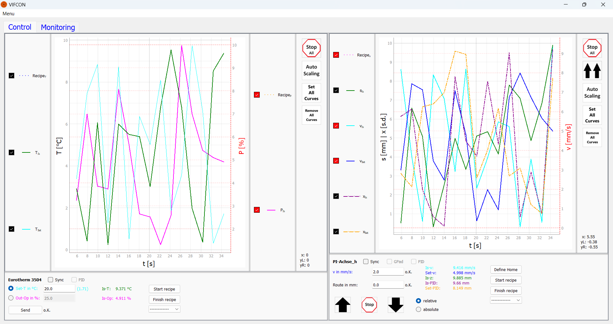

# VIFCON
**Vi**sual **F**urnace **Con**trol

As part of Vincent Funke's (HTW) master's thesis "Automation of a model system for crystal growth with induction heating based on Python and Raspberry Pi", the VIFCON controller was designed at the Leibniz Institute for Crystal Growth (IKZ) for the [model experiments group](https://www.ikz-berlin.de/en/research/materials-science/section-fundamental-description-1).

The controller can be used to control various systems and devices, for example to carry out simple heating tests or crystal growth.

## Supported devices

The following devices are currently supported:

- Eurotherm controller (RS232)
- PI axis (RS232)
    - Mercury-DC-controller C-862
    - Mercury-DC-controller C-863
- TruHeat generator (RS232)

In particular, VIFCON can access the PLC of the Nemo-1 and Nemo-2 system of the model experiments group via Modbus. This addresses:

- drives for rotation,
- drives for stroke and,
- Measuring instruments for pressure and flow, cooling and plant safety.

The so-called Educrys system (Demo-CZ) from VIFCON can also be addressed. The system consists of 3 drives (hub, rotation, fan) and a heater. VIFCON addresses an Arduino via an RS232 interface, which then controls all devices based on the commands. VIFCON monitoring also reads out values.

A gamepad/controller can also be used to control the drives. The gamepad used is an old one from Nintendo or now from GeekPi. The gamepad is shown in the picture [Gamepad.jpg](Bilder/Gamepad.jpg).

A connection to the Multilog logging software can also be established. This was also designed by the model experiments group at the IKZ. See: https://github.com/nemocrys/multilog

In terms of the IKZ, VIFCON can communicate with all systems (see [Configuration](#Configuration)):
1. Nemo-1 system
2. Nemo-2 system
3. DemoFZ
4. Educrys (DemoCZ)

## Usage
### Starting VIFCON

To start VIFCON, you can do the following:

1. Interface is present and Init was set to False in the config file (devices do not have to be connected).
2. Device is present (connected), was correctly configured and Init was set to True in the config file.
3. Test mode (argparser) was activated.

Start options using argparser:
```
usage: vifcon [-h] [-c CONFIG] [-n] [-o OUT_DIR] [-t] [-v]

Use of the VIFCON control. Control and reading of various devices on one system.

options:
  -h, --help            show this help message and exit
  -c CONFIG, --config CONFIG
                        vifcon configuration file [optional, default='./config.yml']
  -n, --neustart        vifcon restart [optional, default=False]
  -o OUT_DIR, --out_dir OUT_DIR
                        directory where to put the output [optional, default='.']
  -t, --test            test-mode [optional, default=False]
  -v, --version         show program's version number and exit
```

VIFCON is started by calling [vifcon_main.py](vifcon_main.py).
```
python .\vifcon_main.py
```

To view VIFCON without devices or to get a first impression of the control system, the template can be used. VIFCON is started as follows (Start option 3):
```
python .\vifcon_main.py -t -c ./Template/config_temp.yml
```

### Configuration

The configuration of VIFCON is achieved through the config.yml file. VIFCON is created using this file. The template [config_temp.yml](Template/config_temp.yml) shows this config file. In order to use VIFCON, it must be copied and modified for the respective experiment.

In addition to this file, there is also a template for the process file and the log file. In the IKZ model experiments group, there are three systems that are operated with VIFCON: Nemo-1, Nemo-2 and Demo-FZ. There is also a template for all of these systems.

Nemo-1: Nemo-Achse-Linear (2x), Nemo-Achse-Rotation (2x), Nemo-Gase, Eurotherm ([config_temp_Nemo-1.yml](Template/config_temp_Nemo-1.yml))    
Nemo-2: Nemo-Achse-Linear (2x), Nemo-Achse-Rotation (2x), Nemo-Gase, Nemo-Generator (2x) ([config_temp_Nemo-2.yml](Template/config_temp_Nemo-2.yml))    
Demo-FZ: PI-Achse (4x), TruHeat ([config_temp_DemoFZ.yml](Template/config_temp_DemoFZ.yml))   
Educrys: Educrys-Antrieb (3x ( Hub, Rot, Fan)), Educrys-Heizer, Educrys-Monitoring ([config_temp_Educrys.yml](Template/config_temp_Educrys.yml)) 

The configuration file contains comments that describe the individual lines and also state the default error if the reading fails. Further information about the configuration file can be found in the file [Config_En.md](Information/Config_En.md).

### Recipes

With the recipe function, target values ​​are created by the program and defined by the config file. In order to use the outsourcing of the recipes to other Yaml files, a folder **recipes** must exist in the folder **vifcon**. More information about the recipes can be found in the file [Recipes_En.md](Information/Rezepte_En.md).

### Files

When VIFCON is started, a measurement data folder (see example) with the name "measdata_date_#XX" is created. Depending on the configuration, the measurement data (csv), the log file (log), a process file (txt), the config file (yml), the GUI (png), the plots (png) and the legends (png) are saved in this folder. The latter is only saved if it is outside the plot. This folder is not created in test mode. A total of only 99 folders can be created per day, otherwise an error is thrown!

**Example:**
measdata_2024-09-27_#03

**Contents of the folder:**  


### GUI

If everything has been configured correctly, VIFCON starts and the GUI is displayed. The GUI is based on programming with PyQt5.




Status of the GUI: February 11, 2025

## Dependencies

VIFCON works with Python >= 3.8 on Windows, Linux and Raspberry Pi (RPi OS 64-bit Version 12 (bookworm)). The following libraries are needed by Python:

1. GUI:
    - PyQt5
    - pyqtgraph
    - sys
    - randomcolor
    - matplotlib

2.  Files:
    - logging
    - PyYaml
    - os
    - shutil

3. Interfaces/communication protocols:
    - pyserial (RS232)
    - pyModbusTCP (Modbus)
    - json (Multilog-Link)
    - socket (Multilog-Link)
    - pygame (Gamepad)

4. More:
    - random
    - time
    - datetime
    - argparse
    - math

[See also](Information/Python_RPI_En.md)

### Screen size:
The GUI requires a minimum screen resolution of 1240x900 pixels.

## Documents

## Information

The **[Information](Information)** folder contains further documents that describe VIFCON in more detail. The following topics can be found there in German and English:

1. The Readme file in German. [Show](Information/Readme_DE.md)
2. Python and Raspberry Pi - Installation and libraries 
    - [Show En](Information/Python_RPI_En.md)
    - [Show De](Information/Python_RPi_DE.md)
3. Recipes 
    - [Show En](Information/Rezepte_En.md) 
    - [Show De](Information/Rezepte_DE.md)
4. Config
    - [Show En](Information/Config_En.md) 
    - [Show De](Information/Config_DE.md)
5. Modbus-Register
    - [Zeige En](Information/Modbus_Nemo_En.md) 
    - [Zeige De](Information/Modbus_Nemo_DE.md)
6. GUI
    - [Zeige En](Information/GUI_En.md) 
    - [Zeige De](Information/GUI_De.md)

## Last change

The last change of this description was: December 17, 2024